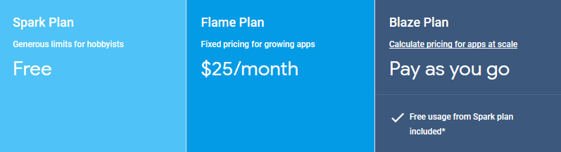

# Firebase

# Table of Contents
1.  Introduction
2.  Backend as a Service: BaaS
	1. Advantages using BaaS
	2. Disadvantages using BaaS
3.  Features
	1. Authentication
	2. Database and Storage
	3.  Hosting
	4.  Crashlytics
	5.  Performance
	6.  Growth and Maintenance
4.  Security
	1. Rules system
	2. Encryption
5.  API
6.  Payment Methods
7.  Encryption
8.  Data migration
9.  Summary
10. Sources 

## The report META
The written report length needs to have a minimum of 3000 
English words and a maximum of 5000 English words
 (that is, approximately, between six and ten pages of text, 
not including images, videos, and other resources).

- Structure your text in several sections each with introduction, 
body, and conclusion.
- Try to offer clear ideas and give useful and meaningful examples 
and resources to complement the concepts exposed.
- Be concise and respectful of the time that the reader is investing: 
if you can explain something using three sentences 
do not write six phrases just for the sake of making your text appear longer.

## Introduction
Firebase is a mobile and web application development platform where the applications and features the developer has access to is hosted on extern server parks connected to the Internet. It is created by *Firebase, Inc.* - a daughter company of *Google* - which makes it a Platform as a Service (*PaaS*). The goal of Firebase is to provide all the tools a developer needs in order to build a successfull app. Among the services offered is tools specifically for development, stability, analytics and scalability, which is all provided through a simple and user-friendly console interface. With this report and presentation, we wish to convey to the class the advantages of using Firebase as a BaaS when developing mobile and web applications.

Firebase is a BaaS that provides a set of features, including real-time database, file storage, authentication, and hosting solutions, all within the same platform. Built-in invitational systems and optional adds is also offered, which therefore can easily be tailored to your specific needs.

*Figure 1: An overview of the interface of the Firebase Console.*

## Backend as a Service: PaaS
The CCBDA lecture slides mentions several components “as a Service”: Infrastructure as a Service (IaaS), Platform as a Service (PaaS), and Software as a Service (SaaS). It is yet to mention yet another “as a Service”, namely Backend as a Service (BaaS) or sometimes Mobile Backend as a Service (MBaaS). BaaS is targeted specifically for developers of applications used by mobile end users. It provides an adjustable and dynamic backend for a wide range of mobile and web implementations, and also offers handy services. Differing from PaaS, by using BaaS it is the developers responsibility to create an environment for managing the solutions runtime. There is a manifold of different BaaS to choose from, where the current leaders apart from Firebase is Apple’s Cloudkit and Kinvey.

The advantages of using Baas are many. There are a lot of different issues a developer needs to consider when building, deploying and running an application. In order to implement a successful application and reach a broad audience, the developer has to contemplate both iOS, Android and mobile web application users. This will most of times require a scalable backend database. There are also challenges such as measuring user activity, recover from fatal server meltdowns, and promoting to mention a few.

### Advantages using BaaS
By using a BaaS and the cloud computing services that comes with it, all of these issues can be drastically simplified. It allows us as developers to implement, deploy and run applications without having to take into account building and maintaining a complex infrastructure which may be time consuming. As the complexities disappears, the level of high-degree programming increases and application development can be done in a more efficient manner. In this way, more time can be spent on implementing and improve our application.

### Disadvantages using BaaS
The disadvantages linked to use of such a system are that the degree of high-level programming might be overwhelming for some applications. If one have to tailor a product for a specific case, it is not ensured that the platform provides the feature needed. There is also typically a correlation between scale and price, which means that the developer might end up having to pay the provider a significant amount of money if the application grows in large scales. This is discussed later in the paper.

Consequently, if you as a developer wishes to be provided a large set of convenient features and the solution has to be developed in a speedy manner with an available backend, you should very much consider using a BaaS.

*Figure 2: An illustration figure of end devices, all connected to the same Backend as a Service.*

# Features

As earlier mentioned, the set of features offered by Firebase is large. In the following section some of the most accommodating are mentioned.

## Authentication

Authentication is an essential part in numerous of apps, and with Firebase, this can be done in matters of few lines of code. Authentication can be done using a wide range of sign-in providers, including standard email, Google, Facebook, GitHub, as well as phone ringing. Firebase also provides user-friendly features such as email address verification and password reset.

*Figure 3: An excerpt of what information is to be found by emails signed in. There are some built-in constraints when signing in, such as format of the email address, password length, etc.*

## Database and Storage
Database and storage might be the main reason for why using a system such as Firebase. Nearly all stateful apps need to be able to store and retrieve information, and this must be done using a backend. It offers a lot of different and handy ways to store information, such that developers might use the method that suits their app best. Among these we have NoSQL cloud database, where the developer can define rules accessibility among different end users. Another convenient way to store data of text is to access it as a JSON file. Furthermore, the database and storage also have options such as backups and measures for the amount of data that is stored, number of simultaneous connections, downloads, etc.

*Figure 4: An glimpse of the database console in Firebase.*

## Hosting
Firebase frontend is tailored for front-end web applications. It is a static, secure, fast and reliable web-hosting provider. Its focus is to deliver the static files in as fast way as possible, no matter where the user is located. It works by caching the files at harddrives located in CDN edge servers around the world, which provides the end user with low latency and a reliable connection. To deploy the app using Firebase Hosting is both fast and simple.

## Crashlytics
Firebase Crashlytics helps to avoid crashes and failures in applications by automatically collecting, analysing and organising crash reports. This might help the developer understand which issues are the most important so that these can be prioritized. Firebase provides real-time console and alerts to keep the developer notified of any abrupt changes in stability. This is presented by graphs and other user-friendly graphics in order to better understand why the failures are happening, and what to do in order to stop it.

## Performance
Performance is a major issue for end users when using a specific application. Users will quickly stop using a slow app with bad performance. Therefore, Firebase helps keeping an app both fast and responsive. It will do so by getting insights from the end users perspective, doing so with automatic and customized performance tracing. It will provide metrics that will tell exactly what is happening during the critical moments of the apps use. This information will come directly from the users.

## Growth and Maintenance
Firebase also provides measures and tools for growth in terms of users. Firebase Predictions uses analytics in gathered data to predict the behaviour of different users. Cloud Messaging allows message sending between the server and all of the clients in an efficient way. Remote Config makes it possible to deploy changes in the application in a matter of minutes. With Dynamic Links the developer can easily append more dimensions to a URL, by sending a user to a specific place with a specific state in other applications. And with AdMob the developer can earn that extra money by showing ads from millions of Google advertisers.

*Figure 5: Firebase BaaS and some of its features.*

There are also numerous more features that Firebase offers for its users. As a developer, by using Firebase as a BaaS, one can easily make use of all of these, or just a few. However, having all these features gathered at a single console with a neat graphical user interface is both timesaving and will make it easier for the developer to improve the application further.

# Security

## Rules system
One of the most important step to secure a database is to organize and write a set of rules. The Firebase database is accessible to any client, so the datanodes have to be protected with those rules that have to be written by an administrator. Rules are used to determine who can read and/or write a file, restricting some of the data to specific users. Rules can also validate the format of a value or index a node to support ordering and querying a sub-part of the database.

The rules are written in a JSON file as javascripts expressions. The best and most recommended way to organize a structure of rules is to follow the model of your existing data. This allows to simplify the numbers of rules to write.

*Figure 6: JSON file structure (from the official firebase documentation)*

In the above example, the rule shows that data can be written and read from the node “foo”, and this data must be a string of less than 100 characters.

An important property of Firebase rules system to keep in mind is the fact that every permissions and privileges given to a node are also granted to every chlidren nodes, which is a good reason to build a structure around those priviledges on top of the data. Thus, some high-level nodes can be created, like an admin node, a userReadable, userWritable, userOwned nodes etc.

Like every other Firebase feature, the rules system can be edited and managed directly from the web console. Moreover, it is possible to simulate a rule before launching it to see the impact it could have in terms of permissions denying for example.

## Encryption
Without any required configuration, Cloud Firestore is automatically encrypted server-side, and every data is decrypted right when a authenticated user request to read it. The data is encrypted with a 256 Advenced Encryption Standard, and each encryption key is also encrypted using master keys generated by google and regularly changed. This method is the same as used for Google’s own internal databases.

It is also possible to easily encrypt its own data client side with the help of other Google tools, like for example the Google Cloud Key Management Service which allows to generate DEKs (Data Encryption Keys) that can later be saved on Cloud Firestore and synced with other devices or users, depending on the configuration. All of this process, or any other equivalent, has to be done by hand, as Cloud Firestore can not know if the data it stores is encrypted server-side or not.

# API
Practically, developpers and system admins interact with Firebase using one or several of its APIs. Firebase has a wide range of APIs, and is mainly compatible with Android (in Java), iOS (in both Objective C and the more recent Swift) and the web using Javascript. It also supports C++, Unity and a server API (which can be in Node.js, Java or Python).

*Figure 7: Available Firebase APIs*

The APIs are full-featured with capabilities to store and access the cloud database - and in general a support for all the CRUD operations; other classes include the ability to notify users of a change, use websockets to communicate and synchronise data automatically between several users, etc. It is possible to allow users to authenticate securely via several first-party (like a phone authentication or a captcha verifier) or third-party (Twitter or Google among others) using the Firebase API, regardless of which platform we are using it on.

For Android, the API also include a range of google services which can optionnaly facilitate the extractions of some analytics, the identification of a user ID and the running of ads.

# Payment Methods

*Figure 8: the pricing plans of Firebase*

Firebase have three different tiers: a free tier, a fixed-priced tier and a “pay as you go” tier.

The free tier can be used for small or test projects as it is not limited in time but in size. This is a great advantage that allow independant or smaller developpers to familiarize themselve with the Cloud Firestore and Firebase in general without investing too much ressource. It has, among other restrictions, a cap of 100 simultaneous connections, a smaller maximum bandwith capability in the Firestore cloud (10GB/month) and a maximum storage of 5GB. As a result, it can still be relatively viable for a project that would use lighter files at a small pace, i.e. a text-file managing project or something related.

The second tier costs $25 per months for bumped capabilities. It can go up to 100k simultaneous connections, has double the bandwith compared to the free tier and offer 50GB of storage, which is 10 times what the free tier has. This tier is used for small to medium-sized applications and can be very viable depending on your product. The main advantage is to keep the cost fixed, hence the absence of any bad surprise in terms of cost. However, the same fixed ideology can also be a great downside, for example in a case of a popular messaging application, where use cases would be based on a lot of files transfers, some users would see their access denied, and the server would be slower for everyone. Fortunately, Firebase support plan upgrading, which allow developpers and administrator to switch their pricing method without having to transfer the data in any way.

The last tier, called the “Blaze Plan” is priced accordingly to your storage, the simultaneous connections, data transfer rate and a lot of other parameters. Those are all tracked automatically to generate each bill. A simulation can be done directly on the pricing page of Firebase to help business make the right choice for them.

*Figure 9: pricing simulation of the “pay as you go” plan*

This method is obviously the most convinient and less restrictive one, in addition to sometimes being the only viable one if you manage heavier projects. However it can become quite expensive really quickly, and teams who invest in it have to think about any potential higher cost that may happen in case of a boom of popularity.

# Data migration
Chosing a Softare as a Service or a Background as a Service is always a big investment, not only money-wise, but also time-wise. It can require training and adaptation for the team. That is why migration is an aspect to take into account, to know how easy or how hard can it be to either import some fo your existing data, or export data if you want to switch from Firebase to something else.

Importing data is possible, and relatively easy to do even if it can be time consuming. Some tools exist to allow the upload of big JSON file for example. More importantly, Firebase has some native tools to start using it with an existing Android app or project. Thus, when adding a project in Firebase, you have the option to use the existing project and configure it. The configuration includes an update of the Gradle files, switching the invite method from Google App Invites to Firebase Invites, upgrade AdMob and finally switching from Google Cloud Messaging to Firebase Cloud Messaging. After that, all the existing data server-side will be transfered to use Firebase.

Exporting data on the other hand, is rather difficult. It is technically possible to request data files to export, however the console doesn’t give you the option to export the users emails, nor does it give you the option to export any user account, the reason being that Firebase does not allow passwords exportation. It means that the more time you stay on the platform and the more user accounts you have, the more dependent the project become.

# Summary
Like every background as a service tool, Firebase has to be considered by any team or business that would like to use it for its strengths and weaknesses. As a modern service, it has the advantage of being quick to start with, whether it is to learn the theory and the structure of the library or to directly launch a project and play with it. We were able to launch an Android app supporting Firebase in very little time, and the API is well-made and the overall documentation is clear enough to be pleasant to work with.

Firebase is full-featured and is one of the best tools to do some analytics and tracking of a project. We have seen and have encountered some use-cases were features like the issue-managing tool Crashlytics were critically helpful and helped not losing too much time on bugs finding. However, just like every other tool, Firebase is not a solution that should be used in every project. It can be expensive, and can have a closed garden effect to keep its user at the cost of less flexible migration processes. From the start, Firebase is not made to replace a traditional relational database; we see it rather like a great management tool and serverless alternative for data structures more based on data communication, with a lot of download and upload operations per day.

# Sources
CCBDA
 - Lecture slides 1: Introduction - Angel

Backend as a Service
 - [https://medium.com/swlh/how-to-choose-the-best-mobile-backend-as-a-service-mbaas-5534e1fc33f4](https://medium.com/swlh/how-to-choose-the-best-mobile-backend-as-a-service-mbaas-5534e1fc33f4)
 - [https://www.quora.com/What-is-the-difference-between-BaaS-and-PaaS](https://www.quora.com/What-is-the-difference-between-BaaS-and-PaaS)
 - [https://www.youtube.com/watch?v=O17OWyx08Cg](https://www.youtube.com/watch?v=O17OWyx08Cg)
 - [https://firebase.google.com/docs/storage/gcp-integration](https://firebase.google.com/docs/storage/gcp-integration)

Firebase docs
 - [https://firebase.google.com/docs/?authuser=0](https://firebase.google.com/docs/?authuser=0)

Rule system:
 - [https://howtofirebase.com/firebase-security-rules-88d94606ce4a?gi=70a33bf028d](https://howtofirebase.com/firebase-security-rules-88d94606ce4a?gi=70a33bf028d)

Google Cloud encryption:
 - [https://cloud.google.com/firestore/docs/server-side-encryption](https://cloud.google.com/firestore/docs/server-side-encryption)

Security:
 - [https://firebase.google.com/docs/database/security/](https://firebase.google.com/docs/database/security/)
 - [https://firebase.google.com/docs/database/security/securing-data](https://firebase.google.com/docs/database/security/securing-data)

Migration:
 - [https://firebase.google.com/support/guides/google-android](https://firebase.google.com/support/guides/google-android)
 - [https://crisp.chat/blog/why-you-should-never-use-firebase-realtime-database/](https://crisp.chat/blog/why-you-should-never-use-firebase-realtime-database/)
 - [https://github.com/firebase/firebase-import](https://github.com/firebase/firebase-import)
