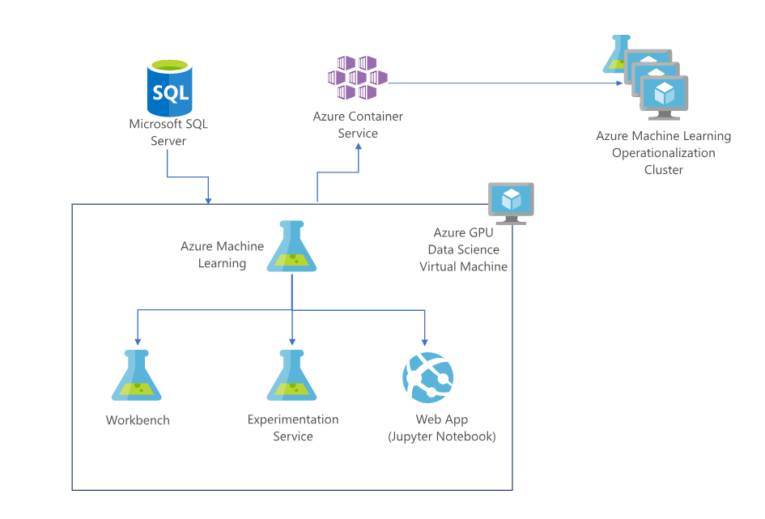

# Services for Data Science at Microsoft Azure

## Contents
1. Introduction \
   i. Data Science \
   ii. Microsoft Azure
2. Azure HDInsight
3. Azure AI \
   i. Azure Machine Learning \
   ii. Data Science Virtual Machine \
   iii. Azure Notebooks \
   iv. PowerBI
4. Conclusions
5. References


# 1 Introduction

## Data Science

Data Science is the extraction of previously unknown and potentially relevant knowledge and insight from data. It is a interdisciplinary field which lies at the intersection of Computer Science, Mathematics, Business and Programming (sometimes hacking). 

Contemporarily, it has gained traction and wide-spread attention majorly due to the following reasons:

1. Data is cheap and abundant. With the development of Web 2.0 and incoming IoT we will have access to myriad amounts of data. As an illustration, IBM estimated in 2012 that 2,5 exabytes (million of Gigabytes) were generated every day. 

2. Development of new algorithm to gain insights. With advances in Artificial Intelligence, today we have developed various new algorithm to help us extract hidden and meaningful insight from data.

3. Rise of cloud services. Cloud computing services, such as Amaazon Web Services, Google Cloud Platform and Microsoft Azure significantly help users in obtaining a scalable and elastic computing resource (IaaS) to operate Data Science at Scale. Moreover, they also provide platform with ready-to-use custom software and algorithm toolkits to help Data Scientists create applications.


## Microsoft Azure

Azure is a cloud computing solution provided and offered by Microsoft. It is commercially available since 2000 and as of May 2018 provides services in 50 regions worldwide. In 2017, KeyBanc Analysts reported that Microsoft Azure held 20% of market share in Cloud Computing, a 25% increase from the previous year making it as the second biggest provider in Cloud Computing services behind Amazon Web Services.

Currently, the number of services provided by Azure is over a hundred, ranging from the general computing instances to more specialized and sophisticated services such as HDInsight for running Spark jobs and Data Science Virtual Machines which are preconfigured with the development environment necessitated by a data science application. 


# 2. Azure HDInsight
	
Azure HDInsight is a cloud solution that provides Hadoop distribution ecosystem components. Hadoop ecosystem itself is a defacto ecosystem used for running and maintaining Big Data systems. A few examples of softwares and platform under Hadoop ecosystem are Hadoop for distributed file system, Spark for ultra-fast data processing framework and Kafka for high-troughput stream processing engine. Since the rise of Big Data marks the beginning of Data Science utilization, the ability to run and maintain Big Data system is very crucial ability for Data Scientists.

The main reason to use HDInsight instead of manually configuring and maintaining each component is that HDInsight provides extra services, maintenance and security over the Hadoop ecosystem clusters. This further translates to Data Scientists being able to focus more on working with the data and delivering values from it, without being bothered by system and hardware configuration issues. Essentially, this increases developer productivity. Furthermore, Azure HDInsight provides 99,99% reliability Service-level agreement (four nines), which essentially relates to less than 1 hour of downtime each year.

As with other Azure services, HDInsight is highly integrated with other Azure services. For example, the source of data as input to HDInsight jobs can be sourced to Azure Blob Storage and Data Lake Storage. The end result from HDInsight too can be sourced to other services, for example to PowerBI which will do visualization from the data and Azure Machine Learning for deeper analytic insights. As a real life example use case of HDInsight, consider PROS, a SaaS company which focussed on price optimization and revenue management. Utilizing Azure HDInsight allows functionality specific to running large computations with huge amounts of data. Spark jobs can be configured and run easily regardless of the size and the time required also shrank significantly. In the word of the Senior Architect at PROS Weiping Wang

``` 
“Rather than having to configure hardware to keep up with demand, Azure HDInsight allows us to keep up with demand dynamically".
```

Furthermore, to capitalize on the fact that Apache Spark is proving to be the primary work horse of Big Data applications, Azure has a unique offering: Azure Databricks. It is a collaborative Apache Spark based analytics platform optimized for Azure, designed in collaboration with the founders of Apache Spark. It is a leading innovation with one-click set up, streamlined workflows, and an interactive workspace that enables collaboration between data scientists, data engineers, and business analysts. As an Azure service, ther is native integration with other Azure services such as Power BI, SQL Data Warehouse here as well.


# 3. Azure AI

Microsoft Azure AI services serves as an end-to-end application to develop Data Science and Artificial Intelligence based projects serving a multitude of use cases across different industries. Many of the fundamental services like image recognition and speech recognition are mature products in the industry and within Microsoft Azure AI toolkit as well. Many nascent technologies like video analysis and more sophisticated language understanding and question answering tools are in preview and being currently tested. With Microsoft’s latest business positioning as cloud and AI first, and also with increasing competition from competitive services from Amazon, Google and IBM Watson among others, the services are expected to only become better with time.

A comprehensive set of flexible and trusted AI services are available in the portfolio:
* *Pre-built APIs*, such as Cognitive Services and Conversational AI with Bot tools, with possibilities for further customization
* *Custom models* with Azure Machine Learning for potentially any scenario based on Machine Learning, including Deep Learning models
* Availability of a large number of open source *frameworks*: Tensorflow, MXNet, Chainer, PyTorch, Caffe, scikit-learn, CNTK, and more

*AI infrastructure* is also provided as part of the platform which can run AI workloads anywhere at scale.
Applications can be built where the data already lives
* in the intelligent cloud
* on-premises
* on the intelligent edge(IoT)
* also, container services like Docker can also be used to run, on the Azure cloud, on premises, or on devices
	
*Innovative hardware*
AI optimized hardware is among the latest innovation areas in the AI domain and the latest GPU technology to FPGA accelerated AI models and networks are used, giving the state of the art and state of the practice for application development.


*Privacy and Security*
It claims to meet international and industry-specific compliance standards, such as ISO 27001, HIPAA, FedRAMP, and SOC Rigorous third-party audits verify Azure’s adherence to the strict security controls these standards mandate.

Other than the traditional services, there is extensive support for handling streaming and Internet of Things(IoT) data through EventHubs and Stream Analytics services. EventHubs is used for efficient data ingestion for distributed computations and real time performance.


## Building Applications

As mentioned previously, there are primarily two ways to build applications: using the provided Azure APIs(Cognitive Services and Bot Services) and create own custom applications.


### Cognitive Services APIs

In the data processing pipeline, the following is the level of flexibility available:

Prepare data: Already built-in or bring your own data
Build & train: Already built-in
Deploy: Add to your application

Here, it is possible to use the already existing data for training or to use train the models on custom data too. Own data, specific to the use case, can be used to retrain the models. Many models, in open source frameworks are trained on ImageNet. The bias of the training data affects the learned model too. In the case of ImageNet, the images are majorly based on animals.

There are simple demos also available for most of the APIs. The following is the categorization of the various API endpoints:

1. Vision
2. Speech
3. Language
4. Knowledge
5. Search

### 1. Vision

*Computer Vision (Images)* 
> Image classification \
> Object, Scene and Activity Recognition \
> Celebrity and Landmark recognition \
> Optical Character Recognition (OCR) \
> Handwriting Recognition

*Face (in Images)* 
> Face detection \
> Person identification \
> Emotion recognition \
> Similar face recognition and grouping

*Video Indexer (Videos)* 
> Face detection \
> Object, Scene and Activity Recognition \
> Metadata, audio, keyframe extraction and analysis

### 2. Speech (in Preview)

*Speech to Text* 
> Automatic speech recognition and speech transcription (speech-to-text) \
> Customizable speech recognition and speech transcription (speech-to-text) \
> Customizable speech models for unique vocabularies or accents

*Speaker Recognition* 
> Speaker identification \
> Speaker verification

*Text to Speech* 
> Automatic text-to-speech \
> Customizable voice fonts for text-to-speech

*Speech Translation* 
> Real-time translation \
> Automated speech translation \
> Customizable translation

### 3. Language

*Text Analytics* 
> Named Entity Recognition \
> Key phrase extraction \
> Text sentiment analysis 

*Translator Text* 
> Automatic language detection \
> Automated text translation \
> Customizable translation

*Bing Spell Check* 
> Web-scale, multi-lingual spell checking \
> Contextual spell checking

*Content Moderator* 
> Explicit or offensive content moderation for text \
> Personally Identifiable Information(PII) detection for text moderation

*Language Understanding* 
> Contextual language understanding


### 4. Knowledge

*QnA Maker* 
> QnA extraction from unstructured text \
> Knowledge base creation from collections of Q&As \
> Semantic matching for knowledge bases

*Custom Decision* 
> Customizable content personalization

### 5. Search

*Bing Web Search* 
> Ad-free web search \
> Safe web search \
> Location-aware web search

*Bing Visual Search* 
> Image identification and classification \
> Knowledge acquisition from images \
> Identification of similar images

*Bing Custom Search* 
> Custom search engine creation \
> Ad-free custom search results

*Bing Entity Search* 
> Named entity recognition and classification \
> Knowledge acquisition for named entities

*Bing Video Search* 
> Ad-free video search \
> Video topic and trend identification

*Bing News Search* 
> Ad-free news search results \
> Trending topic identification

*Bing Image Search* 
> Ad-free image search

*Bing Autosuggest*


### Bot Services
https://azure.microsoft.com/en-us/services/bot-service/


## Building Custom Models

There are primarily the following services which support functionalities to develop a completely customized Data Science application.

* Azure Machine Learning Studio
* Azure Machine Learning Services
* Data Science Virtual Machine


### Azure Machine Learning Studio

Azure Machine Learning Studio is a collaborative, drag-and-drop tool which can be used to build, test, and deploy predictive analytics solutions on data.

<p align="center"></p>

### Azure Machine Learning services (preview) 

Azure Machine Learning Services enable building, deploying, and managing machine learning and AI models using any Python tools and libraries. A wide variety of data and compute services are available in Azure which can be used to store and process the data. It is an integrated, end-to-end data science and advanced analytics solution, enabling data scientists to prepare data, develop experiments, and deploy models at cloud scale.

<p align="center"></p>

The main components of Azure Machine Learning are:

*Azure Machine Learning Workbench*
To manage machine learning solutions through the entire data science life cycle: Data ingestion and preparation, Model development and experiment management, Model deployment in various target environments

*Azure Machine Learning Experimentation Service*
It handles the execution of machine learning experiments. It also supports the Workbench by providing project management, Git integration, access control, roaming, and sharing

*Azure Machine Learning Model Management Service*
Model Management Service allows data scientists and dev-ops teams to deploy predictive models into a wide variety of environments. Model versions are tracked from training runs to deployments. Models are stored, registered, and managed in the cloud.

*Microsoft Machine Learning Libraries for Apache Spark (MMLSpark Library)*
It is an open-source Spark package that provides deep learning and data science tools for Apache Spark. It integrates Spark Machine Learning Pipelines with the Microsoft Cognitive Toolkit and OpenCV library.

*Visual Studio Code Tools for AI*
an extension in Visual Studio Code to build, test, and deploy Deep Learning and AI solutions

Azure Machine Learning is built on top of the open source technologies like Jupyter Notebook, Apache Spark, Docker, Kubernetes, Python, Conda. Additionally, these leading open source frameworks are also available for development: Tensorflow, Pytorch, Scikit-learn, Caffe2
MxNet, Chainer, Onnx, Azure Cognitive Toolkit.

### Data Science Virtual Machine (DSVM)

DSVMs are Azure Virtual Machine images, pre-installed, configured and tested with several popular tools that are commonly used for data analytics, machine learning and AI training. The purpose of these Virtual Machine images is so that by having pre-installed software stacks on Azure Virtual Machine, Data Scientists can save time from installing the required tools and troubleshooting problems should improper installations were made and having optimal configurations for these tools.

Included in the images are tools, languages and framework stacks that are commonly used by Data Scientists. For example, as Machine Learning and AI tools it included TensorFlow, H2O AI and Anaconda, as Data Platforms it includes Hadoop ecosystem software like Hadoop, Spark and Kafka, for the development languages it supports Java, Julia, Python, R and C# which are must have for Data Scientists. A hidden but severe pain point when setting up environment for Data Scientist work is make sure all of them are conflict free. Packages for Python based tool and frameworks are prone to package conflict and careful calibration and installation are required. Azure Data Science Virtual Machine ensure that those problems are already taken care of.

In terms of infrastructure, Data Scientists can enjoy full access to Azure Virtual Machine, especially Graphic Processing Unit instances. Nowadays, a number of Machine Learning models, particularly Neural Networks are highly utilizing Graphic Processing Unit to speed up the training process. Azure Virtual Machine provides access to nVIDIA K80 GPU and nVIDIA V100 GPU with reasonably affordable price (.9$ and 3.06$  respectively), comparable to its competitor like Amazon’s price. The Virtual Machine Image itself is free.	As a real life case study, consider Adrian Rosebrock, author of PyImageSearch, a blog which focuses on educating Computer Vision using Machine Learning and author of “Deep Learning for Computer Vision”. In his blog, he describes his pleasant experiences using these Virtual Machine Image. With all tools already pre-installed and available, he managed to run experiments using wide range of tools immediately and swiftly. For example, he managed to run the famous LeNet network architecture to process MNIST data directly. In addition, all codes from his book appears to run smoothly as well.

In our opinion, these Virtual Machine Images are very suitable for Data Scientists student so they can focus on learning the algorithm, tools and aspect of Data Science swiftly without being slowed down with difficulty on configuring the environment. Same reasons can be applied as well for Data Scientists to do swift modelling and prototyping to test their hypotheses. The next step is that the result of modelling and prototyping can be applied to the larger and more complex production environments such as HDInsight.


### Azure Notebooks

Interactive notebooks are starting more popular as an environment to do the coding and modelling for the data science. Even though the utilization of notebook for programming itself is quite old with Wolfram Mathematica and Matlab serves as the pioneer, it started to get more popularity with open sourced tools such as Jupyter, Apache Zeppelin and R Markdown.

Notebooks are frequently used by data scientists for prototyping and modelling tasks. It can be highly integrated to the computing and the data storage environment without a need for extra effort. Furthermore, notebooks is an excellent medium to share the works and result of a data scientist to the others. Jupyter for example support Markdown and LaTeX scripting, allowing detailed documentation and mathematical equations to be embedded with the code and results. In addition, modern notebooks can be accessed directly with web browser. In short the notebook provided a medium to convey code, information and knowledge interactively.
Azure Notebooks provides a platform for Data Scientists to host, run and share these notebooks. It supports Jupyter, one of the most famous notebook for data science. In addition it also supports Python 2, Python 3, F# and R as the runtime to execute the code in the notebooks. Furthermore, it also supports various plotting libraries such as ggplot, matplotlib, bokeh, and seaborn. 

For example, a Data Scientist can use Notebook to prototype and explore the data. As he write the code being used, he could also add documentation such as justification, details and even equations that are relevant for this task. Ultimately, the notebook can be shared and others can easily view the entire process, read the explanations given and try to run the code, see the results directly and tinkered it to achieve different results and hypotheses. All in all, Notebooks provided an excellent environment to disseminate Data Science findings and evolve those finding to gain new knowledge and insights

### PowerBI

PowerBI is a business analytic tool suites that help deliver more insights from the daya. It is integrated to various data sources and able to do prep and ad-hoc analysis out of it. It is also suitable to produce report and visualization, and publish them to relevant stakeholder.

Visualization remains an integral part of Data Science process. Visualization allows Data Scientists to explore visually what the data looks like, and what kind of distribution the data have. Information and insights captures from such initial exploratory will be very crucial as it can affect the entire cycle of the Data Science process. Explicitly, looking at the visualization of data, Data Scientists will decide what kind of data preprocess, which arguably consumes 70% the time. Furthermore, it will also having effect on what kind of Algorithm that can be used and what value that can be harvested from these data.

Visualization also can be used  as an effective method to convey these findings to the relevant stakeholders of the data. Visualization remains a powerful and effective tool to build narrative and serve as a story-telling tool to convey crucial insight from the data. From visualization, we can have easier way to discover trends and outlier from the data for example.

PowerBI provides unique dashboard to build relevant and needed visualization. PowerBI supports wide range of data source type, from simple and common data like Excel workbook to complex and massive Big Data like Hive cluster from Azure HDInsight.
The main point of PowerBI is the excellent support for integrating data sources to add contex of the information from the data. Consider a sales data from a global company for example. In addition to aggregate the data and build OLAP database, it is also possible to integrate those information to say Bing Map. That way, we can impose those aggregated data to interactive map provided by Bing. Analysts will be able to deliver deeper insight since a visual geography information will add the context and insight to the data that we have.


### Some case studies

https://customers.microsoft.com/en-us/story/schneider-electric-process-mfg-resources-azure-machine-learning

https://azure.microsoft.com/en-us/solutions/architecture/information-discovery-with-deep-learning-and-nlp/
<p align="center"></p>


Accenture
Create a FAQ service from existing content
https://azure.microsoft.com/en-us/services/cognitive-services/qna-maker/

<p align="center"></p>


# 4. Conclusions

Overall, based on our readings and use of the services, it seems like Azure services for Data Science are at the state of the practice of the field. Additionally, some services like Azure DataBricks, Azure Data Science Virtual Machine and additionally the potential to integrate all Azure services with existing Microsoft services and within the Azure ecosystem is quite beneficial. Since, this provides possibilities to integrate with more buusiness oriented tools as well like Excel, PowerBI and SharePoint. In most respects it rivals the competing services provided by other companies and this has also been found by other industry practitioners.[3] Additionally, there exist some certifications and training provided by Microsoft to get up to speed with Data Science and the usage of their services on their own platforms as well as on MOOC platforms like Udemy and edX.[4]

The business focus in general for Microsoft is increasingly directed to cloud and AI services. Moreover, the research prowess of Microsoft Research with its worldwide research centres benefit from decades of AI investment. Internally, Microsoft products like Bing, Office, Windows, Xbox, and others have lately come to be fairly AI-driven products. This leads to many proven pre-built AI models being available to be used directly in data science applications built on Azure.


# 5. References

1. Overview of Microsoft Azure AI Platform, https://azure.microsoft.com/en-us/overview/ai-platform/
2. Overview and samples for Azure Machine Learning Service, https://docs.microsoft.com/en-us/azure/machine-learning/service/
3. Comparison of some MLaaS, https://www.altexsoft.com/blog/datascience/comparing-machine-learning-as-a-service-amazon-microsoft-azure-google-cloud-ai/
4. Microsoft Certifications for Data Science, https://azure.github.io/learnAnalytics-public/cert_guides/certification_70-774_community_guide.html

