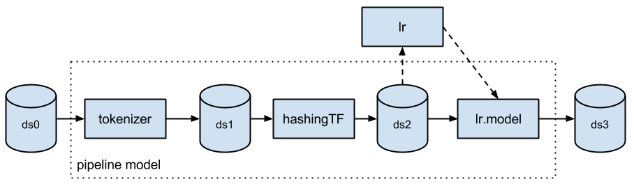

# Spark


* [What is Spark?](https://github.com/IreneMLC/CCBDA2018/tree/master/Research-topic#what-is-spark)
* [Rise, usage and perception](https://github.com/IreneMLC/CCBDA2018/tree/master/Research-topic#rise-usage-and-perception)
	* [Early years](https://github.com/IreneMLC/CCBDA2018/tree/master/Research-topic#early-years)
	* [2015](https://github.com/IreneMLC/CCBDA2018/tree/master/Research-topic#2015)
	* [2016](https://github.com/IreneMLC/CCBDA2018/tree/master/Research-topic#2016)
	* [2017](https://github.com/IreneMLC/CCBDA2018/tree/master/Research-topic#2017)
* [Spark Stack](https://github.com/IreneMLC/CCBDA2018/tree/master/Research-topic#spark-stack)
	* [Spark Core](https://github.com/IreneMLC/CCBDA2018/tree/master/Research-topic#spark-core)
		* [RDDs](https://github.com/IreneMLC/CCBDA2018/tree/master/Research-topic#rdds)
	* [Spark SQL](https://github.com/IreneMLC/CCBDA2018/tree/master/Research-topic#spark-sql)
		* [DataFrames](https://github.com/IreneMLC/CCBDA2018/tree/master/Research-topic#dataframes)
	* [MLib](https://github.com/IreneMLC/CCBDA2018/tree/master/Research-topic#mlib)
	    * [Dataset](https://github.com/IreneMLC/CCBDA2018/tree/master/Research-topic#dataset)
	    * [ML Pipelines](https://github.com/IreneMLC/CCBDA2018/tree/master/Research-topic#ml-pipelines)
	    * [Working of ML Pipelines](https://github.com/IreneMLC/CCBDA2018/tree/master/Research-topic#working-of-ml-pipelines)
	* [Spark Streaming](https://github.com/IreneMLC/CCBDA2018/tree/master/Research-topic#spark-streaming)
	* [Spark GraphX](https://github.com/IreneMLC/CCBDA2018/tree/master/Research-topic#spark-graphx)
* [Spark Programming Languages](https://github.com/IreneMLC/CCBDA2018/tree/master/Research-topic#spark-programming-languages)
* [Spark Packages](https://github.com/IreneMLC/CCBDA2018/tree/master/Research-topic#spark-packages)
* [Spark in Cloud](https://github.com/IreneMLC/CCBDA2018/tree/master/Research-topic#spark-in-cloud)
    * [Spark in AWS Cloud](https://github.com/IreneMLC/CCBDA2018/tree/master/Research-topic#spark-in-aws-cloud)
        * [EMR](https://github.com/IreneMLC/CCBDA2018/tree/master/Research-topic#emr)
        * [Build own cluster on EC2](https://github.com/IreneMLC/CCBDA2018/tree/master/Research-topic#build-own-cluster-on-ec2)
    * [Spark in Google Cloud](https://github.com/IreneMLC/CCBDA2018/tree/master/Research-topic#spark-in-google-cloud)
* [Conclusions](https://github.com/IreneMLC/CCBDA2018/tree/master/Research-topic#conclusions)
* [References](https://github.com/IreneMLC/CCBDA2018/tree/master/Research-topic#references)


## What is Spark?


Spark is a cluster computing platform designed to be fast and general purpose, making data processing easy and accessible. It was developed on 2009 at the AMPLab of the University of California, Berkeley with the objective of becoming a unified engine for distributed data processing. On 2013, it was taken on by the Apache Software Foundation and it is to date one of the most active projects managed by it, with a huge community of individual contributors and corporate backers such as Databricks, IBM, Yahoo!, Intel and China's Huawei <sub>4</sub>. 

It provides high-level APIs in Java, Scala, Python and R, as well as an optimized engine that supports general execution graphs. The Spark stack is comprised of Spark Core and four libraries or modules: Spark SQL, MLib, Spark Streaming and GraphX. Each library is optimized to address the requirements of different use cases and although most applications require Spark Core and one of the libraries, the true perks of the stack appear in applications that require the combination of more than one library. 

Spark can run either as standalone, where all Spark processes are run within the same Java Virtual Machine process, or as part of a cluster, with the later being the most common since a single device is generally not enough for production workloads. 

The following cluster managers have official support as of this date:

* Standalone: Simple cluster manager included with Spark that uses the stack’s built-in job-scheduling framework and makes it easy to set up a cluster.
* Apache Mesos: General cluster manager that can also run Hadoop MapReduce and service applications. It is open-source and very popular as well.
* Hadoop YARN: A cluster-computing and resource-scheduling framework used also on Hadoop V2.
* Kubernetes: An open-source system for automating deployment, scaling, and management of containerized applications.

</br>

When investigating about Spark it is common to also run into questions about another big data framework, Hadoop, which could be seen more as a base or predecessor than as an alternative for most implementations.

Hadoop started on 2006, as a new project under Lucene umbrella, which consisted of the Hadoop Common core libraries, HDFS and MapReduce <sub>14</sub>.

* Hadoop Common: Apache Foundation’s set of utilities and libraries that can be used by other modules within the Hadoop ecosystem. 
* HDFS (Hadoop Distributed File System) The default big data storage layer for Apache Hadoop, which creates several replicas of the data block to be distributed across different clusters for reliable and quick data access. 

* MapReduce: Software framework used to write applications that simultaneously process vast amounts of data on large clusters of commodity hardware in a reliable, fault-tolerant manner. It is a batch-oriented model where a large amount of data is stored in HDFS, and the computation on data is performed as MapReduce phases. The basic principle for the MapReduce framework is to move computed data rather than move data over the network for computation. MapReduce works on any problem that is made up of exactly 2 functions at some level of abstraction: 
	* Map: Execute the same operation on all data in the input set 
	* Reduce: Execute the same operation on each group of data produced by Map 

This means that not all algorithms can be efficiently implemented with the MapReduce programming model, which was one of Hadoop’s limitations. 


Another one of the issues with the first version of Hadoop was that MapReduce had too many responsibilities, being in charge of all functions above the HDFS layer, this meant all higher-level frameworks had to build on top of MapReduce, which was particularly bad because the batch oriented nature of MapReduce increased the latency of application frameworks build on top of it. The performance of iterative queries, usually required by machine learning and graph processing algorithms, took the biggest toll. YARN was adopted on 2012 as a more general and flexible platform atop HDFS and established as a Hadoop subproject. 

<p align="center">
  Frameworks built on top of HDFS and YARN <sub>14</sub>
</p>


 
Spark is also a big data framework and it has a programming model similar to MapReduce but extends it with a data-sharing abstraction called “Resilient Distributed Datasets” or RDDs. Using this extension, Spark can capture a wide range of processing workloads that previously needed separate engines. These implementations use the same optimizations as specialized engines and achieve similar performance but run as libraries over a common engine, making integration and implementation much simpler. 


Since Spark core concept is an in-memory execution model that enables caching job data in memory, it means that it is able to process data quicker than alternative approaches like Hadoop's MapReduce, which writes data to and from computer hard drives between each stage of processing. Its proponents claim that Spark running in memory can be 100 times faster than Hadoop MapReduce, but also 10 times faster when processing disk-based data in a similar way to Hadoop MapReduce itself <sub>15</sub>. Nevertheless, in batch processing, solutions like MapReduce still excel.

Spark performance, as measured by processing speed, has been found to be usually better than Hadoop’s for the following reasons <sub>5</sub>:  

1.	Spark is not bound by input-output concerns every time it runs a selected part of a MapReduce task. 
2.	Spark’s DAGs enable optimizations between steps. Hadoop does not have any cyclical connection between MapReduce steps, meaning no performance tuning can occur at that level.


Another advantage of Spark is its improved usability, by having a much better API than the classic MapReduce and supporting several popular programming languages, which make Spark’s adoption easier and faster. 


Although Spark was originally intended to fit into the Hadoop ecosystem, since it did not have a storage layer and the targeted user base was the one who already had their data in HDFS <sub>12</sub>, today it can be used with many different storage systems aside from HDFS, such as HBase and Amazon’s S3. It can also use YARN as a cluster manager but it is not limited to it. 


<p align="center"></p>
<p align="center">More generalized view of the Spark stack <sub>14</sub></p>


## Rise, usage and perception


### Early years

A historical analysis of Spark’s impact on the development community from its beginning to 2015, compared to other big data technologies showed the following results<sub>10</sub>:

<p align="center"></p>

These StackOverflow results were skewed since the “spark” tag used on site contained Flex Spark (part of the old Adobe Flex) as well as Apache Spark, nevertheless, the spike noticed was undoubtedly due to Apache Spark since it almost coincides with two major events that could have generated growth on the Spark community:

* The adoption of the project by the Apache foundation
* The foundation of Databricks, a moving force behind Spark’s development.


Another data source analyzed was Google Trends<sub>16</sub>, obtaining results similar to those of StackOverflow, but with the increasing popularity curve being much softer. This might be due to a more consistent increase on the popularity of the platform throughout the web that had a major boom which reflected on specific community sites.


<p align="center"></p>


### 2015

The 2015 Spark Survey from Databricks <sub>6</sub> which collected answers from 1417 respondents representing 842 organizations indicated a rapid growth of the Spark community, with the following main takeaways:

* Spark adoption was growing rapidly: 
	* Most active open source project in Big Data with over 600 contributors in the last 12 months, doubled from the previous year. The number of assistants to the Spark Summit Conferences more than doubled when compared with 2014.
	* 69% of respondents were creating two or more data products with Spark
	* Spark was being embraced by companies far beyond the IT industry and by different types of professionals

* Spark use was growing beyond Hadoop: Users running Spark in on premise Hadoop clusters were becoming the minority, with public cloud and Spark’s own cluster manager taking over.

* Spark was increasing access to big data: The ability to program in the language of their choice is a big factor for Spark adopters, that wanted to expand into the areas of advanced analytics and real-time streaming while building foundations on data warehousing and BI.


**Most popular use cases:**


<p align="center"></p>


### 2016

On 2016, the Taneja Group in partnership with Cloudera did a Spark market research<sub>8</sub> developed by surveying nearly seven thousand qualified individuals working with big data from around the world with roles like data scientists, engineers, consultants, admins, big data managers and IT professionals. They selected companies of different sizes, industries and big data maturities, obtaining the following findings:

* 54% of respondents were already actively using Spark to solve a primary organizational use case. 

* 64% of active Spark users were planning to notably increase and expand their usage within the next 12 months. While another 40% of those familiar with Spark but not yet using it had made plans to adopt it soon. 


**The most popular use cases were:**

* Data Processing/Engineering/ETL - 55%
* Real-time Stream Processing - 44% 
* Exploratory Data Science - 33% 
* Machine Learning - 33%
* Customer intelligence - 31%
* Business Intelligence/Data warehousing - 29%


When comparing these results with the ones from Databricks’ 2015 survey we observe that the most popular use cases changed in one year, which might be an indicator of an evolution on the user base, the creation of new ideas resulting from Spark’s flexibility and the fast pace at which new solutions are being implemented in the industry. 

The percentages obtained also show that many organizations indicated that Spark was already being applied to more than one important type of use case; production big data solutions are actually pipelines of activities that span from data acquisition and ingest through full data processing and disposition. This trend towards deploying Spark as a platform for multiple workloads perfectly fits what it was designed to do and one of Spark’s strongest points: being able to support different kinds of organizational needs in one distribution. 


**Reasons cited for using Spark**

* Improved performance was key for most - 74%
* Advanced Analytics including machine learning - 49%
* Stream Processing is a surprisingly popular motivation - 42%
* Ease of Programming helped convince many - 37%.


**Internal challenges to wider Spark adoption**

* Significant skills/training gap - 60%
* Complexity in learning/integrating Spark – 35%
* Significant cultural barriers - 26%
* Open source concerns - 18%
* Lack of enterprise management features in their current source - 15%


### 2017

On 2017, The Data Incubator’s blog created a ranking of the top distributed computing packages that are useful for Data Science, based on GitHub and Stack Overflow activity, as well as Google Search results<sub>11</sub>. The table shows standardized scores, where a value of 1 means one standard deviation above average, which is represented by a score of 0.


<p align="center"></p>


Apache Spark was ranked number 1 dominating the Github activity metric with its numbers of forks and stars more than eight standard deviations above the mean. Apache Hadoop outperformed Apache Spark in Stack Overflow activity but this could be an inflated result deriving from the fact that the term “Hadoop” refers not only to the framework, but can also mean all Hadoop-related projects that make up the ecosystem.


## Spark Stack


As mentioned before, Spark contains several closely integrated components with specific functions that can be used to solve a variety of problems which previously required the use of different frameworks. These components let the user combine them like libraries in a software project and form what is known as the Spark Stack. 

The base of the stack is the Spark Core and on top of it rest four modules optimized for tasks of data management, streaming, machine learning and graph processing. Among the many benefits of having an architecture such as this one are that for any improvement made on the lower levels of the Stack the benefits extend to the modules on top of it, it is easy to scale by using adding another module for a new functionality and the costs associated with the solutions developed and their maintenance are lower since everything runs on top of the same base profiting off a seamless communication between different modules.


<p align="center"></p>
<p align="center">Main Spark components and their interactions <sub>1</sub></p>


### Spark Core

It is the module that contains the basic functionalities of Spark, such as task scheduling, memory management, fault recovery and storage systems’ interaction. It contains the API which defines and allows managing the Resilient Distributed Datasets (RDDs), the base of the whole stack and one of the keys to its success.


#### RDDs

Resilient Distributed Datasets (RDDs) are Spark’s key programming abstractions and consist of fault-tolerant collections of items distributed across many computer nodes that can be manipulated in parallel.

Unlike Hadoop, in Spark computations are carried out in memory and stored there, until the user actively persists them. When starting an operation Spark reads data from a file on a compatible filestore (such as HDFS, S3, etc) into the SparkContext, out of which the RDD is created as an immutable collection of elements that can be operated on in parallel. It is important for them to be immutable since this helps make them fault-tolerant, since the chain of transformations over the RDDs is logged and can be repeated in the event of data loss or the failure of a cluster node

Spark also creates a Directed Acyclic Graph (DAG) along with the RDD, to visualize the order of operations and the relationship between the operations in the DAG. The user can then perform transformations, intermediate steps, actions, or final steps on the RDDs; the results of a given transformation go into the DAG and do not persist to disk, ideally only when the final result is obtained the data in memory is persisted<sub>4</sub>.


### Spark SQL

Spark SQL is a module that allows working with structured data using either SQL or the DataFrame API. It is designed to support workloads that combine familiar SQL database queries with more complicated, algorithm-based analytics; it also enables a degree of integration with existing databases, data warehouses and business intelligence tools. The current module is the successor of an older project from the University of California, Berkeley called Shark.


#### DataFrames

DataFrames are high-level abstractions for basic data transformations, which were common for tabular data in R and Python and were added to Spark on its 2.0 version as a companion interface on top of RDDs. Since then, SparkSQL allows users to query DataFrames in a similar manner to SQL tables in relational databases.  

DataFrames are immutable distributed collection of data like RDDs, but unlike the latter which do not have a set of column-level header references, DataFrames organize data into named columns, similar to Python’s pandas or R packages, making them more user-friendly. They let developers impose a structure onto a distributed collection of data, allowing higher-level abstraction and providing a domain specific language API to manipulate the data, making Spark more accessible to a less specialized audience.


### MLib
MLlib is Apache Spark's scalable machine learning library. It is designed for simplicity, scalability, and easy integration with other tools. With the scalability, language compatibility, and speed of Spark, data scientists can solve and iterate through their data problems faster. Its goal is to make practical machine learning scalable and easy.

<p align="center"></p>

Many common machine learning and statistical algorithms have been implemented and are shipped with MLlib which simplifies large scale machine learning pipelines, including:

* ML Algorithms: common learning algorithms such as classification, regression, clustering, and collaborative filtering
* Featurization: feature extraction and transformation functions, dimensionality reduction, and selection
* Pipelines: tools for constructing, evaluating, and tuning ML Pipelines
* Persistence: saving and load algorithms, models, and Pipelines
* Utilities: linear algebra, statistics, data handling, etc.

In detail, it can provide the following functions and analysis:

* Summary statistics, correlations, stratified sampling, hypothesis testing, random data generation
* Classification and regression: support vector machines, logistic regression, linear regression, decision trees, naive Bayes classification
* Collaborative filtering techniques including alternating least squares (ALS)
* Cluster analysis methods including k-means, and latent Dirichlet allocation (LDA)
* Dimensionality reduction techniques such as singular value decomposition (SVD), and principal component analysis (PCA)
* Optimization algorithms such as stochastic gradient descent, limited-memory BFGS (L-BFGS)

<p align="center"></p>

Spark MLlib is a distributed machine learning framework on top of Spark Core.  Due to its large part to the distributed memory-based Spark architecture, Spark MLlib is as much as nine times as fast as the disk-based implementation used by Apache Mahout (according to benchmarks done by the MLlib developers against the alternating least squares (ALS) implementations, and before Mahout itself gained a Spark interface), and scales better than Vowpal Wabbit.

From the inception of the Apache Spark project, MLlib was considered foundational for Spark’s success. The key benefit of MLlib is that it allows data scientists to focus on their data problems and models instead of solving the complexities surrounding distributed data (such as infrastructure, configurations, and so on). The data engineers can focus on distributed systems engineering using Spark’s easy-to-use APIs, while the data scientists can leverage the scale and speed of Spark core. Just as important, Spark MLlib is a general-purpose library, providing algorithms for most use cases while at the same time allowing the community to build upon and extend it for specialized use cases.

#### Dataset

A Dataset is a distributed collection of data. Dataset is a new interface added in Spark 1.6 that provides the benefits of RDDs (strong typing, ability to use powerful lambda functions) with the benefits of Spark SQL’s optimized execution engine. A Dataset can be constructed from JVM objects and then manipulated using functional transformations (map, flatMap, filter, etc.). The Dataset API is available in Scala and Java. Python does not have the support for the Dataset API. But due to Python’s dynamic nature, many of the benefits of the Dataset API are already available (i.e. you can access the field of a row by name naturally row.columnName). The case for R is similar.

<p align="center"></p>

The goal of Spark Datasets is to provide an API that allows users to easily express transformations on domain objects, while also providing the performance and benefits of the robust Spark SQL execution engine.

Dataset, by contrast, is a collection of strongly-typed JVM objects, dictated by a case class you define, in Scala or Java. Because of unification, developers now have fewer concepts to learn or remember, and work with a single high-level and type-safe API called Dataset.

```
    // Define a case class that represents our type-specific Scala JVM Object
    case class Person (email: String, iq: Long, name: String)

    // Read JSON file and convert to Dataset using the case class
    val ds = spark.read.json("…").as[Person]
```

#### ML Pipelines

In machine learning, it is common to run a sequence of algorithms to process and learn from data. E.g., a simple text document processing workflow might include several stages:

* Split each document’s text into words
* Convert each document’s words into a numerical feature vector
* Learn a prediction model using the feature vectors and labels

MLlib represents such a workflow as a Pipeline, which consists of a sequence of PipelineStages (Transformers and Estimators) to be run in a specific order. We will use this simple workflow as a running example in this section.

Typically when running machine learning algorithms, it involves a sequence of tasks including pre-processing, feature extraction, model fitting, and validation stages. For example, when classifying text documents might involve text segmentation and cleaning, extracting features, and training a classification model with cross-validation. Though there are many libraries we can use for each stage, connecting the dots is not as easy as it may look, especially with large-scale datasets. Most ML libraries are not designed for distributed computation or they do not provide native support for pipeline creation and tuning.

<p align="center"></p>

The ML Pipelines is a High-Level API for MLlib that lives under the “spark.ml” package. A pipeline consists of a sequence of stages. There are two basic types of pipeline stages: Transformer and Estimator. A Transformer takes a dataset as input and produces an augmented dataset as output. E.g., a tokenizer is a Transformer that transforms a dataset with text into an dataset with tokenized words. An Estimator must be first fit on the input dataset to produce a model, which is a Transformer that transforms the input dataset. E.g., logistic regression is an Estimator that trains on a dataset with labels and features and produces a logistic regression model.

#### Working of ML Pipelines

A Pipeline is specified as a sequence of stages, and each stage is either a Transformer or an Estimator. These stages are run in order, and the input DataFrame is transformed as it passes through each stage. For Transformer stages, the transform()method is called on the DataFrame. For Estimator stages, the fit() method is called to produce a Transformer (which becomes part of the PipelineModel, or fitted Pipeline), and that Transformer’s transform() method is called on the DataFrame.

We illustrate this for the simple text document workflow. The figure below is for the training time usage of a Pipeline.

<p align="center"></p>

Above, the top row represents a Pipeline with three stages. The first two (Tokenizer and HashingTF) are Transformers (blue), and the third (LogisticRegression) is an Estimator (red). The bottom row represents data flowing through the pipeline, where cylinders indicate DataFrames. The Pipeline.fit() method is called on the original DataFrame, which has raw text documents and labels. The Tokenizer.transform() method splits the raw text documents into words, adding a new column with words to the DataFrame. The HashingTF.transform() method converts the words column into feature vectors, adding a new column with those vectors to the DataFrame. Now, since LogisticRegression is an Estimator, the Pipeline first calls LogisticRegression.fit() to produce a LogisticRegressionModel. If the Pipeline had more stages, it would call the LogisticRegressionModel’s transform() method on the DataFrame before passing the DataFrame to the next stage.

A Pipeline is an Estimator. Thus, after a Pipeline’s fit() method runs, it produces a PipelineModel, which is a Transformer. This PipelineModel is used at test time; the figure below illustrates this usage.

<p align="center"></p>

In the figure above, the PipelineModel has the same number of stages as the original Pipeline, but all Estimators in the original Pipeline have become Transformers. When the PipelineModel’s transform() method is called on a test dataset, the data are passed through the fitted pipeline in order. Each stage’s transform() method updates the dataset and passes it to the next stage.

Pipelines and PipelineModels help to ensure that training and test data go through identical feature processing steps.

### Spark Streaming

Spark module that enables scalable and fault-tolerant processing of live streams of data. It can be integrated with different sources of data streams and uses the RDDs to ensure that applications written for streaming data can be easily adapted to analyze batches of historical data as well. 


### Spark GraphX

Spark module for manipulating and performing computations over graphs of data. It includes a library made of many popular graph algorithms and extends the RDD API to enable the creation of directed graphs with arbitrary properties attached to each vertex and edge.


## Spark Programming Languages

Programming languages supported by Spark include:
* <a href="https://spark.apache.org/docs/latest/api/java/index.html" target="_blank">Java</a>
* <a href="https://spark.apache.org/docs/latest/api/python/index.html" target="_blank">Python</a>
* <a href="https://spark.apache.org/docs/latest/api/scala/index.html" target="_blank">Scala</a>
* <a href="https://spark.apache.org/docs/latest/sql-programming-guide.html" target="_blank">SQL</a>
* <a href="https://spark.apache.org/docs/latest/api/R/index.html" target="_blank">R</a>

Languages like Python are often regarded as poorly performing languages, especially in relation to alternatives such as Java. Although this concern is justified in some development environments, it is less significant in the distributed cluster model in which Spark will typically be deployed. Any slight loss of performance introduced by the use of Python can be compensated for elsewhere in the design and operation of the cluster. Familiarity with your chosen language is likely to be far more important than the raw speed of code prepared in that language.

<p align="center"></p>

Extensive examples and tutorials exist for Spark in a number of places, including the Apache Spark project website itself. These tutorials normally include code snippets in Java, Python and Scala.

The Structured Query Language, SQL, is widely used in relational databases, and simple SQL queries are normally well-understood by developers, data scientists and others who are familiar with asking questions of any data storage system. The Apache Spark module--Spark SQL--offers native support for SQL and simplifies the process of querying data stored in Spark's own Resilient Distributed Dataset model, alongside data from external sources such as relational databases and data warehouses.

Support for the data science package, R, is more recent. The SparkR package first appeared in release 1.4 of Apache Spark (in June 2015), but given the popularity of R among data scientists and statisticians, it is likely to prove an important addition to Spark's set of supported languages.

```
    text_file = sc.textFile("hdfs://...")
    counts = text_file.flatMap(lambda line: line.split(" ")) \
                .map(lambda word: (word, 1)) \
                .reduceByKey(lambda a, b: a + b)
    counts.saveAsTextFile("hdfs://...")
```
<p align="center">Word Count Example in Python</p>

```
    val textFile = sc.textFile("hdfs://...")
    val counts = textFile.flatMap(line => line.split(" "))
                     .map(word => (word, 1))
                     .reduceByKey(_ + _)
    counts.saveAsTextFile("hdfs://...")
```
<p align="center">Word Count Example in Scala</p>

```
    JavaRDD<String> textFile = sc.textFile("hdfs://...");
    JavaPairRDD<String, Integer> counts = textFile
        .flatMap(s -> Arrays.asList(s.split(" ")).iterator())
        .mapToPair(word -> new Tuple2<>(word, 1))
        .reduceByKey((a, b) -> a + b);
    counts.saveAsTextFile("hdfs://...");
```
<p align="center">Word Count Example in Java</p>

## Spark Packages

Spark Packages features integrations with various data sources, management tools, higher level domain-specific libraries, machine learning algorithms, code samples, and other Spark content. Examples packages include Spark-CSV (which is now included in Spark 2.0) and Spark ML integration packages including GraphFrames and TensorFrames.

<a href="https://spark-packages.org/" target="_blank">spark-packages.org</a> is a community package index to track the growing number of open source packages and libraries that work with Apache Spark. Spark Packages makes it easy for users to find, discuss, rate, and install packages for any version of Spark and makes it easy for developers to contribute packages.

## Spark in Cloud

Spark can be deployed in a traditional on-premises data center as well as in the cloud. The cloud allows organizations to deploy Spark without the need to acquire hardware or specific setup expertise. Enterprise Strategy Group (<a href="http://esg-global.com/" target="_blank">esg-global.com</a>) found 43% of respondents considering cloud as their primary deployment for Spark. The top reasons customers perceived the cloud as an advantage for Spark are faster time to deployment, better availability, more frequent feature/functionality updates, more elasticity, more geographic coverage, and costs linked to actual utilization. Vendors who currently have an offer for the cloud include

* AWS
* Google Cloud
* Microsoft Azure
* Oracle Cloud
* IBM Bluemix
* Databricks

### Spark in AWS Cloud
With AWS, there are two primary methods of building big data cluster for spark.

#### EMR

* EMR is amazon’s primary offering on big data. It comes with amazon’s own Hadoop distribution
* Fully managed, with options of choosing number of core nodes and task nodes
* However, HDFS is not suitable for long term use as NN-HA is not available.
* Using EMR can be used very well to enable a batch oriented data ingestion framework. We can control the time, duration and resource required in the cluster, thanks to excellent AWS CLI or APIs

<p align="center"></p>


#### Build own cluster on EC2

* In this option we can choose EC2 instances as well as our own choice of cluster computing technology
* This requires more automation and management because cluster softwares are not managed by AWS
* This is much recommended when we have a steady influx of real time streaming data sources and we need to process data as soon as it shows up – forcing the cluster to be “Always ON”

<p align="center"></p>

### Spark in Google Cloud
Google Cloud Platform offers managed services for Apache Spark, called Cloud Dataproc. Cloud Dataproc is a managed Spark and Hadoop service that lets you take advantage of open source data tools for batch processing, querying, streaming, and machine learning. Cloud Dataproc automation helps you create clusters quickly, manage them easily, and save money by turning clusters off when you don't need them. With less time and money spent on administration, you can focus on your jobs and your data.

To run powerful and cost-effective Apache Spark and Apache Hadoop clusters on Google Cloud Platform, The easiest way to do this is with Google Cloud Dataproc, a managed Spark and Hadoop service that allows you to create clusters quickly, and then hand off cluster management to the service.

<p align="center">


</p>

## Conclusions

Spark is currently the most popular big data framework due to its performance, versatility and relatively low entry barrier, providing APIs in several popular programming languages and convenient data abstractions. It is a great alternative to process high volumes of data no matter its structure or nature, and allows integrating complex tasks such as machine learning and graphs.

The Spark Stack is powerful and its biggest strengths are put to use on applications that require dealing with different issues that before could only be solved by combining more than one framework. Nevertheless, it is still very convenient for projects that require only the core and one of the modules, since it would leave a door open to later add new functionalities easily and without compatibility issues. 


## References


1) Zečević, P., & Bonaći, M. (2016). Spark in action. Shelter Island: Manning.

1) Karau, H., Konwinski, A., Wendell, P., & Zaharia, M. (2015). Learning spark. Beijing: OReilly.

1) Zaharia M., et al. (2016). Apache Spark: A Unified Engine for Big Data Processing. Communications of the ACM, Vol. 59 No. 11, Pages 56-65

1) Scott J. A. (2015). Getting Started With Apache Spark. United States: MapR Technologies

1) Kalron A.(2018, March 08). Hadoop vs. Spark: A Head-To-Head Comparison. Retrieved March/April, 2018, from https://logz.io/blog/hadoop-vs-spark/

1) Zaharia, M., et al. (2016, October 27). Spark Survey 2015 Results. Retrieved March/April, 2018, from https://databricks.com/blog/2015/09/24/spark-survey-2015-results-are-now-available.html 

1) Gutow, A. (2015, December 04). A Year in Review for Apache Spark. Retrieved March/April, 2018, from http://vision.cloudera.com/a-year-in-review-for-apache-spark/

1) Matchett, M. (2016, December 14). Apache Spark Market Survey (Part 1 of 2). Retrieved March/April, 2018, from https://vision.cloudera.com/apache-spark-market-survey-part-1-of-2/

1) Matchett, M. (2016, December 20). Apache Spark Market Survey (Part 2 of 2). Retrieved March/April, 2018, from https://vision.cloudera.com/apache-spark-market-survey-part-2-of-2/

1) Berkholz, D. (2015, March 13). The emergence of Spark. Retrieved March/April, 2018, from http://redmonk.com/dberkholz/2015/03/13/the-emergence-of-spark/

1) Boland, S. (2018, April 11). Ranking Popular Distributed Computing Packages for Data Science. Retrieved March/April, 2018, from https://blog.thedataincubator.com/2018/02/ranking-popular-distributed-computing-packages-for-data-science/

1) Phatak, M. (2015, January 2). History of Apache Spark : Journey from Academia to Industry. Retrieved March/April, 2018, from http://blog.madhukaraphatak.com/history-of-spark/

1) Stoica, I. (2018, February 06). Apache Spark and Hadoop: Working Together. Retrieved March/April, 2018, from https://databricks.com/blog/2014/01/21/spark-and-hadoop.html

1) Bonaci, M. (2015, April 11). The history of Hadoop – Marko Bonaci – Medium. Retrieved March/April, 2018, from https://medium.com/@markobonaci/the-history-of-hadoop-68984a11704

1) Scott, J. (2015, September 21). Spark 101: What Is It, What It Does, and Why It Matters. Retrieved March/April, 2018, from https://mapr.com/blog/spark-101-what-it-what-it-does-and-why-it-matters/

1) Prasad P. (2015, July 13). Comparing Real Time Analytics and Batch Processing Applications with Hadoop MapReduce and Spark. Retrieved March/April, 2018, from https://rideondata.wordpress.com/2015/07/13/hadoop-mapreduce-vs-spark/

1) Quora Colaborators. (April 2018). What are a few competitors to Apache Spark? - Quora. Retrieved March/April, 2018 from https://www.quora.com/What-are-a-few-competitors-to-Apache-Spark

1) DeZyre. (2014, November 12). Hadoop MapReduce vs. Apache Spark Who Wins the Battle? Retrieved March/April, 2018, from https://www.dezyre.com/article/hadoop-mapreduce-vs-apache-spark-who-wins-the-battle/83

1) Carey, S. (2017, December 12). Hadoop vs Spark: What are they and which is right for your business? Retrieved March/April, 2018, from https://www.computerworlduk.com/data/hadoop-vs-spark-which-is-right-for-your-business-pros-cons-vendors-customers-use-cases-3642888/

1) Gupta, G. (2017, December 04). Hadoop MapReduce vs. Apache Spark - DZone Big Data. Retrieved March/April, 2018, from https://dzone.com/articles/apache-hadoop-vs-apache-spark

1) Apache Spark™. (2014, May 26), Spark Overview - Unified Analytics Engine for Big Data, https://spark.apache.org/docs/2.0.2/

1) Apache Spark™. (2014, May 26), MLlib | Apache Spark - Unified Analytics Engine for Big Data, 24 May 2014, https://spark.apache.org/mllib/

1) Spark Packages. (2014, Dec 22), https://spark-packages.org/

1) Apache Spark™. (2014, May 26) ML Pipelines - Unified Analytics Engine for Big Data, https://spark.apache.org/docs/latest/ml-pipeline.html

1) Apache Spark™. (2014, May 26) Spark SQL, DataFrames and Datasets Guide. Apache Spark™ - Unified Analytics Engine for Big Data, https://spark.apache.org/docs/latest/sql-programming-guide.html#datasets-and-dataframes

1) Laskowski, Jacek. (2014, December 22), Spark Packages · Mastering Apache Spark, https://jaceklaskowski.gitbooks.io/mastering-apache-spark/varia/spark-packages.html

1) Lee, Denny. (2016, October 27) Apache Spark Key Terms, Explained. Databricks, https://databricks.com/blog/2016/06/22/apache-spark-key-terms-explained.html

1) Apache Spark™. (2014, May 24), Integration with Cloud Infrastructures - Unified Analytics Engine for Big Data, https://spark.apache.org/docs/2.3.0/cloud-integration.html

1) Databricks. (2016, October 27) ML Pipelines,  https://databricks.com/glossary/what-are-ml-pipelines

1) Databricks. (2016, October 27) Datasets, https://databricks.com/glossary/what-are-datasets

1) Apache Spark™ (2014, May 26) ML Pipelines - Unified Analytics Engine for Big Data, https://spark.apache.org/docs/2.2.0/ml-pipeline.html

1) Apache Spark™ (2014, May 26) Running Spark on EC2 - Unified Analytics Engine for Big Data, https://spark.apache.org/docs/1.6.2/ec2-scripts.html

1) Amazon. (2018, January 8) Create a Cluster With Spark, https://docs.aws.amazon.com/emr/latest/ReleaseGuide/emr-spark-launch.html

1) Guha, Ayan. (2016, July 18) LinkedIn, Big Data Architecture with Apache Spark and AWS, https://www.linkedin.com/pulse/big-data-architecture-spark-aws-ayan-guha/

1) Anadiotis, George. (2017, November 1), ZDnet, The Future of the Future: Spark, Big Data Insights, Streaming and Deep Learning in the Cloud. https://www.zdnet.com/article/the-future-of-the-future-spark-big-data-insights-streaming-and-deep-learning-in-the-cloud/
