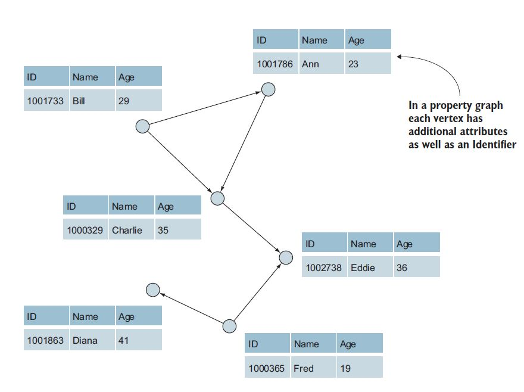

 

## 1. Introduction

In the recent years, people, devices, processes, and other entities have been more connected and generating more data than ever. This large volume of data is structured or unstructured and derived from various sources such as social networks, World Wide Web, and etc. For instance, according to *[World Wide Web Size](http://worldwidewebsize.com/)*, the indexed Web contains at least 1.61 billion pages till May, 2018. The term “Big Data” refers to the collection of all this available data and the ability to manage and analyze it. Managing and analyzing Big Data have become more essential than before.

### 1.1. What is a graph?
Graphs have been widely utilized to represent this large volume of data in a wide range of application domains such as social science, astronomy, computational biology, telecommunications, computer networks, semantic web, protein networks and [more](https://books.google.es/books?id=VJblDAAAQBAJ&pg=PA53&lpg=PA53&dq=Facebook+has+reported+that+its+social+network+graph+contains+more+than+a+billion+users+(vertices)+and+more+than+140+billion+friendship+relationships+(edges)+in+2012.&source=bl&ots=HNgvwYq2x7&sig=JtB2wCQD22np13ybWH2wLA4Oh5I&hl=en&sa=X&ved=2ahUKEwiGmdv30OzaAhWEWCwKHRrUBUMQ6AEwAnoECAAQPA#v=onepage&q=Facebook%20has%20reported%20that%20its%20social%20network%20graph%20contains%20more%20than%20a%20billion%20users%20(vertices)%20and%20more%20than%20140%20billion%20friendship%20relationships%20(edges)%20in%202012.&f=false). A Graph is a flexible structure to model data objects and the complex connections between them. It consists of vertices (nodes) and edges that represent data objects and connections (relationships) among the vertices, respectively.

The Web graph is a dramatic example of a large-scale graph or a Big Graph, with billions of nodes and trillions of edges. For instance, graphs of social networks contain billions of nodes and edges. [Facebook](https://www.theguardian.com/technology/2012/oct/04/facebook-hits-billion-users-a-month) has reported that its social network graph contains more than a billion users (vertices) and more than 140 billion friendship relationships (edges) in 2012. In semantic web context, the ontology of [DBpedia](http://www.semantic-web-journal.net/system/files/swj558.pdf) contains 3.7 million objects (nodes) and 400 million facts (edges).

With the ever-increasing size of graph-structured data, a critical need in developing scalable processing systems has arisen. In practice, managing and analyzing these massive graph datasets in large distributed computing infrastructures is a challenging task. [Apache Spark](https://spark.apache.org/) is a distributed computing system growing in popularity due to its speed. It has provided various algorithm implementations for data mining, data analysis, machine learning, and graph algorithms.

### 1.2. Graph use cases
There are a variety of use cases where graphs provide better data structure than relational databases or NoSQL data stores, for instance. Some of these use cases are as the following:

**Shortest path** : This algorithm is employed in social network applications for measuring the relevance of a particular user in the network. Users with smaller shortest distances are more relevant than users farther away. A full description and implementation of this algorithm in Spark can be found at this [link](https://blog.insightdatascience.com/computing-shortest-distances-incrementally-with-spark-1a280064a0b9).

**Community Detection** : These algorithms provide better understanding the structure of complex networks, and ultimately extracting useful information from them. [Community Detection algorithms](https://www.researchgate.net/publication/311645849_Community_detection_on_complex_graph_networks_using_Apache_Spark) focus on identifying two types of communities namely
disjoint communities and overlapping communities. In the disjoint community detection algorithms, the detected communities do not share any members in common and these algorithms assume that the network can be partitioned into dense regions in which nodes have more connections to each other than to the rest of the network. In contrast, overlapping community detection algorithms identify a set of clusters that are not necessarily disjoint and the detected community members can belong to more than one community. For example, Alibaba website uses graph data analytics techniques like community detection to solve ecommerce problems.

**Recommendations and Personalization** : Graph analysis is a useful tool to generate recommendation and personalization models for customers and to provide them with decisions and recommendations got from data analysis. These systems help the businesses to have an effective impact on their customers to purchase their product. This data analysis also helps with marketing strategy and customer service behavior.

**Topic Modeling** : This includes techniques to cluster documents and extract topical representations from the data in those documents.

**Fraud Detection** : Graph data can be employed to find [fraudulent transactions](https://www.slideshare.net/JenAman/credit-fraud-prevention-with-spark-and-graph-analysis) in a payment processing application based on the connected data that include the entities like users, products, transactions, and events.

**Flight Performance** : In this [article](https://databricks.com/blog/2016/03/16/on-time-flight-performance-with-graphframes-for-apache-spark.html) on-time flight performance is discussed by analyzing flight performance data (graph structures) and employing statistics like airport ranking and shortest paths between cities.

In this research report, we present a comprehensive overview of [GraphX](https://spark.apache.org/graphx/), an embedded Big Data processing framework for graphs, built on top of Apache Spark. Finally, a use case will be illustrated to understand GraphX better.

 

## 2. GraphX

GraphX is a new component in Apache Spark API for graphs (especially forBig Graphs such as social networks) and graph-parallel computation (e.g., PageRank). In other words, GraphX is an efficient graph processing system that provides:
  - graph data structures composed of [Spark RDDs](https://spark.apache.org/docs/latest/rdd-programming-guide.html)
  - a set of fundamental operators (e.g., subgrapg, joinVertices, and aggregateMessages)
  - an optimized variant of the Pregel API, a popular graph processing architecture to solve some of the problems faced in large graph processing
  - a collection of growing graph algorithms (Page Rank, Triangle Counting, and Connected Components) to simplify graph analytics tasks 
  
These features are expained in more details in the following sections.

### 2.1. Property Graph

In graph processing systems, graphs are represented as *property graphs*. A property graph may be defined in graph theoretical terms as a directed, vertex-labeled, edge-labeled multi-graph with self-edges, where edges have their own identity. A multi-graph has multiple edges in parallel to demonstrate multiple relationships between the same vertices. Parallel edges simplifies modeling scenarios where there can be multiple relationships between the same vertices (e.g., two people can be co-workers and friends at the same time). Also, property graphs have user defined properties attached to each vertex and edge. In the following figures (taken from [*Spark GraphX In Action*](http://liuchengxu.org/books/src/Spark/Spark-GraphX-in-Action.pdf)), the nodes and edges of a property graph are illustrated:

 

 

A property graph can be represented as a pair of vertex and edge collections. A vertex collection contains vertex ID, a unique 64-bit long identifier, and the vertex properties. A Vertex identifier is derived externally (e.g., user ids) or by applying a hash function to the vertex property (e.g., page URL). It should be mentioned that no ordering constraints are imposed on the vertex identifiers. Similarly, an edge collection contains properties keyed by the corresponding source and destination vertex identifiers. By representing a property graph as a pair of collections, it is possible to compose graphs with other collections in a distributed dataflow framework. 
These graphs are derived from social networks, web graphs and more.

### 2.2. Vertex and Edge RDDs

The Spark storage abstraction called [RDD](https://spark.apache.org/docs/1.6.2/api/java/org/apache/spark/rdd/RDD.html) (Resilient Distributed Dataset) which enables applications to keep data in memory. GraphX maintains the vertices and edges in optimized data structures as [VertexRDD](https://spark.apache.org/docs/1.6.2/api/java/org/apache/spark/graphx/VertexRDD.html) and [EdgeRDD](https://spark.apache.org/docs/1.4.0/api/java/org/apache/spark/graphx/EdgeRDD.html) so it extends the Spark RDD by introducing a new Graph abstraction: RDG (Resilient Distributed property Graph). Notice that these property graphs are immutable, distributed, and fault-tolerant, like RDDs. It means that any changes to the values or structures of the graph are accomplished by producing a new graph with the desired changes. 
In addition to the vertex and edge views of the property graph, GraphX also exposes a *triplet view*. The triplet view logically joins the vertex and edge properties yielding an *RDD[EdgeTriplet[VD, ED]]* containing instances of the [EdgeTriplet class](https://spark.apache.org/docs/1.2.0/api/java/org/apache/spark/graphx/EdgeTriplet.html).

 

### 2.3. Spark Graph Operators

A Property graph has a collection of basic operators that takes the functions defined by users in order to produce new graphs that have transformed structure and properties. In GrpahX, as mentioned in the previous section, a graph is a functional data-structure in which mutating operations return new graphs. The basic operations (numEdges, numVertices, inDegrees, outDegrees, degrees) to access and manipulate the data associated with vertices and edges as well as the underlying structure of a graph are defined in [*Class Graph*](https://spark.apache.org/docs/2.2.0/api/java/org/apache/spark/graphx/Graph.html). Moreover, [*Class GraphOps*](https://spark.apache.org/docs/1.4.0/api/java/org/apache/spark/graphx/GraphOps.html) contains additional functionality for *Class Graph*. In the following, different groups of operators for property graphs are described.

#### 2.3.1. Property Operators

Like the RDD [*map*](https://spark.apache.org/docs/latest/rdd-programming-guide.html#basics) operator, the property graph contains **mapVertices**, **mapEdges**, **mapTriplets**.

 

**VD** and **ED** refer to the vertex attribute type and the edge attribute type, respectively. These operators create a new graph with the vertex or edge properties modified by the user defined function (UDF) for mapping.
Furthermore, these operators are often used to initialize the graph for a particular computation or project away unnecessary properties. For instcance, given a graph with the out degrees as the vertex properties is initialized in PageRank:

 

#### 2.3.2. Structural Operators
Currently GraphX supports a simple set of commonly used structural operators. The following is a list of the basic structural operators in Spark.

 

**Reverse operator** : This operator returns a new graph with all the edge directions reversed. As the reverse operation does not modify vertex or edge properties or change the number of edges, it can be implemented efficiently without data movement or duplication. This operator can be applied to compute the inverse PageRank, for instance.

**Subgraph operator** : This operator takes vertex and edge predicates as input and output a graph containing only the vertices that satisfy the vertex predicate and edges that satisfy the edge predicate. It also connects vertices that satisfy the vertex predicate. The *subgraph* operator is useful when it is required to restrict the graph to a few vertices and edges. 

**Mask operator** : It returns a graph containing the vertices and edges, found in the input graph, to construct a subgraph. The *mask* operator can be used with *subgraph* operator to restrict a graph based on the properties in another related graph. 

**GroupEdges operator** : It merges parallel edges, duplicate edges between pairs of vertices, in a multigraph.

#### 2.3.3 Join Operators

Sometimes it is required to extract data from external collections (RDDs) and join it with graphs. AS an example, there might be extra properties for a user and it is necessary to merge it with an existing node in a graph. Hence, this task can be accomplished by using the *join* operators. There are two Join operators:  **joinvertices**, and **Outerjoinvertices**.

 

**JoinVertices** : This operator joins the vertices of a graph with the input RDD and then outputs a new graph with the vertex properties. These vertex properties are obtained by applying the user defined map function to the result of the joined vertices. Vertices without a matching value in the RDD retain their original values. It must be considered that if the RDD contains more than one value for a given vertex only one will be used.

**OuterJoinVertices** : This operator is similar to *joinVertices* operator except that the user defined map function is applied to all vertices and can change the vertex property type. As all vertices may not have a matching value in the input RDD, the map function uses *an Option type*. For instance, to setup a graph for PageRank, vertex properties can be initialized with their outDegree.

#### 2.3.4. Neighborhood Aggregation

Aggregating information about the neighborhood of each vertex is an essential step in analysis of graphs. In analyzing social networks, it might be interesting to find out that how many users are following a specific user or what the average age of the followers is. Many iterative graph algorithms such as PageRank, Shortest Path, and connected components aggregate properties of neighboring vertices repeatedly. In GraphX, the core aggregation operation is *aggregateMessages*. It applies a user-defined *sendMsg* function to each *edge triplet* in the graph. Afterwards, it uses the *mergeMsg* function to aggregate those messages at their destination vertex.

 

Another common aggregation task is to compute the degree of each vertex, the number of edges adjacent to each vertex. It is necessary to know the in-degree, out-degree, and the total degree of each vertex in the context of directed graphs. The *Class GraphOps* contains a collection of operators to compute the degrees of each vertex. For example, **maxInDegree**, **maxOutDegree**, and **maxDerees** are exploited to compute the maximum degree in a graph.

Furthermore, **collectNeigborsIds** and **collectNeighbors** operators are employed to collect neighboring vertices and their attributes for each vertex. Notice that these operators are quite costly due to the fact that they duplicate information and require substantial communication. Therefore, it is recommended to use *aggregateMessages* to perform the same computations.

#### 2.3.5. Caching and Uncaching

Notice that Spark RDDs are not persisted in memory by default, therefore they must be explicitly cached when using them multiple times to avoid recomputation. As the graphs in GraphX employs RDDs, it is recommended to call *cache* function from *Class Graph* first when a graph is used for multiple times.

### 2.4. Pregel API

In a graph, properties of vertices depend on properties of their neighbors which also depend on properties of their neighbors. Therefore, graphs are known as recursive data structures. Moreover, many significant graph algorithms compute the properties of each vertex iteratively until a fixed-point condition is reached. In order to express these iterative algorithms, a range of graph-parallel abstractions have been proposed. GraphX employs a variant of the Pregel API to take advantage of these algorithms.

The Pregel operator executes in a series of *super steps*. In each *super step*, vertices *receive* the sum of *messages* from the previous super step, compute a new value for the vertex property, and then *send messages* to neighboring vertices in the next super step. Unlike Pregel, messages are computed in parallel as a function of the edge triplet and the message computation has access to both the source and destination vertex attributes. Vertices that do not receive a message are skipped (becomes inactive) within a super step. The Pregel operators terminates iteration and returns the final graph when there are no messages remaining (or all vertices become inactive).

Note, unlike more standard Pregel implementations, vertices in GraphX can only send messages to neighboring vertices and the message construction is done in *parallel* using a user defined messaging function. These constraints allow additional optimization within GraphX.

### 2.5. Graph Algorithms

As mentioned in the previous sections, GraphX has a set of graph algorithms to help with graph data processing and analytics tasks, including : *PageRank, Connected Components and TriangleCounting*.  They are implemented to simplify analysis process on graphs. These algorithms are contained in the *org.apache.spark.graphx.lib* package and can be called directly as methods by employing * Class GraphOps*.

#### 2.5.1. PageRank

PageRank algorithm is used to determine the relative importance of an object inside a graph data set. It measures the importance of each node in a graph, assuming an edge from another node to this node represents an endorsement. This algorithm was originally designed as to rank web pages by [Google search engine](http://blogs.cornell.edu/info2040/2011/09/20/pagerank-backbone-of-google/]). Google uses PageRank as one of the measures to determine the importance of a web page based on the how many other web pages reference it.

There [two implementations](https://spark.apache.org/docs/latest/api/scala/index.html#org.apache.spark.graphx.lib.PageRank$) of PageRank provided in GraphX, static and dynamic:
**Static PageRank** : This implementation of PageRank, runs PageRank for a fixed number of iterations. In other words, it runs for a fixed number of iterations to generate PageRank values for a given set of nodes in a graph data set.
**Dynamic PageRank** : This implementation uses the Pregel interface and runs PageRank until convergence of ranks based on a predefined tolerance value (i.e., stop changing by more than a  specified tolerance).

Moreover, GraphX includes an example social network dataset to run PageRank on. A set of users is given in data/graphx/users.txt, and a set of relationships between users is given in data/graphx/followers.txt. Find full example code for these datasets at this [link](https://github.com/apache/spark/blob/master/examples/src/main/scala/org/apache/spark/examples/graphx/PageRankExample.scala).

#### 2.5.2. Connected Components

A Connected Component in a graph is a connected subgraph where two vertices are connected to each other by an edge and there are no additional vertices in the main graph. This means the two nodes belong to the same connected component when there is a relationship between them. The lowest numbered vertex number of ID in the subgraph is used to label the connected components in a graph. For example, in a social network, connected components can approximate *clusters*. GraphX contains an implementation of the algorithm in the [*ConnectedComponents*](https://spark.apache.org/docs/latest/api/scala/index.html#org.apache.spark.graphx.lib.ConnectedComponents$) object. To better understanding of this algorithm, there is a full example code for social network datasets (mentioned in PageRank section) at this [link](https://github.com/apache/spark/blob/master/examples/src/main/scala/org/apache/spark/examples/graphx/ConnectedComponentsExample.scala).
There are two ways of traversing the graph for computing connected components: Breadth-first Search (BFS) and Depth-first Search (DFS).

*Strongly Connected Components (SCC)* is another algorithm in graph data processing. If all nodes in a graph are reachable from every single node, then the graph is considered to be strongly connected.

#### 2.5.3. Triangle Counting

Triangle counting is a community detection graph algorithm which is used to determine the number of triangles passing through each vertex in the graph data set. A vertex is part of a triangle when it has two adjacent vertices with an edge between. The triangle is a three-node subgraph, where every two nodes are connected. This algorithm returns a Graph object to extract vertices from this triangle counting graph. GraphX implements a triangle counting algorithm in the [*TriangleCount*](https://spark.apache.org/docs/latest/api/scala/index.html#org.apache.spark.graphx.lib.TriangleCount$) object.

*Triangle Counting* contains three steps: 
First, it computes the set of neighbors for each vertex. 
Then, for each edge compute the intersection of the sets and send the count to both vertices. 
Finally, it computes the sum at each vertex and divide by two since each triangle is counted twice. 
There is a full example code implemented for social network datasets by applying *Triangle Counting* algorithm at this [link](https://github.com/apache/spark/blob/master/examples/src/main/scala/org/apache/spark/examples/graphx/TriangleCountingExample.scala).

Triangle counting is used heavily in social network analysis and other use cases where *Triangle Counting algorithm* is used as spam detection and link recommendations. Note that *PageRank* is a measure of relevancy whereas *Triangle Count* is a measure of clustering.

### 2.6. Graph Builders

GraphX provides several ways of building a graph from a collection of vertices and edges in an RDD or on disk:

**GraphLoader.edgeListFile** : [*GraphLoader*](https://spark.apache.org/docs/latest/api/scala/index.html#org.apache.spark.graphx.GraphLoader$@edgeListFile(SparkContext,String,Boolean,Int):Graph[Int,Int]) provides a way to load a graph from a list of edges on disk. It creates a Graph from the specified edges, automatically creating any vertices mentioned by edges. All vertex and edge attributes default to 1.

**Graph.apply** : [*Graph.apply*](https://spark.apache.org/docs/latest/api/scala/index.html#org.apache.spark.graphx.Graph$@apply[VD,ED](RDD[(VertexId,VD)],RDD[Edge[ED]],VD)(ClassTag[VD],ClassTag[ED]):Graph[VD,ED]) allows creating a graph from RDDs of vertices and edges. Duplicate vertices are picked arbitrarily and vertices found in the edge RDD but not the vertex RDD are assigned the default attribute.

**Graph.fromEdges** [It](https://spark.apache.org/docs/latest/api/scala/index.html#org.apache.spark.graphx.Graph$@apply[VD,ED](RDD[(VertexId,VD)],RDD[Edge[ED]],VD)(ClassTag[VD],ClassTag[ED]):Graph[VD,ED]) allows creating a graph from only an RDD of edges, automatically creating any vertices mentioned by edges and assigning them the default value.

**Graph.fromEdgeTuples** [It](https://spark.apache.org/docs/latest/api/scala/index.html#org.apache.spark.graphx.Graph$@apply[VD,ED](RDD[(VertexId,VD)],RDD[Edge[ED]],VD)(ClassTag[VD],ClassTag[ED]):Graph[VD,ED]) allows creating a graph from only an RDD of edge tuples, assigning the edges the value 1, and automatically creating any vertices mentioned by edges and assigning them the default value. It also supports deduplicating the edges.

### 2.7. Graph partitioning

If a graph is too large to fit in the memory of a single machine, Spark divides the graph among multiple computers in a cluster of computers. Partitioning a graph by *vertices* is called **edge-cut** because the edges are getting cut. A graph processing system can also use **vertex-cut**, edges are spread evenly among the machines which leads into balanced distribution of data across the cluster. GraphX employs this idea originated from [*GraphLab*](https://turi.com/), a graph processing system proposed by Carnegie Mellon University in 2009.

The GraphX data structure or RDG employs a *vertex-cut* representation of a graph using three unordered horizontally partitioned tables implemented as Spark RDDs: *Edge Table*, *Vertex Data Table*, and *Vertex Map*. These tables are explained in the following.
**Edge Table** : This table stores the adjacency structure and edge data. Each edge is represented as a tuple consisting of the source vertex id, destination vertex id, properties (defined by user), and a virtual partition identifier (pid) to partition the table as well. Note that the edge table contains only the vertex ids and not the vertex data. 
**Vertex Data Table** : It stores the vertex data, in the form of a pair including each vertex’s id and data. The vertex data table is indexed and partitioned by the vertex id.
**Vertex Map** : It provides a mapping from the id of a vertex to the ids of the virtual partitions that contain adjacent edges. 
During graph computations, it is often needed to assemble an edge with the data associated on both vertices. 

GraphX uses a 3-way relational join to bring together the source vertex data, edge data, and target vertex data:

 

The resulting table from the 3-way join presents an edge centric view of the graph, with each tuple containing the edge data, source vertex data, and the target vertex data.

### 2.8. GraphFrames
[GraphFrames](https://databricks.com/blog/2016/03/03/introducing-graphframes.html) is a new add-on component to GraphX. It integrates features like pattern matching and graph algorithms with Spark SQL. Vertices and edges are represented as *DataFrames* instead of *RDD objects*. GraphFrames simplify the graph data analytics pipeline and optimize the queries across both graph and relational data. For better understanding, this [article](http://blog.cloudera.com/blog/2016/10/how-to-do-scalable-graph-analytics-with-apache-spark/) shows how to use GraphFrames to calculate the PageRank for each node in the graph data set.

## 3. Programming Examples & Interesting Use cases

In this section, a few simple programming examples in Scala and interesting use cases are provided.

[**Example 1**](https://www.infoq.com/articles/apache-spark-graphx): The main goal of this example is to determine graph data statistics such as: 
  - How popular different users in the social network are (PageRank)
  - Clusters of users based on how the users in the network are connected (Connected Components)
  - Community detection and cohesiveness of the communities of users in the social network (Triangle Counting)
  
[**Example 2**](http://www.sparktutorials.net/Analyzing+Flight+Data%3A+A+Gentle+Introduction+to+GraphX+in+Spark): Analyze flight data.

[**Example 3**](https://www.edureka.co/blog/spark-graphx/#Understanding_GraphX_With_Examples): In this link, there are two simple examples:
  - Extract information about Twitter users from a simple graph
  - A simple flight data analysis using Spark GraphX
  
[**Example 4**](https://www.cakesolutions.net/teamblogs/graphx-pregel-api-an-example): Find the minimum value in a graph using Pregel API.

[**Example 5**](https://dzone.com/articles/introduction-to-spark-graphx): How to use Spark GraphX for analyzing a graph of social network users.

 
[**Use case 1**](https://databricks.com/session/building-a-graph) - **Building a Graph of US Businesses**: [Radius Intelligence](https://radius.com/) is a company in the US that empowers data science to deliver an unique marketing intelligence platform used by over hundred US companies. In [Spark Summit East 2016](http://bigdatausecases.info/sources/Spark%20Summit%20East%202016), they exploited GraphX, MLLib and Scala to create a comprehensive and accurate index of US business from dozens of different sources. 

[**Use case 2**](https://www.youtube.com/watch?v=lFBPdL9XpA4&feature=youtu.be) - **Using GraphX/Pregel on Browsing History to Discover Purchase Intent**: [Rubicon Project Buyer Cloud](https://rubiconproject.com/) uses intent data to find new customers for advertisers. Intent data comes in many forms, one of which is online browsing history. This type of data is large in volume, high dimensional, sparse, noisy, but informative. In [Spark Summit East 2016](http://bigdatausecases.info/sources/Spark%20Summit%20East%202016), they present a propagation-based model that uses *GraphX* and *Pregel* to identify possible customers for each advertiser. For revewing the slides, check this [link](https://www.slideshare.net/SparkSummit/using-graphxpregel-on-browsing-history-to-discover-purchase-intent-by-lisa-zhang).

[**Use case 3**](https://databricks.com/session/multi-label-graph-analysis-and-computations-using-graphx) - **Multi-Label Graph Analysis and Computations Using GraphX**: This use case, in [Spark Summit 2017](http://bigdatausecases.info/sources/Spark%20Summit%202017), shows how LinkedIn is able to leverage  *GraphX*  to efficiently find top LinkedIn feed influencers in different communities and by different actions. 

[**Use case 4**](https://www.youtube.com/watch?v=7_jm_tDD_SI&list=PL-x35fyliRwhP52fwDqULJLOnqnrN5nDs&index=2) - **Using Spark GraphX to detect communities at Alibaba**: In this use case in [Spark Summit 2015](https://spark-summit.org/eu-2015/schedule/), [Alibaba](https://www.alibaba.com/) has used *GraphX* and *Spark Streaming* to detect community for Large-scale e-Commerce data. For revewing the slides, check this [link](https://www.slideshare.net/SparkSummit/dynamic-community-detection-ming-huang).

[**Use case 5**](https://databricks.com/session/closing-the-loop-interactive-analysis-and-visualization-with-spark) - **Closing the Loop: Interactive Analysis and Visualization with Spark**: In [Spark Summit 2015](https://spark-summit.org/eu-2015/schedule/), [New York Data Company](http://www.nydata.co/) presented a framework using Spark alongside the open source visualization server Lightning to both process and visualize data interactively. Workflows can incorporate a variety of Spark libraries, such as *Spark Streaming* for visualizing streaming, *machine learning algorithms*, and *GraphX* for displaying graph analyses. 

[**Use case 6**](https://databricks.com/session/spark-graphx-and-blockchains-building-a-behavioral-analytics-platform-for-forensics-fraud-and-finance) - **Spark, GraphX, and Blockchains: Building a Behavioral Analytics Platform for Forensics, Fraud, and Finance**: 
This use case described how [BlockCypher](https://www.blockcypher.com/) built machine learning and graph traversal systems on Apache Spark to help both government organizations and private businesses stay informed in the brave new world of blockchain technology. 

## 4. Conclusion

Spark GraphX is *fast* because it provides comparable performance to the fastest specialized graph processing systems. It is comparable with the fastest graph systems while retaining Spark’s flexibility, fault tolerance and ease of use.
Moreover, Spark GraphX is *flexible* since it works with both graphs and computations. GraphX unifies ETL (Extract, Transform and Load), analysis and iterative graph computation within a single system. We can view the same data as both graphs and collections, transform and join graphs with RDDs efficiently and write custom iterative graph algorithms using the Pregel API.
Finally, Spark GraphX has a *Growing Algorithm Library*. Some of the popular algorithms are PageRank, Connected Components, and triangle count.

## 5. Useful references

### Books:
1. Apache Spark Graph Processing - Build, process, and analyze large-scale graphs with Spark: It can be downloaded from this [link](http://liuchengxu.org/books/src/Spark/Apache-Spark-Graph-Processing.pdf)
2. Spark GraphX in Action: It can be downloaded from this [link](http://liuchengxu.org/books/src/Spark/Spark-GraphX-in-Action.pdf)

### Papers:
1. GraphX: A Resilient Distributed Graph System on Spark - [Link](http://www.istc-cc.cmu.edu/publications/papers/2013/grades-graphx_with_fonts.pdf) to download.
2. GraphX: Graph Processing in a Distributed Dataflow Framework - [Link](https://people.csail.mit.edu/jshun/6886-s18/papers/graphx.pdf) to download.
3. Community Detection of Heterogeneous Networks with RankClus Based on Spark GraphX - [Link](https://www.google.com/url?sa=t&rct=j&q=&esrc=s&source=web&cd=2&cad=rja&uact=8&ved=2ahUKEwilwrCjgvHaAhXJUhQKHfu8C9AQFjABegQIABAt&url=http%3A%2F%2Fdpi-proceedings.com%2Findex.php%2Fdtcse%2Farticle%2Fdownload%2F14989%2F14502&usg=AOvVaw3T-hP6FAZ3EM_7nve_fzMJ) to download.
4. Big Graph: Tools, Techniques, Issues, Challenges and Future Directions - [Link](https://airccj.org/CSCP/vol6/csit65611.pdf) to download.
5. A Performance Study of An Implementation of the Push-Relabel Maximum Flow Algorithm in Apache Spark’S Graphx - [Link](https://dspace.library.colostate.edu/bitstream/handle/11124/166690/Langewisch_mines_0052N_10897.pdf;sequence=1) to download.

### Links:
1. Spark GraphX [Main Website](http://spark.apache.org/graphx/)
2. GraphX [Programming Guide](http://spark.apache.org/docs/latest/graphx-programming-guide.html)
3. [Graphx package](https://spark.apache.org/docs/latest/api/scala/index.html#org.apache.spark.graphx.package)
4. [GraphX and GraphFrames documentation](https://docs.azuredatabricks.net/spark/latest/graph-analysis/index.html)
5. Hands on Exercises - Graph analytics with GraphX - [ampCamp](http://ampcamp.berkeley.edu/big-data-mini-course/graph-analytics-with-graphx.html) 
