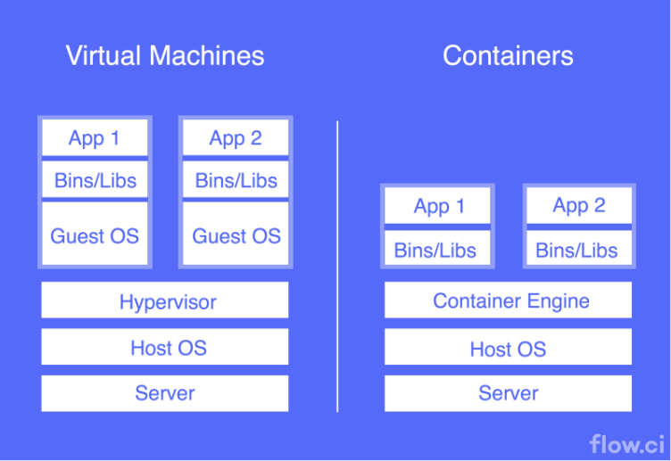
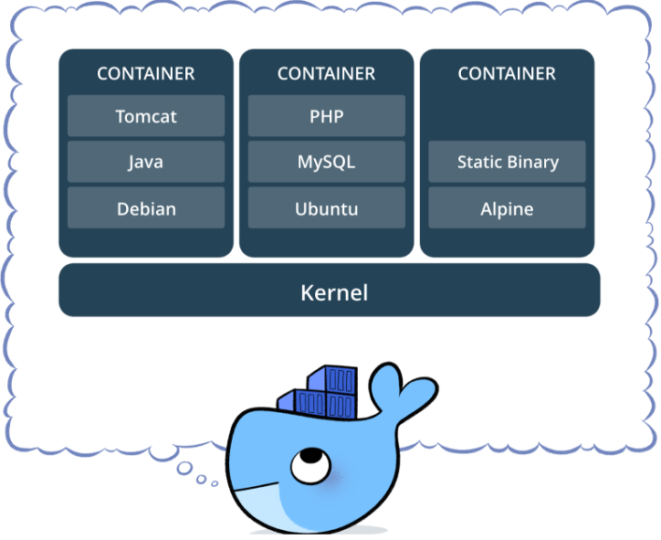
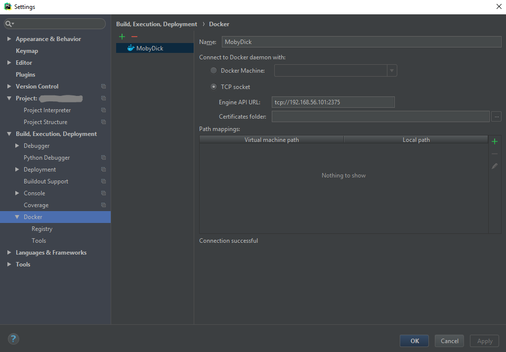
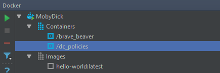

# Dockers: Research Project

*Alejandro Jurnet*, *Pau Marcer*

**CCBDA 2018**

-----------------------

### Abstract

On this document, some of the basic aspects of the Docker technology are presented, to show the basis and some commands to run a code using Dockers. Dockers is a virtualization technology that provides isolation but with less resources. Some other features provide a set of functionalities and different services like clustering, DDNS, overlay networks... Moreover, we can integrate Dockers in the Pycharm editor.

In **Section 1: Introduction to Dockers**, a brief introduction to what is Dockers and which are the benefits; in **Section 2: Dockers**, some basic concepts and elements of Dockers are presented; in **Section 3: Quick Start to Dockers**, some basic operations with dockers are explained; in **Section 4: How to use Dockers in PyCharm/InteliJ**, the integration with Pycharm is explained and finally in **Section 5: Conclusions**, some final notes are provided. 

* [1. Introduction to Dockers](#1)
* [2. Dockers](#2)
* [3. Quick start to Dockers](#3)
* [4. How to use Dockers in PyCharm/InteliJ](#4)
* [5. Conclusions](#5)


<a name="1"/>

## 1. Introduction to Dockers

Dockers are what is known as operating system level virtualization, dockers pack the minimum set of tools to allow us to create virtualized apps, dockers run directly onto the operating system, there is no hypervisor.



Dockers are based on images and containers, an image can be build with various methods from source code, and the container is the running image, this allows any image to be runned as a container on any docker capable machine without the need of modifying the code, thus docker allows our applications to be portable.
Docker allows for application dependencies, so we can have an app distributed in various images.
There is a centralized repository where we can obtain a huge variety of images, then depending on our needs we can choose the most appropriate for our case
Dockers can be used from hosting scalable cloud services to testing environments for our apps. For example we could sell dockers as IaaS, and launch new instances as required.


### Pros/Cons

+ Dockers are good for deploying a lot of services on the same machine with low overhead cost.
+ Dockers doesn’t require any hypervisor, this allows for smaller images, and faster startup/replication time. But this affects the way the container communicates to the OS, restricting the possible operations.
+ Dockers share the OS, hypervisors have a copy of the OS, so the isolation is higher
+ Docker linux images are **restricted** to linux and cannot be used on windows or viceversa.

### Alternatives

Some alternatives to dockers can be:

+ Kubernetes https://kubernetes.io/
+ vagran https://www.vagrantup.com/

<a name="2"/>

## 2. Dockers

### Container

A container is one of the elemental elements in the Docker system, it’s main purpose is to run an image. Containers can be created, started, moved, modified (network, etc.), stopped, deleted These operations can be executed using the Docker API (via REST) or CLI.

The containers are isolated from the the host device and between them by default, but there are plenty of options to open the system to the container (e.g. share network address or namespace, storage and access to files in host, other containers data, etc...), maintaining a certain degree of isolation, as the kernel and the container keeps separated. 

A container can be configured when created from a base image(static) or when started from an image(dynamic) by adding an entrypoint/command and flags. All the configurations and states that are not saved in a persistent location are lost, due that containers are stateless.



Containers are like stacks of different images, that allow the developer to only use what is needed in a clean way. In the previous figure we can appreciate how this works. Containers are isolated between them and their contents (images) are way different. Even we can replicate multiple instances of containers to run in parallel the same application. Containers are smaller than Virtual Machines due that we only need to include the applications that we need but is not necessary to include a full Operating System. Dockers provides an environment to execute on the top of the current system isolating the execution and preventing access or changes.

Other approaches to have more isolation is having a virtual machine with dockers inside.


### Image

Docker images are the most fundamental part of dockers. We can see the image as a read-only template with the instructions for creating a Docker container, according to the definition in the Dockers definition. 

For the normal user, an image is often seen as a service, a "program" that he/she downloads and runs a certain functionality. There are lots of examples of services like web hosting, virtual routers with DNS and DHCP, DHT, distributed file systems...  

Moreover, images are often build on the top of other images. As developer, create a Dockerfile is needed to build an image. Here, each instruction creates a new layer in the image.

### Dockerfile and Docker-compose

A Dockerfile is a group of all commands that the user would execute in order to build an image. Dockerfile allow to build images automatically or distribute to others the instructions to run a container properly.

```Dockerfile
FROM python:3
CMD ["python3"]
```

The instructions are not case-sensitive, but Docker documentation suggest them to be uppercase by convention. However is required to start always with the FROM instruction, that specifies the base image from the container is built. 

Some of the instructions most used are the following ones:
	
+ ADD: Add a file or multiple to a destination inside a container.
+ COPY: Copy a file or multiple to destination inside a container.
+ ENV: Set an environment variable in the container.
+ EXPOSE: Expose a port or range of the container.
+ FROM: Base image of the container.
+ WORKDIR: Base directory to work
+ MKDIR: Create a directory in the container.
+ RUN: Run a command in the default shell.
+ CMD: Run a command without shell. Also is used normally to specify the application we want to run.

Here we can find an example of a Dockerfile:

```Dockerfile
FROM python:3
RUN mkdir /var/app
WORKDIR /var/app
ADD *.py /var/app/
ADD requirements.txt .
EXPOSE 80
ENV DEBUG=False

RUN bash -c "pip install -r requirements.txt"
CMD ["python", "-u", "app.py"]
RUN bash -c "ip addr"
```

Although Dockerfile give us the functionality of building a stack of images following the recipe, we need to run and maintain manually the containers or create a script to automate some of the procedures. Here docker-compose is a powerful tool.

Docker-compose is what commonly people call the recipe but is a service that can group a sort of different images and configure some aspects like sharing a common network, creating dependencies between containers, restarting containers on failure, included all the instructions in the Dockerfile.

Later we explain how to build and run a docker-compose from the composer file. That file is a YAML file to configure your application’s services, like databases, monitors... 

Using Compose is basically a three-step process:
Define your app’s environment with a Dockerfile so it can be reproduced anywhere.
Define the services that make up your app in docker-compose.yml so they can be run together in an isolated environment.
Run docker-compose up and Compose starts and runs your entire app.

The full list of instructions can be found [here](https://docs.docker.com/compose/compose-file/#build). 

Normally, we can find some compose files using public images in DockerHub. Docker-compose give us the option to build the image to use from the local files specified in the provided path, including in the directory the Dockerfile.

As a curiosity, most of the CI (Continuous Integration) and CD (Continuous Deployment) tools use this structure in the recipes for applications. With Docker-compose we can perform some automatic tests and automatic deployment.


### Network

As Dockers aims to deploy a set of micro-services each in one or multiple containers, we need some communication between them. Dockers also implements a networking service transparent and transversal. A Docker container can be accessed by other container in the same host, another container in other host or other service in the host or outside the host. This communication is two-way, with some configurations to define the scope of the network and the reachability of the containers inside the network.

When we create a network in Dockers, depending on the driver we choose some features are enabled or disabled. Here we can find a list with the most common we can find:

+ **bridge:** The default network driver. If you don’t specify a driver, this is the type of network you are creating. Bridge networks are usually used when your applications run in standalone containers that need to communicate. This driver allows containers connected to the same bridge network to communicate, while providing isolation from containers which are not connected to that bridge network.

	bridge is created automatically, and new containers connect to it unless otherwise specified. You can also create user-defined custom bridge networks, that is highly recommended to have more control and isolation for each service. 

	Containers connected to the same user-defined bridge network automatically expose all ports to each other, and no ports to the outside world. This allows containerized applications to communicate with each other easily, without accidentally opening access to the outside world. If we use the default, any container connected to this network can access. 

	Containers on the default bridge network can only access each other by IP addresses while on a user-defined bridge network, containers can resolve each other by name or alias (specified at the creation of the container or in docker-compose file). 


+ **host:** Another well known driver used when some network isolation is not required or some external source network communication is necessary. This driver use the host’s networking directly, meaning that they share the IP. Some precautions must be take to avoid collisions with same ports in the host and container. 

+ **overlay:** This driver is used when you need containers running on different Docker hosts to communicate, or when multiple applications work together using swarm services.

+ **none:** The best network driver when no network in the container is required. 

Exist other network drivers like macvlan or third-party ones. 

### Swarm

Dockers also include the swarm functionality, that allows to create a cluster of different docker hosts, with all the control and network setup. The system is designed to be decentralized, with multiple hosts as managers or workers, auto DNS, replication, and other functionalities. 

There are some projects that build powerful clusters using cheap RaspberryPi or low-performance old computers.

More information can be found [here](https://docs.docker.com/engine/swarm/).

<a name="3"/>

## 3. Quick start to Dockers

### How to build an image

An image is build using one of the following docker tools:

+ Dockerfile.
+ Docker compose.

We will see how to use those tools in the next points. Some reference can be found [here](https://docs.docker.com/engine/reference/commandline/images/)

### How to run a container

To run a container first we need an image to generate the container, once we got the image, we can run the container with a given name, a run command, that will be run inside the container when it starts, this is optional, we can specify the network or networks we want our container to connect to, and the ip address that the container will have on each network.

**Basic example:**

`$ docker run --name debian-it -it debian`

This runs a new debian container with the given name and an interactive shell.

### Using dockerfiles

To create a dockerfile, first we must specify a base image, this image will be used to build our app, we recommend using always the minimum possible image, for example if we want to run a python script, we do not need a whole linux image, we can use the python base image, this will save disc space and build time.

Once we got the image, we will need to inject our script inside, this is done with a simple copy command, we can setup env variables if needed, the next step will be installing the libraries or dependencies of our script, in the case of python we can simply copy the whole virtualenv to the container or run inside the container a pip install with the requirements.txt. Finally we can specify an entrypoint or run command for our new image, this is the code that will be run when we create a container from the image, in case that we want to run the container with different arguments we can skip this and specify the run command once we launch the container, on the run command.

Python code execution example:

```Dockerfile
FROM python:3
ADD script.py /
ENV env=test
RUN pip install library
ENTRYPOINT [ "python", "./my_script.py” ]
```

or

```Dockerfile
FROM python:3
ADD script.py /
ADD requirements.txt
ENV env=test
RUN pip install -r requirements.txt
```

Dockerfiles adhere to a specific format and use a specific set of instructions. You can learn the basics on the [Dockerfile Reference](https://docs.docker.com/engine/reference/builder/) page. If you’re new to writing Dockerfiles, you should start there. Some guidelines about the best practices and eficiency of the Dockerfiles are provided [here](https://docs.docker.com/develop/develop-images/dockerfile_best-practices/). 


### Using Docker compose

Docker compose extends dockerfiles allowing us to create multi container environments.
For example, if we have created and app that requires a database, lets say SQL, we can use docker compose to launch our app, and at the same time launch another container with the SQL database, and to create a connection between them(if needed, in this case we don’t need more connections). This allows us to have our app in a different container than the database.

Example using django and postgres:

```yaml
version: '3'

services:
  	db:
    		image: postgres
  	web:
    		build: .
   		command: python3 manage.py runserver 0.0.0.0:8000
    		volumes:
      			- .:/code
    		ports:
      			- "8000:8000"
    		depends_on:
      			- db

**The build, actually uses a dockerfile to build the django container.

On django we connect to the database with the following code:
DATABASES = {
    'default': {
        'ENGINE': 'django.db.backends.postgresql',
        'NAME': 'postgres',
        'USER': 'postgres',
        'HOST': 'db',
        'PORT': 5432,
    }
}
```

Note that the hostname of the database will be the name of the service, and it will be resolved by docker networking, and we do not need to open any port using postgres as it comes by default.

Full documentation [here](https://docs.docker.com/compose/django/).

Instead of using the image:postgres, we can build a dockerfile with our custom database or extra service.

```yaml
build:
      		context: ./dir
      		dockerfile: Dockerfile
      		args:
        			buildno: 1
```


So using docker compose we can chain services and dependencies of our final app, this allows us to build a highly modular service. It can be equipared to makefile but instead of dependencies with libraries we got dependencies with microservices. More info [here](https://docs.docker.com/compose/compose-file/compose-file-v2/).

### Using networking

First of all we have to create a new network, and specify the driver we want to use, we can specify the subnet and range, if we leave it empty docker assigns the next available default subnet.

`$ docker network create --driver bridge --subnet=192.168.0.1/24 --gateway=192.168.0.1 --ip-range=192.168.0.128/24 [my_network]`

#### In the run command:

In the run command we can only connect to one network

`$ docker run -dit --name alpine4 --network [my_network] alpine cmd`

If we want to connect to other networks we have the command:

`$ docker network connect [other_network] alpine4`

A fancy and easy tutorial can be found [here](https://docs.docker.com/network/network-tutorial-standalone/).


#### In the Dockerfile:

Is not possible to attach networks on the dockerfile, as will break the portability of the images, and the dockerfile does not allow to create any networks, this can be done on the Docker compose, as the compose allows for network creation.
If we want to attach an image created with a docker file we have to use the command

`$ docker network connect [network] [container] that we saw on the previous point.`

#### in Docker Compose:

In docker compose a private virtual network is created for our app. If we want to build our own networks apart and connect them to the container we do the following on compose:

```yaml
version: "3"
services:

  proxy:
    build: ./proxy
    networks:
      - frontend
  app:
    build: ./app
    networks:
      - frontend
      - backend
  db:
    image: postgres
    networks:
      - backend

networks:
  frontend:
    # Use a custom driver
    driver: custom-driver-1
  backend:
    # Use a custom driver which takes special options
    driver: custom-driver-2
    driver_opts:
      foo: "1"
      bar: "2
```

For more reference on specifing custom networks in a docker-compose check [here](https://docs.docker.com/compose/networking/#specify-custom-networks).

### Using volumes

Volumes are used for persistent data storage, when we create a container, if we want the data generated by that container to persist after the container has stopped, we must use a volume.

#### To create a volume:

`$ docker volume create my-vol`

To mount the volume when we create the container

`	$ --mount source=my-vol,target=/app`

Source defines the volume we want to mount, target the mount point on the container.

More info [here](https://docs.docker.com/storage/volumes/)

<a name="4"/>

## 4. How to use Dockers in PyCharm/InteliJ

PyCharm (and the other editors from JetBrains) can install a plugin to allow the interaction with Dockers. This makes easy for the developer to test the codes in a container directly, build images and run a docker-compose.

Normally, the common use is to manage the Docker system in the host. However, there are other configurations that allow to have Dockers in another host, a cluster or a VM in the host. 

The procedure is very simple:

+ Install Dockers. Select the installation depending your OS. For Windows users, is not recommended to install Dockers in the host machine, since Microsoft Hiper-V is needed and has conflict with VirtualBox. 

+ If not installed, download and install the Docker plugins.

+ Configure the daemon in Pycharm (Settings/Preferences -> Build, Execution, Deployment / Docker.



+ Connect to the daemon in the menu at the bottom of the editor.



For Windows users and to provide more isolation and a controlled environment, we recommend to create a Virtual Machine in the host and create a connection with the host and with the Internet, install Dockers and configure the daemon to listen external requests. The setup can have a Debian or other Linux based as OS. More information can be found [here (installation)](https://docs.docker.com/docker-for-windows/install/) and [here (using Dockers in Win)](https://docs.docker.com/docker-for-windows/)

<a name="5"/>

## 5. Conclusions

As a conclusion, Dockers are very useful to deploy microservices and create some distributed environments. The use of Dockers is very easy and well documented, multi-platform and with a huge amount of images created by the community. 

For some users, it's difficult to start using dockers, an at the beginning can be very confusing. But in most of the cases, the benefits and the simplicity of the procedure to create and run a service are much higher than others. Moreover, some services are starting to deliver their executables inside a container.

Dockers is a strong technology that is growing, it's here to stay at least for the following years and some updates will increase the set of functionalities.

