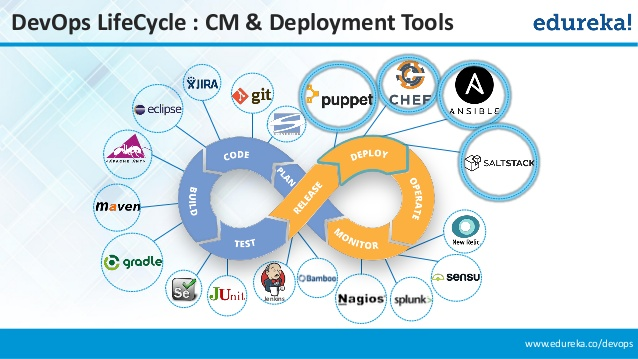
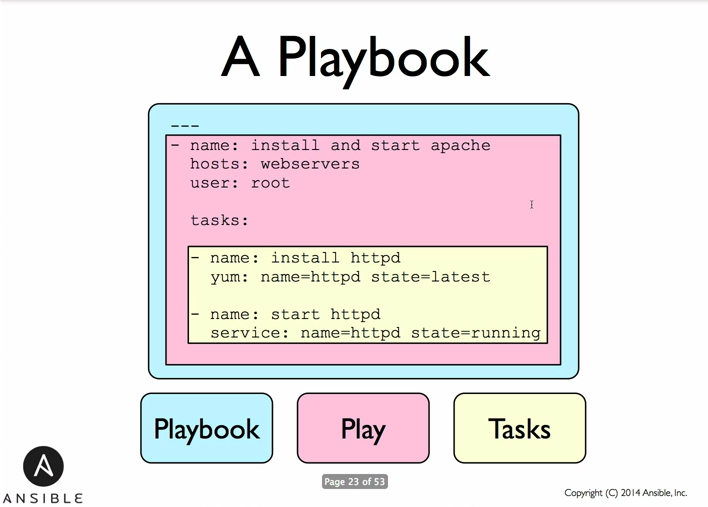
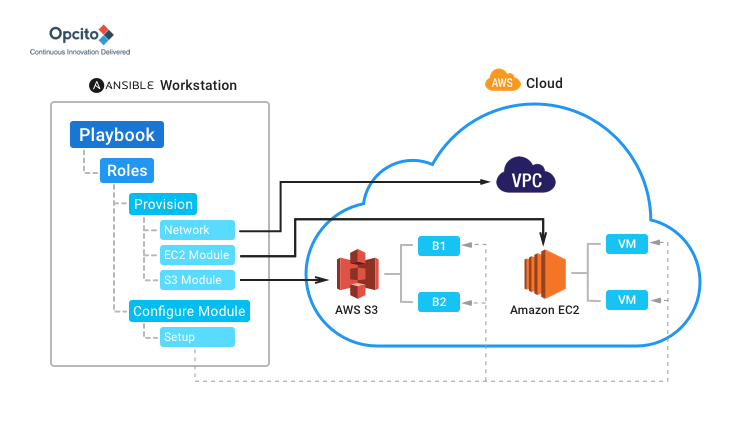

# Ansible


* [Introduction](#Introduction)
* [First steps](#Installation)  
* [Components](#Components)  
* [Deployment tasks](#Deployment)
* [AWS](#aws)
* [Conclusions](#Conclusions)
* [References](#References)  
  
<a name="Introduction"/>

## Introduction

### Infrastructure as Code (IaC)


Historically, it was required to ensure that a system’s state matched what was expected and then create a document certifying that this was the case. This is how a shell script used to look compared to how Configuration Management (CM) tools scripting looks nowadays:

  

```

# Shell Script:

echo “spock:*:1010:1010:Spock:/home/spock:/bin/sh” \ >> /etc/passwd

(the user spock is added to passwd file)

  

# CM Tool Script:

user { “spock”:

ensure => present,

gid => “science”,

home => “/home/spock”,

shell => “/bin/sh”

}

```

  

Today, it is possible to write that document as a specification declaring the expected state of the system, then rely on tools such as Ansible to implement the transformations required. With the cloud services and distributed calculations it has become critical to provision many machines with identical configurations. This cannot be done manually due to the time constraints and possible human errors.

  

In Shell Script, it is needed to write automation scripts from scratch, but in CM tools 80% of the functionalities are already available. In shell script, it is needed to define the workflows, while in CM tools the workflows are already available. Also, CM tools provide a user interface (UI) to simplify the job of automating the tasks, but there is no UI available in shell scripting.

  

There are multiple Configuration Management Tools that take charge of automating the deployment in DevOps, for example Chef, Puppet, SaltStack. In this report we will explore Ansible.




  

### Comparison with other Configuration Management Tools

There are many Configuration Management Tools to automate tasks and orchestrate processes. However, Ansible has the following advantages over other tools.

-   __Its simplicity:__ Ansible uses Playbooks written in YAML syntax. As YAML is a human-readable data serialization language, it is more understandable for non-developers. Ansible more closely resembles a tool called SaltStack (Salt), which also uses YAML files for configuration and is also written in Python. Both Ansible and Salt are built primarily as execution engines, where the system definition is just a list of commands to run, abstracted behind reusable modules that provide an idempotent interface to the servers. Thanks to most of Ansible’s modules and Salt’s state modules being idempotent, both tools can be used to define the state of a machine before the tool will run and enforce that state.
    
-   __Ansible is agentless:__ Puppet and Chef each use a central server to store the desired state of machines and any metadata associated with them. Ansible doesn’t have any central server at all, making it agentless. When using tools such as Puppet and Chef each server will check in periodically with the central server to see if there are any updates. Ansible relies entirely on the end user pushing out the changes themselves.
    
-   __Ansible is powerful & flexible:__ Having a simpler language, Ansible admits a wider variety of commands than other tools, allowing a higher level of complexity. Ansible has powerful features to model even the most complex IT workflows. In this aspect, Ansible’s batteries included approach (meaning that it is self-sufficient, ready to use, with everything that is needed) can manage the infrastructure, networks, operating systems and services that you are already using, as Ansible provides you with hundreds of modules to manage them. Together Ansible’s capabilities allow you to orchestrate the entire application environment regardless of where it is deployed.
    
-   __Its efficiency:__ No extra software on your servers means more resources for your applications. Also, since Ansible modules work via JSON, Ansible is extensible with modules written in a programming language you already know. Ansible introduces modules as basic building blocks for your software. So, you can even customize it as per your needs. For e.g. If you have an existing message sending module which sends messages in plain-text, and you want to send images too, you can add image sending features on top of it.
    

  
  

<a name="Installation"/>

## First steps

### Install Ansible

#### Linux

  

```

sudo apt-get install python-software-properties # if required

sudo apt-add-repository ppa:ansible/ansible

sudo apt-get update

sudo apt-get install ansible

```

  

#### OS X

```

brew install ansible

```


#### Windows

Ansible is not officially supported in windows but there are ways to run it from Windows Subsystem for Linux (WSL). Vagrant allows to use ansible on the guest system to provision linux machines from windows.

To run Ansible on Windows natively, follow these steps:


1. Install babun from [http://babun.github.io/](http://babun.github.io/). This is a preconfigured install of Cygwin, a POSIX environment with development tools for Windows.

2. Once that is installed, you’ll need to run pact install python-openssl python-crypto in a terminal. This installs some required libraries. You’ll also need easy_install and pip . To get these, run `https://bootstrap.pypa.io/ez_setup.py` followed by `python ez_setup.py` then `easy_install pip`.

3. At this point, you’re almost ready to install Ansible on Windows. You can use Pip to install the required dependencies by running pip install jinja2 pyyaml requests before running `git clone --recursive https://github.com/ansible/ansible` to download Ansible.

4. Finally, you need to install Ansible. To do this, run `cd ansible && make install`. At this point, you should be able to run ansible. Following these instructions, you may be able to use a Windows host as an Ansible control machine. However, this is not supported, and the official recommendation is to run a virtual Linux machine via Vagrant on Windows and install Ansible on your virtual machine. This will then serve as your control machine.

  
  

### Creating an Environment

Ansible can easily be used with Vagrant to provision virtual machines created by it. For that the Vagrantfile should contain an entry for the provision that refers to a provisioning script, for example Ansible playbook.

  

```

config.vm.provision "ansible" do |ansible|

  ansible.playbook = "provisioning/playbook.yml"

End

```

  

Using ansible will run Ansible on your local machine, while using ansible_local will log in to the virtual machine and run it there instead.

After that we can configure a simple playbook that contains only one task: ping. This task will run `ping` command after vagrant finished creating the virtual machine. This way we can ensure that the created virtual machine is up and accessible from the network.

```

---

- hosts: all

  tasks:

  - name: Make sure that we can connect to the machine

    Ping:

```

Running this playbook produces the following output.
  

```

TASK: [Make sure that we can connect to the machine]

**************************

ok: [default]

```

  
  

### Minimal web service in python installation: pip and Django

Ansible can easily be used to provision applications in any programming languages. In this section we will explore how to provision pip and Django on the virtual machine that already has python installed. This minimal playbook is only applicable for small project since larger projects will have many more dependencies and will require usage of Ansible roles. However, this example shows how to use modules. In this case we use module `apt` that runs `apt-get` command with the specified arguments to install pip and `pip` module to install Django.

  

```

---

- hosts: all

  become: true

  tasks:

  - name: Install pip

    apt: name=python3-pip state=present update_cache=yes

  - name: Install django

    pip:

    name: django

    executable: /usr/bin/pip3

```

 Output:
  

```

PLAY [all] *********************************************************

  

TASK [Gathering Facts] *********************************************************

ok: [default]

  

TASK [Install pip] **********************************************************

ok: [default]

  

TASK [Install django] **********************************************************

changed: [default]

  

PLAY RECAP *********************************************************************

default : ok=4  changed=1  unreachable=0  failed=0

```

  

<a name="Components"/>

## Components

### Ansible terminology

-   __Controller Machine:__ The machine where Ansible is installed, responsible for running the provisioning on the servers you are managing.
    
-   __Inventory:__ An initialization file that contains information about the servers you are managing.
    
-   __Playbook:__ The entry point for Ansible provisioning, where the automation is defined through tasks using YAML format.
    
-   __Task:__ A block that defines a single procedure to be executed, e.g. Install a package.
    
-   __Module:__ A module typically abstracts a system task, like dealing with packages or creating and changing files. Ansible has a multitude of built-in modules, but you can also create custom ones.
    
-   __Role:__ A pre-defined way for organizing playbooks and other files in order to facilitate sharing and reusing portions of a provisioning.
    
-   __Play:__ A provisioning executed from start to finish is called a play. In simple words, execution of a playbook is called a play.
    
-   __Facts:__ Global variables containing information about the system, like network interfaces or operating system.
    
-   __Handlers:__ Used to trigger service status changes, like restarting or stopping a service.
    


### Playbooks and Idempotency

Each playbook can contain more than one play, which can contain more than one task. The goal of each task is to execute a module. Ansible’s modules should be idempotent, that is, running a module multiple times in a sequence should have the same effect as running it just once. One way to achieve idempotency is to have a module check whether its desired final state has already been achieved, and if that state has been achieved, to exit without performing any actions. If all the modules a playbook uses are idempotent, then the playbook itself is likely to be idempotent, so re-running the playbook should be safe.

If you run vagrant provision with ad hoc tasks, you’ll notice that you may have a task that says changed every time it runs. This isn’t ideal, as it could trigger handlers or have other unintended side effects. You want your playbooks to say “OK” or “skipped” for every task when you look at the output of your playbook run. Fortunately, you can suppress that using changed_when. changed_when is a field that controls whether Ansible thinks that a task performed an action that made a change or not. If the expression provided evaluates to true, Ansible will record that a change was made and trigger any handlers that need to run. If it evaluates to false, Ansible will record that no change was made, and no handlers will be triggered.

Here’s a simple example of how you can use changed_when. List out the contents of

the `/tmp` directory and if see the word "django" occurs anywhere in the output. If so, Ansible will report that the task changed something.

  

```

- name: Example changed_when

  command: ls /tmp

  register: demo

  changed_when: '"django" in demo.stdout'

```

  

If the text "django" is not found in the command’s output, Ansible will report that the task did not change anything, showing OK in the output. Ansible checks if the expression evaluates to false to decide if a task changed anything. If you never want the command to return “changed,” you can specify changed_when: false to make it always return as OK.


```

- name: Does the database exist?

  command: mysql -u root wordpress -e "SELECT ID FROM wordpress.wp_users

  LIMIT 1;"

  register: db_exist

  ignore_errors: true

  changed_when: false

```

  

### Tasks and Handlers

One example of using handlers would be updating of nginx config by replacing the config file. However, nginx needs to be restarted in order to pick up the changes that you made to the configuration file. The best way to deal with things that need to be restarted when other things change is to use a handler. Handlers are just like tasks, but they can be triggered from anywhere.
  

```

- name: restart nginx

  service: name=nginx state=restarted

```


This code will use the service module to restart nginx any time the handler is triggered. Speaking of which, you can trigger it whenever your config file changes by updating the task to look like the following:


```

- name: Create nginx config

  template: src=templates/nginx/default dest=/etc/nginx/sites-available/default

  notify: restart nginx

```

  
If you run vagrant provision twice, the handler will not be run the second time. This is because you just ran vagrant provision and deployed the nginx configuration, and Ansible has detected that there are no changes required.
  


  
  

### Inventory

In the inventory file, we list the hosts and groups that Ansible will work on. Ansible runs provisioning on every specified host. By default, this file is stored in `/etc/ansible/hosts`.

  

This is how an inventory file is passed to ansible before running the ping module:

```

ansible all –i /path/to/inventory.ini –m ping

```

The inventory file will either be an INI file or a JSON file. The inventory file will include a list of servers, either expressing the domain, domain:port, or IP address. It is possible to reduce redundancy by writing `host[1-3].example.com` instead of

```

host1.example.com

host2.example.com

host3.example.com

```

So, an `inventory.ini`could look like:

```

host[1-3].example.com

host5.example.com:50822

192.168.9.29

```

The hosts listed will be run from top to bottom.

  

### Variables

Variables in Ansible are how we deal with differences between systems. Variables names are composed of letters, numbers and underscores, and they must always start with a letter. In a playbook, it’s possible to define variables directly inline like so:

```
- hosts: webservers
  vars:
    http_port: 80
```
Then, the variable is called as `{{ http_port }}`. It is possible to use other variables when defining new variables. In case variable names are repeated, in order to know which variable to read, Ansible uses precedence rules.
  

### Roles

Roles are used to load automatically certain vars_files, tasks, and handlers based on a known file structure. It is also possible to group content by roles and to share roles among users. Using roles allows multinode orchestration. As commented before, Ansible works against multiple systems in your infrastructure at the same time. Using roles makes it possible to orchestrate the different hosts (servers) listed in the inventory. Thus, they define behavior for server type. It is not possible to reuse playbooks, but using roles it is possible to reuse the content, avoiding redundancy and obtaining a higher level of organization. Moreover, there is a repository of ready to use roles: Ansible Galaxy. On this website people can upload roles that they have developed for other people to use.

  

Here we can see the different roles in a project structure:

```
site.yml
webservers.yml
fooservers.yml
  roles/
     common/
         tasks/
         handlers/
         files/
         templates/
         vars/
         defaults/
         meta/
     webservers/
         tasks/
         defaults/
         meta/


```

  

In this example provided by [Ansible documentation](https://docs.ansible.com/ansible/latest/user_guide/playbooks_reuse_roles.html), we can identify two roles: `common`and `webservers`. The files defined in roles will be stored in directories with the following names:

  

-   __tasks__ - contains the main list of tasks to be executed by the role.
    
-   __handlers__ - contains handlers, which may be used by this role or even anywhere outside this role.
    
-   __defaults__ - default variables for the role.
    
-   __vars__ - other variables for the role.
    
-   __files__ - contains files which can be deployed via this role.
    
-   __templates__ - contains templates which can be deployed via this role.
    
-   __meta__ - defines some meta data for this role.
    

For example, if `roles/common/tasks/main.yml` exists, the tasks listed in the file will be added to the play. The same happens with handlers, variables and role dependencies. This is how a playbook would look with roles:

```
---
- hosts: webservers
  roles:
     - common
     - webservers

``` 
  

This is how the tasks inside a role directory would look like [(from Ansible Documentation)](https://docs.ansible.com/ansible/latest/user_guide/playbooks_reuse_roles.html):

  

```

# roles/example/tasks/main.yml  
- name: added in 2.4, previously you used 'include'  
  import_tasks: redhat.yml  
  when: ansible_os_platform|lower == 'redhat'  
  import_tasks: debian.yml  
  when: ansible_os_platform|lower == 'debian'  
  
# roles/example/tasks/redhat.yml  
- yum:  
  name: "httpd"  
  state: present  
  
# roles/example/tasks/debian.yml  
- apt:  
  name: "apache2"  
  state: present

```

  

In a few words, roles allows a playbook to be split up into multiple different files. It is not possible to run a role on its own; first it must be included inside a playbook along with the information about which hosts to run on.

  
  
  

<a name="Deployment"/>

## Deployment tasks

In this section, we show the most common tasks required to deploy an application


* [Configure servers](#Task1)

* [Set up environment (in our case Python)](#Task2)

* [Deploy code](#Task3)

* [Migrate database schema & data](#Task4)

* [Perform some ad hoc tasks](#Task5)

All of these tasks can be managed by Ansible.

  

<a name="Task1"/>

### Configure servers

```

- name: install latest version of Apache

  yum: name=httpd state=latest

  

- name: check if apache conf.d dir exists

  stat: path=/etc/httpd/conf.d/

  register: apache_dir

  

- debug: msg="conf.d exists and is dir"

  when: apache_dir.stat.isdir is defined

  and apache_dir.stat.isdir

```

<a name="Task2"/>

### Set up environment

```

- name: check if virtualenv already exists

  stat: path={{virtualenv_dir}}

  register: venv_dir

  

- name: create virtualenv for Django web app

  shell: virtualenv {{virtualenv_dir}}

  when: venv_dir.stat.isdir is not defined

  

- name: install web application dependencies

  pip: requirements={{app_dir}}/reqs.txt

  virtualenv={{virtualenv_dir}}

```

<a name="Task3"/>

### Deploy code

```

- name: install known_hosts file for GitHub

  copy: src={{ ssh_dir }}/known_hosts

  dest=/home/{{ deploy_user }}/.ssh

  

- name: checkout latest web app code

  git: repo={{code_repo}} dest={{app_dir}}

```

<a name="Task4"/>

### Migrate db schema & data

```

- name: Django syncdb

  django_manage: command=syncdb

  app_path={{app_code_dir}}

  virtualenv={{venv_dir}}

  environment: django_env_vars

  

- name: Django migrate

  django_manage: command=migrate

  app_path={{app_code_dir}}

  virtualenv={{venv_dir}}

  environment: django_env_vars

```

<a name="Task5"/>

### Perform ad hoc tasks

```

- name: Django collectstatic

  django_manage: command=collectstatic

  app_path={{app_code_dir}}

  virtualenv={{venv_dir}}

  environment: django_env_vars

```

  

Command line:

```

$ ansible-playbook django-stack.yml --step \

--start-at-task="Django collectstatic" \

-u deployer -K

```

  
  
<a name="aws"/>

## AWS

Ansible can be used to create infrastructure on AWS. For this, we need to use an orchestration playbook. As this is an orchestration playbook and you don’t have a remote machine to connect to, you should add connection : local to your playbook. This tells Ansible that it should run on the local machine instead of trying to SSH to a remote machine (as there isn’t one available). We do this because the AWS modules in Ansible do not run against a remote host. Instead, they make HTTP requests to the Amazon API to perform actions such as creating a virtual machine.



An example of a playbook to create an AWS instance:

```

---

- name: Create AWS resources

  hosts: all

  connection: local

  gather_facts: False

  tasks:

    - ec2:

      image: ami-b9ff39d9

      region: us-west-2

      instance_type: t2.micro

      instance_tags:

        Name: Demo

```

The created instances can be then provisioned by the provisioning playbooks.

  

Deleting AWS instances:

  

```

---

- name: View AWS machines

  hosts: all

  connection: local

  gather_facts: False

  tasks:

    - ec2_remote_facts:

      region: us-west-2

      filters:

      "instance-state-name": running

      register: instance_list

    - debug: var=instance_list

```

This example shows how to manage AWS instances with Ansible but it is possible to work with other cloud providers using their modules in Ansible.

  
  
  

<a name="Conclusions"/>

## Conclusions

Our experience implementing Ansible; do not try to use a virtual machine as a host machine. We started working on an Ubuntu VirtualBox, but virtual machines generated inside virtual machines tend to crash. Although Ansible does not provide support for Windows, we successfully installed Ansible in the virtual machines generated by Vagrant in the Windows Command Prompt.

Evaluating comparisons between different Configuration Management Tools, we can see that Ansible is considered the market leader 
[as expressed in the graph below](https://www.g2crowd.com/categories/configuration-management?segment=all).

  


  

<a name="References"/>

## References

Ansible docs, [http://www.ansibleworks.com/docs/](http://www.ansibleworks.com/docs/)

Deploy Django with Ansible, [https://github.com/mattmakai/sf-django](https://github.com/mattmakai/sf-django)

Edureka, DevOps Tutorials, [https://www.edureka.co/blog/what-is-ansible/](https://www.edureka.co/blog/what-is-ansible/)

Michael Heap, Ansible From Beginner to Pro, 2016

Ansible Galaxy, [https://galaxy.ansible.com/](https://galaxy.ansible.com/)


