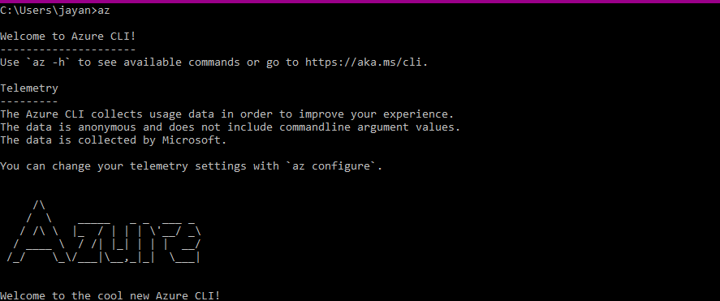
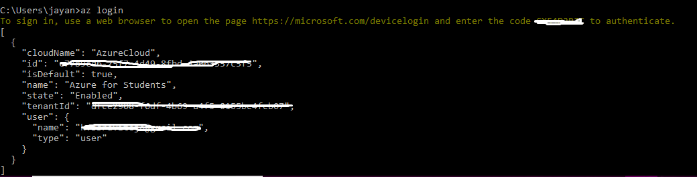
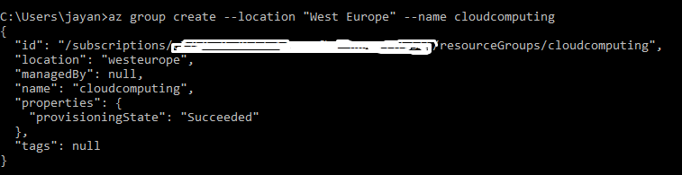
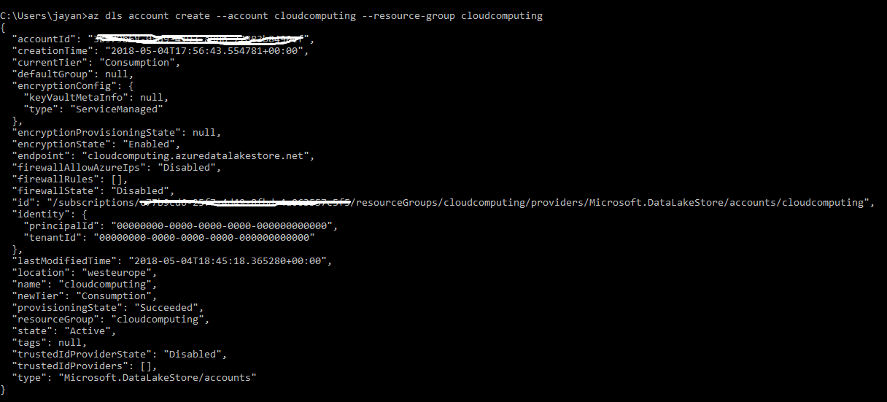
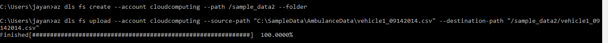
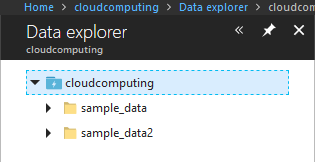

<h1>1.	Introduction </h1> 

<b>Data</b> nowadays is enormously growing every second. Many businesses working with big data are looking for suitable infrastructure models to help them apply analytics to their data, or simply to store it for undetermined future use. The current trending solution is using Data Lakes. In this research report, we’re going to review such a solution and take a closer look on Microsoft’s entry into the data lake market - Azure Data Lake, and in particular, Azure Data Lake store.

 <h2> 1.1.	What are data lakes?</h2>

Data Lake is a centralised repository that allows to store and collect  big data in its natural format.  Later it  facilitates  to perform different analytics, visualization and big data processing by handling the 3 V’s (Volume,  Variety, Velocity) of the data.  
                     

Data lakes are usually created on the basis of Hadoop and Hadoop business distributions, such as Hortonworks and MapReduce, which offer a lake data architecture. Businesses can also create data lakes using cloud services "infrastructure as a service" (IaaS), for example Amazon Web Services (AWS) and Microsoft Azure. The Amazon Elastic Compute Cloud (EC2) supports data lakes, and Microsoft has the Azure Data Lake platform.[1]

  <h2>1.2.	Architecture </h2>
The key components of a data lake architecture are[4] :
<h3>1.	Ingestion Tier:</h3>
This tier must be able to extract data from different sources( Databases, Logs, IOT devices, Social media, web) in different modes(Real-time,One-time load, Batch) in different types( Semi-structured, Structured, Unstructured) and load them into the data lake. It must be able to handle any new sources.[3]
<h3>2.	Data Storage: </h3>
This is the most important component of the architecture. The storage unit must be scalable and all-time available. It must be able to storage data in any format and provide easy and fast access.
<h3>3.	Distillation Tier: </h3>
This  collects necessary data from the data storage unit and converts them to structured data to use it for analysis.
<h3>4.	Processing Tier:</h3>
		This applies analytical algorithms and user queries for analysis.
<h3>5.	Unified Operations Tier: </h3>
This governs system management and monitoring. It includes auditing and proficiency management, data management, workflow management.
<h3>6.	Insight Tier: </h3>
This tier requires the insights from the previous tiers to perform research and analysis using SQL, No-SQL or others.
<h3>7.	Action Tier: </h3>
This integrates insights with business decisioning systems to build data-driven applications.	

<h2>1.3.	Data Warehouses Vs Data Lakes: </h2>
This section provides the major reasons why businesses nowadays are shifting towards data lakes from data warehouses.[5]

<h2>1.4.	Challenges:</h2>

<b>1. </b>	Data in a data lake <b>does not have unique identifiers</b>. There are no categories or classes defined, data is unfiltered, that makes searching more challenging.  
<b>2.	</b>If you need to return queries very fast, as in a few seconds or less, the data lake won’t give you that performance.  
<b>3. </b>	Data is usually not clean so it’s <b>not easy to join the data.</b>  
<b>4.	</b>There is no way to find out <b>if the data is useful until it is analyzed </b>. All the data is being ‘vacuumed up’ into a data lake and meshed together, without being organised by quality, but big amount of data at hand does not mean you automatically get value from all of this data.  
<b>5. </b>	<b>Security concerns </b>- hacks into data lakes are a continual threat, one that is exacerbated by the large number of data lakes that enterprises have. 
<b>6. </b> As the data lakes accept any kind of data in any form, poorly designed systems end up into <b>Data Swamps</b>. Data Swamp is a term used to describe the lack of documentation of data in the data lakes which makes it difficult to analyse and exploit the data. So, one must govern and manage the data in the data lake or else it eventually turns into a Data Swamp which costs huge money, storage and time[15]. 
<h1>2.	Microsoft Azure Data Lake </h1>

 Microsoft Azure Data Lake is a scalable <b>cloud data storage and analytics service </b>.

<h2>2.1. Product Description:</h2>

Azure Data Lake is a cloud storage and analytics service provided by Microsoft. It is as a hyper-scale repository for big data analytics and is compatible with the Hadoop distributed file system (HDFS). Azure Data Lake store has enterprise level capabilities like scalability, high availability, high throughput, security, manageability and durability etc., and can be accessed using WebHDFS (Rest APIs). The main features of the product includes:[6]

<h3>2.1.1	Storage: </h3>

It can store data from all disparate sources, including cloud and on-premise sources of any size and structure. Any existing IT system can easily interface with data stored in Data Lake and refer to this data for further use. We can store and analyse peta-bytes of files and trillions of objects.

<h3>2.1.2	 Cost:</h3>

The user can choose between on-demand cluster and pay per-job service. You can scale up and down individual components like storage, computation power as per your business requirements.

<h3>2.1.3	Security: </h3>
Data is always encrypted in motion using SSL and at rest using service or user-managed HSM-backed keys in Azure Key Vault. [7].
<h3>2.1.4	 Throughput:</h3>
Supports high throughput by parallel execution of huge queries. It can manage high volumes of data with very low latency.
<h2>2.2	 Architecture: </h2>
Azure data lake has mainly three components:
<h3>2.2.1	Azure Data Lake Store</h3>

Data Lake Store provides the repository that is necessary to keep the data influx of just about infinite volume. The store is designed for high-performance processing and analytics from HDFS applications and tools. In the store, data can be shared for collaboration with enterprise-grade security.

<h3>2.2.2	    Azure Data Lake Analytics</h3>

Data Lake Analytics offers a mechanism for picking apart and analyzing that data. To provide access between the storage and analytic, the Data Lake platform uses Apache YARN and WebHDFS-compatible REST APIs.

<h3>2.2.3	 HDInsight</h3>

Azure HDInsight is a full stack Hadoop Platform as a Service from Azure. Built on top of Hortonworks Data Platform (HDP), it provides Apache Hadoop, Spark, HBase, and Storm clusters.

<h1>3.	Data Lake Store </h1>

Azure Data Lake Store is secured, encrypted, massively scalable and built to the open HDFS standard, allowing you to run massively-parallel analytics.

<h2>3.1	 How to load data into Data Lake store:</h2>
One can use Azure Portal, Azure CLI, Azure Powershell to access Data Lake Store. Loading data can be carried out in different ways like :  
<b>1.</b>	Data can be <b>manually</b> uploaded.  
<b>2.</b>	We can use <b>Azure Data Factory</b> to ingest data from azure SQL databases, Azure Data Warehouses, Azure Data Blobs and Azure tables.  
<b>3.</b>	Streams data from <b>Azure Stream Analytics</b>.  
<b>4.	</b>Using <b>AdlCopy</b> to copy data from azure blob storage to data lake store.  
<b>5.</b>	Using <b>Sqoop</b>to import and export data from Azure SQL database to Data lake store.  
<h3>3.1.1	Method 1: Using Azure Portal </h3>
In this section we demonstrate how to upload data manually using azure portal and azure CLI.   
<b>Prerequisites:</b> Microsoft Azure Account (We used a trial account for students with $200 credits).  

<b>Step 1 : </b> Login into the azure account and you will see the following screen with different services.  

 

<b>Step2: </b> Click on “create resources” and select “Storage”  and select “Data Lake    Store”. 
 

		
<b>Step 3: </b>Fill in the details  and click on create. 

 

  
<b>Step 4 :</b>  After creating a resource, click on the data explorer to carry out few operations. 

 
   
<b>Step5: </b>Create a folder “sample data” and upload the sample files. We downloaded sample files of [ambulance data]( https://github.com/Azure/usql/tree/master/Examples/Samples/Data/AmbulanceData) available on the azure website  
 

 

		
<h3>3.1.2	Method 2: Using Azure CLI		</h3>	
We can allow carry out these operations on command line using “az” command on windows.  

<b>Step 1: </b>Download Azure CLI on windows and execute it. Now type “az” command and the output will be as follows. 

 
<b>Step 2: </b>Login into azure portal by the command “az login”. 

 
 

<b>Step 3:</b> Once login is succesful the details of the account are shown on the screen. Now select a subscription from your list of subscriptions using following command . 

 

 

<b>Step 4: </b>Now create a resource group named “cloudcomputing” in west europe region. 

 

<b>Step 5: </b>Now create a data lake store account named “cloudcomputing” with the resource group “cloudcomputing”. 

 

 

<b>Step 6: </b>Create a folder “sample_data2” and upload the files. 
 

 

Now, if we inspect our azure portal we can find the new folder sample_data2 created using CLI. 

 

 

Similarly, we can perform other operations like downloading, renaming, deleting the files.

<h2>3.2	 Azure Data Lake Store File System </h2>
	The data lake store can be accessed using the file system AzureDataLakeFileSystem (adl://) in Hadoop. This improves the performance compared to the usage of  webHDFS.  
<h2>3.3	 Security </h2>
 	If you want to secure your data lake store, we can create IAM roles and control access by assigning permissions to the roles. 
<h2>3.4	 Pricing </h2>
	The pricing for data lake store depends on the number of bytes of storage and number of transactions carried out on the lake.
The following is the pricing chart for pay per use type of subscription in eu-west region according to the Azure official website. 
 

 
 
 

 
				
<h1>4.	Data Lake Analytics </h1>
<h2>4.1.	 Introduction 	</h2>

 Azure Data Lake Analytics is a service that simplifies big data, instead of deploying, configuring, and tuning hardware, you write queries to transform your data and extract valuable insights. The service handles all the complex management tasks so customers can develop and execute solutions without worrying about deploying or maintaining the infrastructure to support them and only pay for a job when it is running, which makes it cost-effective. 

<b>U-SQL</b> is a language that allows you to write code once and configure automatic parallelization for the required scale. With the available .NET, R, and Python libraries, user can process petabytes of workload data of various categories, such as query creation, extraction, conversion and loading, analytics, machine learning, machine translation, image processing, and tone analysis. Microsoft Azure provides documentation about U-SQL and it’s usage in Visual Studio and on the portal (see ref. [10], [11]).

<h2> 4.2.	How does it work</h2> 

Data Lake Analytics is integrated with Visual Studio, providing developers with a familiar environment for creating analytical solutions. The solution created for the Data Lake Analytics service consists of one or more jobs that define the business logic. When the job is sent to Data Lake Analytics, the service will access the source data, perform certain operations, and display the results in the Data Lake Store.[8] Data Lake Analytics supports Data Lake Store and Azure Storage as data sources. You can use Data Explorer to browse data sources and perform basic file management operations. 
 
   
Azure Data Lake provides several options for submitting jobs to Data Lake Analytics: 
    
<b>1.</b>	Use Azure Data Lake Tools in Visual Studio to submit jobs directly 
<b>2.</b>	Use the Azure Portal to submit jobs via the Data Lake Analytics account. 
<b>3.</b>	Use the Data Lake SDK job submission API to submit jobs programmatically (there are SDK .NET, SDK for Python and SDK for Java tutorials are available on the Microsoft Azure, see ref. [13]) 
<b>4.</b>	Use the job submission command available through the Azure PowerShell extensions to submit jobs programmatically (see ref. [14]).

Microsoft provides all the documentation with scripts and examples on their website (see ref. [10]). Let’s take a closer look on the process of job submitting using Visual Studio and Azure portal.

<h3>4.2.1.	Method 1: Using Visual Studio </h3> 
<b>1.	</b>The tools are part of the workload of the storage and processing of data and the development of Azure in the Visual Studio Installer (not supported in Visual Studio 2017 15.3 or later).  
<b>2.</b>	After installing and enabling the tools, a user needs to connect to a Microsoft Azure subscription and select his Data Lake Analytics accounts. 
<b>3.	</b>To create a U-SQL script, select <b> File > New > Project > U-SQL Project </b>and write the script. For example, here is a simple script, that defines a dataset and writes it to the default Data Lake Store as a file called /data.csv.

`@a  = 
    SELECT * FROM 
        (VALUES
            ("Lays", 100.0),
            ("Pringles", 730.0)
        ) AS 
              D( product, amount );
OUTPUT @a
    TO "/data.csv"
    USING Outputters.Csv();`

<b>4.	</b>The Data Lake Analytics account is to be specified in the upper-left corner of our script window. 

 

 

<b>5.</b>	After the account is selected, we need to Submit the job (click on Submit > Verify the Analytics Account > Submit) 
<b>6.	</b>After the submission is complete, we can see the results of submission in the Data Lake Tools for Visual Studio Results. 
<b>7.</b>	When the job succeeds, there will be displayed Job Summary, Job Details, Job Graph (visualization of the progress of the job), MetaData Operations (all the actions that were taken on the U-SQL catalog), Data,  State History, and Diagnostics. 
<b>8.</b>	To see output of the job, go to Server Explorer and browse the job you submitted > Click on Data > On the Job Outputs select the "/data.csv" file. 

 

<h3>4.2.2.	 Method 2:Using Azure Data Lake Analytics Portal </h3> 
  To submit the job using the Azure Portal:
<b>1.</b>	Create a Data Lake Analytics account in a similar manner to data lake store account and give the name of the data lake store you want to use. In our case it is “cloudcomputing”. (created in the previous section 3.1.1) 
<b>2.</b>	Go to the <b>Data Lake Analytics account > New Job.</b> 
<b>3.	</b>Insert your U-SQL script > Click Submit Job and wait until the job status changes to Success (in case the job fails, the information on monitoring and troubleshooting is available on Azure Data Lake Analytics tasks). 
<b>4.	</b>To see the output of the job, click the Output tab, and select the file.For example, in the following script we are extracting the data from drivers.txt file and selecting all the rows from the extracted data and save it in the extractorText_Drivers.csv file. 
 

 

 

 
 
 

 

<h2>4.3.	Pricing </h2> 
Pricing for Azure Data Lake depends on numerous variables, such as storage capacity, number of analytics units (AUs) per minute, number of completed jobs, cost of managed Hadoop and Spark clusters.
There are two pricing options for using Azure Data Lake Analytics : Pay-as-You-Go and Monthly commitment packages.
Pay-as-You-Go lets a user pay by the second:
 
  

 

Monthly packages provide significant discounts (up to 74%):

            

 

<h1>5.	Conclusion </h1> 

Finally, it is clear that if the business generates different varieties of complex data in huge volumes, using data lakes over other storages like data warehouses is a good solution. 

Azure Data Lake is an  important new product of ambitious cloud offering of Microsoft. With Data Lake, Microsoft provides service to store and analyze data of any size at an affordable cost. For a company that works with enormous data, or with a broad mix of data types on which they want to run multiple levels of analysis — Microsoft Azure Data Lake offers a bridge to the data science world, using tools  that developers and analysts are familiar with.  

<h1>6.	References:</h1> 
 
[1]: https://en.wikipedia.org/wiki/Data_lake  
[2]:https://aws.amazon.com/big-data/datalakes-and-analytics/what-is-a-data-lake/  
[3]:https://www.yash.com/blog/data-lake-architectural-components/ 
[4]: https://www.yash.com/blog/data-lake-architectural-components/ 
[5]:https://www.kdnuggets.com/2015/09/data-lake-vs-data-warehouse-key-differences.html 
[6]: https://www.databasejournal.com/features/mssql/overview-of-azure-data-lake.html 
[7]: https://azure.microsoft.com/en-us/solutions/data-lake/ 
[8]: https://www.red-gate.com/simple-talk/cloud/cloud-data/azure-data-lakes/ 
[9]: https://searchcloudcomputing.techtarget.com/definition/Microsoft-Azure-Data-Lake 
[10]: https://docs.microsoft.com/en-us/azure/data-lake-analytics/ 
[11]: https://docs.microsoft.com/en-us/azure/data-lake-analytics/data-lake-analytics-u-sql-get-started 
[12]: https://www.gitbook.com/book/saveenr/usql-tutorial 
[13]: https://docs.microsoft.com/ru-ru/azure/data-lake-analytics/data-lake-analytics-manage-use-dotnet-sdk 
[14]: https://docs.microsoft.com/ru-ru/azure/data-lake-analytics/data-lake-analytics-manage-use-powershell 

<b>Extra sources: </b>

1.	Data Lake Architecture: https://www.capgemini.com/wp-content/uploads/2017/07/pivotal-business-data-lake-technical_brochure_web.pdf 
2.	Difference between different data storages:  https://intersog.com/blog/what-is-the-difference-between-data-lakes-data-marts-data-swamps-and-data-cubes/

