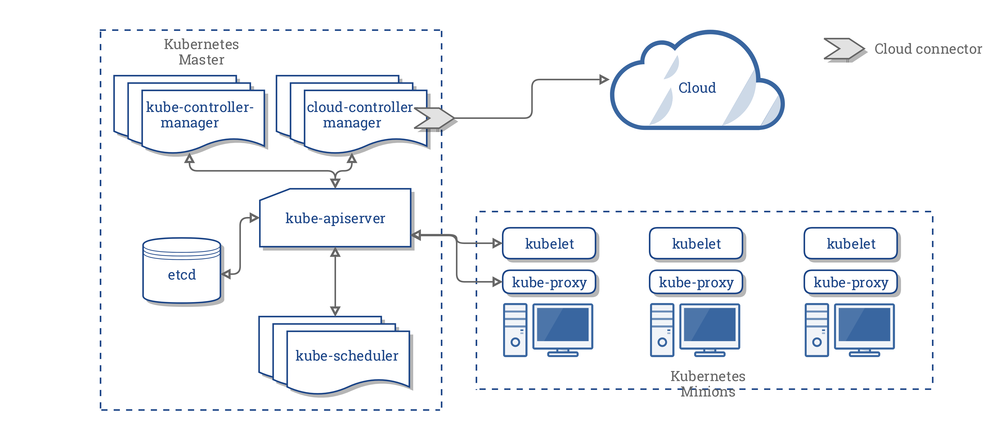

# Research Project: Kubernetes

## Authors

Joan Marcual - Sergi Alonso

## Table Of Contents

[Introduction](#introduction)

[Kubernetes](#kubernetes)

[Successful use cases](#successful-use-cases)

[Architecture](#architecture)

[Design](#design)

[Kubernetes Competitors](#kubernetes-competitors)

[Author's experience](#authors-experience)

[Useful links and related information](#useful-links-and-related-information)

[Conclusion](#Conclusion)

## Introduction

Deploying an application into production wasn't always so easy. It involved complex and unreadable bash scripts with huge amounts of corner cases and workarounds. Sysadmins were devoted to this kind of tedious and repetitive tasks.

Tools like Ansible, Puppet or Chef, several continuous integration and deployment frameworks appeared to make life easier, and once the setup was complete, little to nothing went wrong.

In the last years, containers have grown to standardise the environment and abstract away the specifics of the underlying operating system and hardware. Docker containers have become a de facto standard, and now companies need tools that allow containers to be deployed and automated. That's where Container Orchestration comes in.

Container orchestration is an abstraction layer that allows seamless management of containers' runtime in a cluster node, with automated scheduling and eviction, with features like load balancing and auto-scaling, all following the same standard and letting the orchestrator do most of the system administration.

There are several container orchestrators available on the market, but Kubernetes is one of the most advanced ones, almost becoming the de facto standard for container orchestration.

In this report, we deeply explain what is Kubernetes, who is using it, how it works and what are the most interesting features of it compared to its rivals.

## Kubernetes

Kubernetes is an open-source platform for managing containerized services. It's a Google project open-sourced back in 2014 after 15 years of experience running production [workloads at large scales](https://research.google.com/pubs/pub43438.html). It has a large and growing ecosystem as there are constant updates, support tools and plugins. Kubernetes is therefore a robust and reliable tool that is constantly growing. It can be thought of as a container platform, a microservices platform, and a lot more. To keep it simple, the main idea of a Kubernetes cluster is to have several processes managing the platform running in a Master node, and the corresponding services running in several other Slave nodes, in which the tasks will be orchestrated and run.

The scope of Kubernetes features is really wide. It provides a management environment for computing, networking and storage but always with the intention of being:

- Portable: It can be run everywhere, e.g public cloud, bare metals, laptops, virtual machines.. its behaviour is consistent.
- General-purpose: Every type of workload should be able to be run in it.
- Flexible: Kubernes features can be used on demand and optionally, providing the users the flexibility needed in order to use their own solutions.
- Automatable: Dramatically reduce the burden of manual operations.

and [more](https://github.com/kubernetes/community/blob/master/contributors/design-proposals/architecture/architecture.md)

Kubernetes operates at the container level, providing relatively common features like other Cloud platforms like deployments, scaling, load balancing, logging and monitoring. All these features are, however, optional and allow for a flexible approach the user can benefit from.

## Successful use cases

Some of the most important Cloud computing companies are using Kubernetes as its underlaying technology. Here are some examples of why Kubernetes is being used in a number of vendor solutions:

### Mesosphere for its [DC/OS](https://mesosphere.com/blog/kubernetes-dcos/) product

*Kubernetes on top of Mesos through DC/OS allows our customers to deploy the popular container orchestrator on top of a powerful distributed systems platform. With this unique architectural approach, Mesosphere DC/OS can provide an experience like the public cloud providers’ container engines within our customers’ data centers or across hybrid cloud.*

### Rancher Labs for its [container management platform](https://rancher.com/what-is-rancher/what-rancher-adds-to-kubernetes/)

*Kubernetes is a powerful engine for orchestrating containers. Rancher includes a full Kubernetes distribution, but adds value around Kubernetes in three key areas: Cluster Operations and Management, Intuitive Workload Management, and Enterprise Support.*

### Red Hat for its [OpenShift](https://www.openshift.com/container-platform/kubernetes.html) product

*Kubernetes is the industry leading open source container orchestration framework. Kubernetes builds on 15+ years of Google’s experience deploying containers for large-scale production environments. Rapid innovation, broad application use-cases, and ease-of-use are driving significant community activity and significant market adoption of Kubernetes by enterprises, governments, cloud providers and vendors.*

#### CoreOS for its [Tectonic](https://coreos.com/tectonic/) product

*Tectonic ships with CoreOS's signature automated operations, runs multi-cloud, and is the fastest, most secure path to Kubernetes. Tectonic is the secure, automated, and hybrid enterprise Kubernetes platform. It automates operational tasks, enables platform portability and multi-cluster management, and is always current with the latest upstream OSS so as to eliminate vendor lock-in.*

## Architecture

Kubernetes is built around its API, through which the user describes the cluster's desired state. From the API one can select which workloads and services must be run, which container images to use, how many replicas and other aspects. The user can directly use the REST API or use **kubectl**, which is the Kubernetes' command-line interface.

Once this information has been sent, the Kubernetes Control Plane is in charge of making it happen. To do so, Kubernetes will start new containers, scale up the number of containers of a service and more.



The Kubernetes Control Plane is a collection of processes that run in a Kubernetes Cluster. As we have mentioned before, the simple description of a Kubernetes Cluster is the following:

- A **Kubernetes Master**, a set processes that run on a single node (the Master node) which include:
  - the API server (**kube-apiserver**)
  - the controller (**kube-controller-manager**) and the scheduler (**kube-scheduler**), the ones responsible to control that the status of the cluster is the desired one.
  - the cloud controller, (**cloud-controller-manager**) that allows new cloud providers to integrate with Kubernetes easily by using plugins.
  - an [**etcd**](https://coreos.com/etcd/) instance, a high availability key value store used as backing store for cluster configuration data.

- The **minions**, each individual non-master node. Each minion needs to run:
  - the **kubelet** agent, which is the main agent and ensures the specified containers are running and are healthy.
  - the **kube-proxy** process, the network proxy that is capable of executing simple TCP and UDP forwarding, needed to reflect services defined through the Kubernetes API (see section: Networking).

## Design

Kubernetes is designed to work with a series of loosely coupled building blocks that collectively provide mechanisms for deploying and scaling applications.

### Pods

A Pod is the most basic bulding block of Kubernetes. This is the smallest Kubernetes object that the user can create or deploy. A pod represents **a running process** on your cluster. Usually a Pod packages an application container (or more than one), storage resources, a unique network IP and several options that state how the container should run. [Docker](https://www.docker.com/) is the most common container runtime used, but others are supported.

As we mentioned, a Pod can wrap a single container, or multiple in case they are responsible of running tasks that need to share resources. This way, Kubernetes doesn't manage the container directly, but the Pod.

Here's an example of a Pod definition using YAML.

```yaml
kind: Pod
metadata:
  name: myapp-pod
  labels:
    app: myapp
spec:
  containers:
  - name: myapp-container
    image: busybox
    command: ['sh', '-c', 'echo Hello Kubernetes! && sleep 3600']
```

Pods by themselves do not self-heal. If a Pod fails, the Pod is deleted. We previously mentioned a Pod is the very basic building block of Kubernetes, so a higher-level of abstraction is used to handle the job of managing the Pod's lifecycle: the Controllers.

### Controllers

Controllers are lifecycle manager loops that create and manage multiple Pods for the user, handling replication and self-healing mecanisms. The user could deploy a Pod by itself but normally one should use a Controller so Kubernetes provide those extra services. In this regard, if using a Controller, when a Node fails, the Controller will automatically replace the Pod by scheduling a new one on a different, healthy, Node.

Most common examples of Controllers are Deployments, DaemonSets.

#### Deployments Controller

A Deployment Controller handles the creation and replication of a Pod. This feature is useful for several uses cases, for example:

- Applying a new Pod definition
- Scaling up
- Status control
- Clean up..

The following example ilustrates a Deployment

```yaml
apiVersion: apps/v1
kind: Deployment
metadata:
  name: nginx-deployment
  labels:
    app: nginx
spec:
  replicas: 3
  selector:
    matchLabels:
      app: nginx
  template:
    metadata:
      labels:
        app: nginx
    spec:
      containers:
      - name: nginx
        image: nginx:1.7.9
        ports:
        - containerPort: 80
```

As we can see, in a few lines we can have several configurations set up. In the above example, we have created **three replicas** of an Nginx webserver, using the Docker container **nginx:1.7.9** and exposing the **port 80**.

#### Daemonset

A Daemonset Controller ensures that all Nodes run a copy of a Pod. This is useful to execute a service in every Node that joins the cluster. As nodes are added, pods will be deployed to them. When nodes are removed, the Pods will be garbage collected.

Some typical uses for this kind of controller are running a cluster storage daemon like **ceph**, running logs collection daemon like **logstash**, or node monitoring daemons like **Datadog**.

This is a more complex kind of Controller to write and we think its configuration is out of the scope of this document. More information on how to write a DaemonSet controller can be found [here](https://kubernetes.io/docs/concepts/workloads/controllers/daemonset/#writing-a-daemonset-spec)

### Labels

As we have seen throughout the examples, the keyword *labels* is used to add some metadata to the definition of the pods. Let's detail a bit more what exactly are labels.

Labels are just simple key-value pairs. They are available on pods, controllers, services and other Kubernetes definitions. Sometimes, it's useful to have a selector attribute like in the previous Deployment example. This way, if we define a service (see next section), we can tell Kubernetes which labels to use when finding pods to forward traffic to.

[Source](https://www.packtpub.com/virtualization-and-cloud/getting-started-kubernetes)

### Services

A Service is a layer of abstraction that acts as a basic Load Balancer. Services allow external applications to not worry about different access points and benefit from a scalable backend. Usually, the service IP address remains stable and abstracts any change or problem that could happen to a Pod.

For example, consider the Deployment example of three application replicas accessible through the port 9376. A client should not be aware or keep track of the different available backends themselves. A Service enables this decoupling and allows the client to access one single IP that will be forwarded by the **kube-proxy** process.


The previous example would be declared like this in a Service for Kubernetes:

```yaml
kind: Service
apiVersion: v1
metadata:
  name: my-service
spec:
  selector:
    app: MyApp
  ports:
  - protocol: TCP
    port: 80
    targetPort: 9376
```

This specification will create a Service which targets port 9376 on any Pod and exposes it to an abstracted Service port TCP 80. This will assign a unique IP and a unique port for the service, which will be available from within the cluster.

If the user wants to expose the port outside the cluster, we will need to specify the type *LoadBalancer*, but an External Load Balancer from a Cloud provider will be needed.

More information on publishing services on cluster ports can be found [here](https://kubernetes.io/docs/concepts/services-networking/service/#publishing-services---service-types)

### Networking

One of the most interesting parts of Kubernetes is how its networking works.

*Coordinating ports across multiple developers is very difficult to do at scale and exposes users to cluster-level issues outside of their control. Dynamic port allocation brings a lot of complications to the system - every application has to take ports as flags, the API servers have to know how to insert dynamic port numbers into configuration blocks, services have to know how to find each other, etc. Rather than deal with this, Kubernetes takes a different approach.* [Source](https://kubernetes.io/docs/concepts/cluster-administration/networking/#kubernetes-model)

Kubernetes imposes three key requirements on any networking topology:

- all containers can communicate with all other containers without NAT
- all nodes can communicate with all containers (and vice-versa) without NAT
- the IP that a container sees itself as is the same IP that others see it as

This means Kubernetes needs a network model that fulfill this requirements. The networking relies in third party solutions, and there are several options to choose from. Here we list the most interesting ones:

- Flannel: Flannel is a very simple overlay network that satisfies the Kubernetes requirements. Many people have reported success with Flannel and Kubernetes.
- Weave Net is a resilient and simple to use network for Kubernetes and its hosted applications. Weave Net runs as a CNI plug-in or stand-alone.
- OpenVSwitch is a somewhat more mature but also complicated way to build an overlay network. This is endorsed by several of the “Big Shops” for networking.

More information can be found [here](https://kubernetes.io/docs/concepts/cluster-administration/networking/#how-to-achieve-this)

### Monitoring

Kubernetes provide a Core Metrics API to check resource usage metrics, such as container CPU and memory usage. However, one of the most interesting tools that are currently supported in Kubernetes is [Heapster](https://github.com/kubernetes/heapster), *a project meant to provide a base monitoring platform on Kubernetes*.

Heapster is an aggregator of monitoring and event data, and works natively on all Kubernetes setups. It runs as a pod in the cluster, like any other Kubernetes application would. Heapter gathers information from Kubelet and is stored in a configurable backend.


The most popular stack is InfluxDB backend with Grafana for visualisation, both running as services in the cluster.


Find more information [here](https://github.com/kubernetes/heapster/blob/master/docs/influxdb.md)

### Namespaces

One of the most useful features of Kubernetes is its support of Namespaces.

Namespaces are virtual environments that are meant to be used by groups of many users across multiple teams. In other words, Namespaces are a way to divide the cluster so it can be shared among multiple users or tenants.

Namespaces provide important features like *resources quota*, so, in cases where you run multitenancy communities or want broad-scale segregation and isolation of the cluster resources, namespaces can be used to this end.

They are also useful to have a DNS entry for different environments such as Development, Staging and Production.

You can find more information on namespaces [here](https://kubernetes.io/docs/concepts/overview/working-with-objects/namespaces)

### Security

Security is a very broad topic and it's out of the scope of this report. The subject could fill its own report. However Kubernetes provides an interesting feature called **secrets**.

A secret is an object that contains sensitive data like a token or a password. A Pod can use a secret to reference that information in a safe way. Otherwise, that information would be put in a Pod specification. Instead, a secret allows for more control over it and reduces the risk of exposure.

## Kubernetes Competitors

There are several other scheduler or orchestrator tecnologies. The most relevant ones are Docker Swarm and Mesosphere DC/OS.

[Docker Swarm](https://docs.docker.com/engine/swarm/) is a very easy and simple orchestrator, offering a low learning curve and less complexity than Kubernetes. Swarm users are encouraged to use Docker's environment tools, like docker-compose which in the last versions lets the user create software stacks that can be automatically deployed to a Docker Swarm.

[Mesosphere DC/OS](https://docs.mesosphere.com/1.11/overview/what-is-dcos/) is a datacenter operating system that is also a cluster manager and a container platform. As a cluster manager, manages both resources and tasks running on the agent nodes. As an operating system, it abstracts the cluster hardware and software resources and provides common services to applications. DC/OS is a tool that has a wider and deeper scope than Kubernetes, and it had its own orchestration system prior to the big boom of containers. That was until last year that that DC/OS introduced the Kubernetes orchestration layer into its own product, so its products are, nowadays, compatible rather than competitors.

[Source](https://mesosphere.com/blog/kubernetes-and-the-dcos/)

In many situations, Kubernetes outperforms Docker Swarm's efforts to manage a machine cluster from a single Docker API.

Kubernetes is clearly one of the most interesting ones, and that's why a lot of vendors are integrating it in its products instead of using Docker Swarm. Moreover, it comes in an open-source free version or with production support releases.

[Source](https://searchitoperations.techtarget.com/definition/Google-Kubernetes)

## Author's experience

We have been working with Kubernetes for one year in our lab. We decided to include it as a container orchestration layer in our software stack for scheduling services on Smart Cities because it showed potential as a reliable and scalable tool. It's one of the core systems of our application and one of the most robusts, if not the most.

We had previously worked with Docker Swarm and, although we didn't find any performance issues, Kubernetes has proven to be much more powerful and robust and, in general, easy to develop with.

If you need to build a system capable of deploying users' services we highly recommend it as there are several API clients you can use to provide your clients with its features, as well as several plugins and a huge community. If, on the other hand, you own or run a private cloud, you may prefer to use one of the official products available that wrap Kubernetes and provide multi-tenancy capabilities and extra features, like Red Hat Openshift.

Kubernetes helps us deploying different services seamlessly in a heterogenious mixture of nodes with different architectures (armhf, arm64, x86, amd64...) and completely different workloads (web services, dashboards, queueing systems, alarm monitoring, stream processing) so we needed a general-purpose tool. We find the Kubernetes architecture to be one of the most flexibles to work with.

## Conclusion

In this report we have described the foundations of Kubernetes architecture and design. We have given a description of all the components that shape a Kubernetes cluster as well as description of its basic building blocks while discussing its features by providing some examples. We have also commented on its competitors and why Kubernetes is one of the most famous container orchestrators right now, showing examples of relevant companies that are integrating Kubernetes as part of its products and including our own experience.

Although we already knew some features about Kubernetes and have worked with this software, this report has helped us gain and organise even more useful knowledge about it. It will hopefully be as useful for other students in case that in some day they have to decide wether to use it or not.

## Other links and related information

- [Kubernetes.io](https://kubernetes.io/)

- [Docker Swarm is Dead. Long Live Kubernetes!](https://medium.com/@reactiveops/docker-swarm-is-dead-long-live-kubernetes-2d0db0609e09)

- [Kubernetes github](https://github.com/kubernetes/kubernetes)