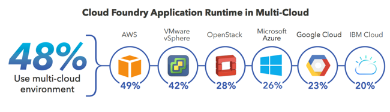

# 
#### Cloud Computing Research Report
##### Marie Elisabeth Heinrich and Joan Tiffany Ong Lopez
###### April 28, 2018

---

## Table of Contents
* [1 Introduction](#1-introduction)
  * [1\.1 Motivation](#11-motivation)
  * [1\.2 Current service landscape &amp; problem definition](#12-current-service-landscape--problem-definition)
* [2 Cloud Foundry](#2-cloud-foundry)
  * [2\.1 Overview of Cloud Foundry](#21-overview-of-cloud-foundry)
  * [2\.2 Architecture &amp; Main Components](#22-architecture--main-components)
    * [2\.2\.1 Architecture](#221-architecture)
    * [2\.2\.2 Deployment approaches](#222-deployment-approaches)
  * [2\.3 Advantages &amp; Disadvantages](#23-advantages--disadvantages)
  * [2\.4 Use Cases &amp; Maturity Assessment](#24-use-cases--maturity-assessment)
    * [2\.4\.1 Use Case: Bosch IoT Cloud](#241-use-case-bosch-iot-cloud)
    * [2\.4\.2 Customer Opinions &amp; Statistics](#242-customer-opinions--statistics)
* [3 Sample Application](#3-sample-application)
  * [3\.1 Overview and project goal](#31-overview-and-project-goal)
  * [3\.2 Set\-up &amp; Deployment](#32-set-up--deployment)
  * [3\.3 Personal Experience &amp; Lessons Learned](#33-personal-experience--lessons-learned)
* [4 Conclusions](#4-conclusions)
* [5 Sources](#5-sources)

## 1 Introduction
### 1.1 Motivation

Technology is changing and evolving rapidly these days. This does not only come along with benefits but also with challenges that companies need to adapt to. One major change is the shift to open source software. Software companies need to adapt business models or think about innovative ways to leverage the potential of open source data. Staying with "data" itself, you might even call it the "oil of the digital age" that companies need to understand and use in order to stay competitive in the future. Thus, the importance of data-driven decision making and **open source software** is not longer a concern for IT industries only, but becoming essential for many other industries as well. Nowadays, the number of connected devices that are the core components of the Internet of Things (IoT) is growing at an almost exponential rate. Gartner recently reported that the number has reached more than 8 billion in 2017 and is expected to increase up to 20 billion by 2020.  [source](https://www.gartner.com/newsroom/id/3598917) This implies not only a tremendous amount of data being created and stored, but also raises the need for advanced analytics to gain financial benefits from it.  
Not surprisingly, **cloud-native applications** are gaining momentum and we saw multiple cloud platform and application services popping up in recent years, supporting companies in dealing with their data and reducing time-to-market. Along with multiple cloud providers the desire for **multi-cloud strategies** is also picking up speed and will jump from 10% in 2015 to 70% in 2018 according to Gartner. [source](https://www.gartner.com/newsroom/id/3598917) This is mainly driven by considerations like avoiding vendor lock-in on a single platform or offering customers more flexibility in choosing their preferred provider for thier applications.  
Furthermore, developers face **rising complexity** e.g. because of new data types requiring new data storage models or real-time analytics, as shown in the figure below. To cope with these, frameworks and languages have been developed to increase developer productivity, support developers in terms of connectivity, roles, load balancing, server management and 24/7 availability.

However, a developer might still be mainly interested in just *developing the code* without getting lost in the cloud provider and seeks for a self-service end-to-end solution that:

1.	Has one API or command line that abstracts complexity
2.	Ensures code is not affected by how the application is scaled, where it’s deployed and which components are used as a service
3.	Allows maximum productivity of the developer

This is were Cloud Foundry (CF) comes into play: CF is an open source multi-cloud Platform as a Service (PaaS) offering customizable soltuions for solving the above mentioned problems and tackling the challenges of technology change.

### 1.2 Current service landscape & problem definition
Before we deep-dive into CF, let us quickly recall which forms are distinguished in the platform landscape. The figure below depicts the range of cloud options available to companies today. The offerings can be distinguished based on the scope of services provided externally and the services managed by the customer (light vs dark blue). As CF is a PaaS we mainly focus on this category. Its main purpose is abstracting processes like allocating data stores, updating operating systems or assigning web resources to let companies deploy their applications quickly and at scale. To find out more about currently available cloud architectures, we recommend reading the following [whitepaper](https://www.cloudfoundry.org/journey-platform-landscape/) from CF.

[source](https://www.cloudfoundry.org/journey-platform-landscape/)

###### But wait! Why do we need yet another PaaS?
Having several well-known, established PaaS providers such as AWS, Google Cloud or Microsoft Azure in the market raises the question what additional benefit CF could bring. We can believe there are three major reasons why Cloud Foundry is beneficial:

1.	It is not (or hardly) possible to move/migrate between clouds. Companies face the risk of vendor lock-in with current solutions which raises the need for a technology that can leverage multiple provider offerings.
2. The above mentioned Cloud solutions are not open source. Thus, they do not allow developers to fully customize it and develop their own cloud platform which reduces complexity (and potentially development cost), but also limits flexibility. In an open source driven industry, full customization might become essential for some comanies, e.g. when considering IoT use cases in which industrial companies want to provide their own IoT platforms to customers.
3.  In some applications it is not enough to configure high availability within one cloud provider, but between cloud providers as well. When an outage in one cloud provider occurs, the application can be routed to another availability zone in another cloud provider, thus providing even higher availability than the AZs available in one cloud provider.
4.	Limited offerings in on-premise solutions or requirements for certain supported frameworks as well as platform-dependent licensing costs raise the need for an independent open source offering.

## 2 Cloud Foundry
### 2.1 Overview of Cloud Foundry

###### What is Cloud Foundry?
[CF](https://www.cloudfoundry.org/) is an open-source PaaS aiming to offer customers as many choices as possible to customize their own solution. In particular, it is a container-based platform and uses industry standards to orchestrate lifecycles and run cloud-native applications that are designed for a PaaS (e.g. using different services). The focus of CF is on ensuring *that* your app is running rather than *where* it is running. Hereby it follows the concept of a **multi-cloud strategy** which comes along with some major advantages: it allows flexibility, consistency and choice of the most suitable cloud platform for specific app workloads and combines it with rapid, simple deployment as well as micro service deployments.

###### Who developed Cloud Foundry?
CF is an open source project and was originally designed and developed by a developer team of VMware in 2009 and was initially released in 2011. Today it is governed by the Cloud Foundry Foundation, an independent non-profit Linux Foundation Collaborative Project with currently 40 main members. Its code is written in Ruby and Go and available under the Apache 2.0 License at https://github.com/cloudfoundry/.

###### What is the scope of Cloud Foundry?
The following are the major tools, frameworks and components that are supported in the default version. However, additional services can be added by using the service broker API.

* Available development frameworks
  * Spring for Java, Scala, Rubi on Rails and Sinatra, node.js, Grails
  * *Community developed: PHP, Python*
* Developer tools
  * Command line interface (vmc), Eclipse based IDE (‘STS’)
* Application Service interface
  * Data Services (vFabric Postgres, MySQL)
  * Message Services (vFarbic, RabbitMQ)
  * Others (Redis key-value store, mongoDB)
* Cloud provider interface (multi-cloud)
  * Micro cloud, public cloud & private cloud (either CF or partner providers)

A [micro cloud](https://www.cloudfoundry.org/blog/we-shrunk-the-cloud-introducing-micro-cloud-foundry-for-developers/) here refers to an instance of CF (distributed as a virtual machine) on a developer’s PC. The major benefits are its symmetry with other CF instances (e.g. local app development and easy deployment to the cloud afterwards) and its dynamic DNS support allowing you to work on and access CF from everywhere.

###### Are there enterprise-ready distributions available?
In April 2013, EMC and VMware launched *Pivotal* to market their assets including CF, RabbitMQ and Spring as a deployment-ready solution for companies. [source](https://en.wikipedia.org/wiki/Pivotal_Software) It is a certified distribution which comes along with additional services and automation of most common tasks. We will go into more details in [2\.2\.2 Deployment approaches](#222-deployment-approaches).

Along with Pivotal Cloud Foundry, there are currently 9 [certified Cloud Foundry Platforms](https://www.cloudfoundry.org/certified-platforms/) available that provide certified offerings by ensuring the usage of the same core CF software and thus allow portability of applications. As of today these providers are:
* [Atos](https://atos.net/en/solutions/application-cloud-enablement-devops/multi-cloud-application-platform)
* [cloud.gov](https://cloud.gov/overview/pricing/start-using-cloudgov/)
* [Fujitsu cloud service k5](http://jp.fujitsu.com/solutions/cloud/k5/function/paas/cf/)
* [Huawei FusionStorage](http://developer.huawei.com/ict/en/site-paas)
* [IBM Cloud Foundry](https://www.ibm.com/cloud/cloud-foundry)
* [Pivotal Cloud Foundry](https://pivotal.io/platform)
* [SAP Cloud Platform](https://cloudplatform.sap.com/index.html)
* [SUSE Cloud Application Platform](https://www.suse.com/products/cloud-application-platform/)
* [Swisscom Application Cloud](https://www.swisscom.ch/en/business/enterprise/offer/cloud-data-center-services/paas/application-cloud.html)

### 2.2 Architecture & Main Components
#### 2.2.1 Architecture
In this chapter we'll take a look at the technical backbone of CF. An overview of the CF architecture is shown in the figure below and we shall briefly describe each of the components. However, this is by no means exhaustive and an extensive description of each component can be found in the [CF documentation](https://docs.cloudfoundry.org/concepts/architecture/).

 [source](https://docs.cloudfoundry.org/concepts/architecture/)

* **Routing**  
The [Router](https://docs.cloudfoundry.org/concepts/http-routing.html), written in Go, directs inbound and outbound traffic to CF services with highest [security standards](https://docs.cloudfoundry.org/concepts/security.html).
* **Authentication**  
CF uses the OAuth 2.0 protocol to define how users get access to an HTTP service and uses features like token management to control application access. The Login Server is part of the [UAA](https://docs.cloudfoundry.org/uaa/index.html) (User Account and Authentification) and checks the user log in credentials (identity management). All user settings are managed from the command line, either with the [CLI](https://docs.cloudfoundry.org/cf-cli/getting-started.html) tool or the UAA command line.
* **App Lifecycle**  
CF monitors the status of applications and takes either automatic or manual actions based on changes. The [cloud controller](https://docs.cloudfoundry.org/concepts/architecture/cloud-controller.html) currently supports Postgres and MySQL as well as the following fog web connectors: Azure, OpenStack, NFS, Google, AWS.  [Diego](https://docs.cloudfoundry.org/concepts/diego/diego-architecture.html#overview) is the container runtime sytem of CF and determines how to stage and run apps and tasks. It is the glue that orchestrates the app execution, app logs and health monitoring. The cell rep component manages the lifecycle of those containers and the processes running in them, reports their status to the Diego Bulletin Board System (BBS), and emits their logs and metrics to the Loggregator. The exact architectural layout and detailed data and communication flows are described in the [documentation](https://docs.cloudfoundry.org/concepts/diego/diego-architecture.html#overview).
* **Storage & Execution**  
The Cloud Controller manages the [blob stores](https://docs.cloudfoundry.org/deploying/common/cc-blobstore-config.html) for the following files during an application lifecycle: Resources, App packages, droplets, build pack cache. The blob store uses Fog Ruby Gem in order to use services like Amazon S3 or the NFS filesystem for storage and provides significant performance gains due to first its ability to scale the binary package format as well as second ensuring reproducible results upon subsequent releases. Application instances, application tasks, and staging tasks all run as *garden* containers on the [Diego Cell VMs](https://docs.cloudfoundry.org/concepts/diego/diego-architecture.html#cell-components) which are a component of Diego as described above.
* **Services**   
Services are software available at a [marketplace](https://docs.cloudfoundry.org/devguide/services/managing-services.html) and can be added to an application, e.g. a database. The service is connected via the open source [Open Service Broker API](https://www.openservicebrokerapi.org/) that creates a service instance when receiving a request and binds it to the application. This bindings report information to the Router to pass information how the app exchanges information with e.g. the database.

  
  [source](https://www.openservicebrokerapi.org/)

* **Messaging**  
The BBS server serves as a load balancer and single entry point to the CF system. It handles messages from inside and outside and keeps track of the work across Diego. [NATS](https://docs.cloudfoundry.org/concepts/architecture/messaging-nats.html) is a lightweight and distributed queueing messaging system written in Ruby.
* **Metrics & Logging**  
CF captures logs and metrics from every application using the [App Log Aggregator](https://docs.cloudfoundry.org/devguide/deploy-apps/streaming-logs.html), which allows powerful analysis and insights. It also allows integration of existing logging and monitoring solutions like Splunk, Logstash, New Relic, Datadog or Dynatrace.

#### 2.2.2 Deployment approaches

This section describes a few basic decisions to be made for deploying CF.

##### Open Source Cloud Foundry, or Pivotal Cloud Foundry?
When searching for "Cloud Foundry" we need to distinguish between two different terms: the open source CF release on [GitHub](https://github.com/cloudfoundry-attic/cf-release) and
[Pivotal Cloud Foundry](https://pivotal.io/platform) (hereinafter PCF). But what are the main differences?

**CF Release** is the minimal necessary foundation for deploying and running a resilient cloud native application platform, coming along with authentication, CLI, platform APIs, logging and the elastic runtime.  
**PCF** in contrast is a solution mainly made for companies, coming along many additional services to reduce time, cost & complexity of deployment & platform management. An overview of these additional services is depicted in the diagram below. A more detailed description can be found in this [Pivotal blog article](https://content.pivotal.io/blog/compounding-open-source-cloud-foundry-value-the-pivotal-difference).

[source](https://content.pivotal.io/blog/compounding-open-source-cloud-foundry-value-the-pivotal-difference)

##### Application Runtime or Container Runtime?

As different applications require different approaches for deployment, CF offers two major choices: CF Application Runtime and CF Container Runtime. According to CF, for cloud-native 12 factor applications the first will likely be the better option for deployment whereas the latter might be optimal if more flexibility and management of pre-packed apps is required. [source](https://www.cloudfoundry.org/container-runtime/) In the following we're briefly introducing both concepts with their high-level architecture.

**Application Runtime**

[source](https://www.cloudfoundry.org/application-runtime/)

[CF application runtime](https://www.cloudfoundry.org/application-runtime/), previously known as *Elastic Runtime*, is the simplest choice for developers as it is a code-centric platform for simplifying and managing the development lifecycle. It is very easy to scale or shrink most of the architectures component and resources. An overview of the CF architecture from an application runtime perspective is depicted in the figure below.

[source](https://www.cloudfoundry.org/application-runtime/)

What happens under the hood when an app is pushed to CF application runtime is a direct interaction of the user with the cloud controller (CC). The CC is directing *Diego Brain* to coordinate individual Diego cells and execute a series of operations: from bundling and staging the app, storing large binary files in the blob storage to running the app (as it is or in a container). External infrastructure and services can be added using the single API path provided by the Service Broker API.

**Container Runtime**

[source](https://www.cloudfoundry.org/container-runtime/)

[CF Container Runtime](https://www.cloudfoundry.org/container-runtime/) focuses on deployment, management and integration of containers. As such, it combines the open source container orchestrator [Kubernetes](https://kubernetes.io/) with the power of [CF BOSH](https://www.cloudfoundry.org/bosh/) to enable a uniform way of instantiating, deploying and managing highly available Kubernetes in a multi-cloud environment. The way they interact is shown in the figure below.

[source](https://www.cloudfoundry.org/container-runtime/)

Summarizing the above, CF container runtime supports companies in getting the most out of their containers and cloud architectures, by:
* Providing a platform for containers and ensure elasticity and portability across multiple cloud providers
* Reducing operational complexity by monitoring performance of containers at a scale
* Being open and collaborative with other projects like the Open Container Initiative (OCI) or the Container Networking Interface (CNI).
* Supporting Docker images and connecting to the Docker Registry

###### But what is CF BOSH?

In short: CF Application runtime is managing your applications, CF container runtime is managing your containers and [CF BOSH](https://www.cloudfoundry.org/bosh/) is a tool to manage the runtime layers, lifecycles of complex distributed systems/applications and their respective infrastructure set-up. It is the "*technical implementation*" of the previously described multi-cloud environment as it is able to deploy multiple nodes across multiple availability zones and monitor their health. Next to the task of maintaining the integrity of a cloud environment it allows VM recovery, upgrading and scaling by modifying its so called *manifest*. The major components of CF BOSH are shown below.

[source](https://www.cloudfoundry.org/bosh/)

The **deployment manifest** is a yaml file describing *which CF BOSH releases* should be deployed *how* onto *which cloud* and  ensures deployment of the app in the same way every time. A **stemcell** is similar to an operating system image of a virtual machine that isolates the base operating system from other software packages. The **release** is a layer on top of a stemcell describing how software should be deployed and configured. The full development documentation is available [here](http://bosh.io/docs/).

###### Is CF the same as Docker or Kubernetes?
No, CF itself is a *platform*, focusing on managing applications and/or containers and is able to support running Docker images and connecting to the Docker Registry to provide companies that are already running Docker with *additional platform capabilities* (PaaS). Kubernetes is more an Infrastructure as a Service (IaaS) with its main purpose to run your container, leaving everything else up to the developer and knowing very little about the inner-workings of an application. A major difference to CF is in the development & deployment approach, when e.g. working with Docker images: In Kubernetes you need to define the template for the docker image yourself in a Dockerfile whereas PCF provides the template automatically from a buildpack. A very nice comparison from a developer point of view can be found [here](https://medium.com/@odedia/comparing-kubernetes-to-pivotal-cloud-foundry-a-developers-perspective-6d40a911f257).

### 2.3 Advantages & Disadvantages
The following table summarizes the advantages and disadvantages of CF:

Advantages | Disadvantages
--- | ---
Open Source & community contribution under the Apache 2.0 license | Costs of using managed/certified CF instances, or cost of provisioning required cloud infrastructure if doing own installation
Multi cloud: all infrastructures monitored on one single dashboard | Complex installation/configuration process (if choosing the open source version without out-of-the-box solutions)
Choice of infrastructure (provider) |
Competitive advantage: portability between different infrastructure providers to get best price on utility |
Choice of industry-standard frameworks |
Extensible architecture to digest future cloud innovation |

### 2.4 Use Cases & Maturity Assessment

#### 2.4.1 Use Case: Bosch IoT Cloud
With additionally rising customer requests for IoT solutions in the cloud, [Bosch](https://www.bosch.com/), a global industrial company headquartered in Germany, was forced to find an answer to this demand and officially released its [IoT Suite](https://www.bosch-si.com/iot-platform/bosch-iot-suite/homepage-bosch-iot-suite.html) in early 2017 which is based on CF as a platform-agnostic middleware layer and cloud service.

###### Why did they decide for Cloud Foundry?
One major problem the Bosch IoT team faced in the past years was that connected devices are produced by multiple manufacturers that use different protocols which causes a lack of unified standards. By using CF, Bosch managed to align applications and device protocols on common industrial standards suitable for the respective customer tenant. An additional target of their platform is to ensure scalability of IoT applications as well as compatibility with a broad range of IaaS providers to allow customers to choose their required services and cloud providers independently. In February 2017 Bosch and IBM [announced](http://www.bosch-presse.de/presseforum/details.htm?txtID=3638) their collaboration to make the IoT suite available on [IBM Bluemix](https://www.ibm.com/cloud/) and [IBM Watson](https://www.ibm.com/watson/) to further extend their customer offering.

[source](https://www.cloudfoundry.org/blog/cloud-foundry-enables-bosch-to-scale-and-build-iot-apps-faster/)

> "With CF and the IoT suite, Bosch manages to reduce complexity and costs of IoT projects, accelerate development cycles and improve time-to-market, resulting in significant competitive advantages for customers". [(source)](https://www.cloudfoundry.org/blog/cloud-foundry-enables-bosch-to-scale-and-build-iot-apps-faster/)

#### 2.4.2 Customer Opinions & Statistics
A user survey about Cloud Foundry released in April 2018 by ClearPath Strategies yields some interesting findings about the usage and customers of CF. We will only highlight 4 major findings here. Further details can be found in the [full report](https://www.cloudfoundry.org/wp-content/uploads/CFF-User-Survey-April-2018.pdf).

1. **Universality & Scalability:**  
CF Application Runtime is used globally with 43% of its users in North America and 33% in Europe. More than half of the users (61%) are large enterprises ($1+ billion annual revenue).

  
  [source](https://www.cloudfoundry.org/wp-content/uploads/CFF-User-Survey-April-2018.pdf)

2. **Maturity:**  
About 53% of CF users have just started with the platform in the past two years. However, use in production has grown by 7% compared to the previous year, proving the evolving maturity of the platform. The most frequent use cases were microservices (54%) followed by websites (38%).

  

  
  [source](https://www.cloudfoundry.org/wp-content/uploads/CFF-User-Survey-April-2018.pdf)

3. **Variety of use cases:**  
About the same amount of customers (26%) use CF open source self-managed PaaS or other orchestration tools like Kubernetes and Docker to manage their containers.

  
  [source](https://www.cloudfoundry.org/wp-content/uploads/CFF-User-Survey-April-2018.pdf)

Many customers leverage the multi-cloud environment advantage of CF (48%) with AWS being the most often used service provider (49%). Unsurprisingly, 92% of the users responded that cross-platform flexibility is very important to them.

  
  [source](https://www.cloudfoundry.org/wp-content/uploads/CFF-User-Survey-April-2018.pdf)

According to the report the majority uses on-premise private clouds. Since the study yields a total of 122% in the respondents’ statistic, we can conclude that multiple cloud form usage is common amongst customers.

  

  [source](https://www.cloudfoundry.org/wp-content/uploads/CFF-User-Survey-April-2018.pdf)

4. **Customer Diversity:**  
CF is used in a variety of industries with IT (48%) and financial services (16%) making up the majority.

  
  [source](https://www.cloudfoundry.org/wp-content/uploads/CFF-User-Survey-April-2018.pdf)

#### Community contributions
When accessing maturity of an open source software we also consider community contributions to be an important factor. As shown in the statistics below, the community continuously contributes to the development of the platform, supporting the statement that CF maturity is gaining momentum. The real-time statistics can be explored in the [CloudFoundry Kibana dashboard](https://cloudfoundry.biterg.io/app/kibana#/dashboard/C_Overview)

Considering the statistics we can say that even though CF just started a few years ago, it seems to attract many customers across multiple industries with its unique solution portfolio that avoids vendor lock-in, gives customer a maximum amount of freedom and also has a diverse and active community, continuously developing new capabilities. Additionally, it has several ongoing development [projects](https://www.cloudfoundry.org/projects/) to further improve the software, it might have only scratched the surface and users could expect an even broader variety of features in the future.

## 3 Sample Application
### 3.1 Overview and project goal

To try the Cloud Foundry multi-cloud capability for ourselves, we deployed a sample application that uses at least one resource in another cloud platform. For this we use two of the CF-certified platforms, namely Pivotal Cloud Foundry and SAP Cloud Platform.

### 3.2 Set-up & Deployment

We found a sample application that illustrates CF's multi-cloud functionality, called [9fellas](https://content.pivotal.io/blog/multi-cloud-application-portability-in-action). Created by Pivotal, this toy application does nothing more than display animal icons or "fellas" in the web app, for every instance or thread added by the user. The back end datastore is a Redis database. In the following clip we can see the app's behavior: when `/addthread` is called, a fella appears; when `/deletethread` is called, a fella disappears.

One can also use the `cf scale` command to horizontally scale the application by increasing the number of instances. In the following clip, we increase the instances to two and call `/addthread`. Each row of fellas represents threads in an instance - as we can see here, after increasing the instances, some threads are created in the new instance.

###### How does this illustrate multi-cloud?

> "If each cloud is a different electrical grid, then Cloud Foundry is the travel adapter."  [source](https://content.pivotal.io/blog/multi-cloud-application-portability-in-action)

This quote aptly describes what we want to show in our proof of concept. We want to deploy an application on one cloud provider which uses a resource on yet another cloud provider, made possible by Cloud Foundry. To this end, we deployed the 9fellas toy application to PCF installations (i.e. "the travel adapters") in two CF-certified cloud providers (i.e. "the grid"): Pivotal Web Services (PWS) and SAP Cloud Platform (SCP). The redis database resides in PWS, which is accessible from both 9fellas app instances in PWS and SCP.

###### Now let's deploy the sample application

If you haven't already, sign up for a PCF free trial in [Pivotal](https://try.run.pivotal.io/gettingstarted) and in [SAP Cloud Platform](https://account.hanatrial.ondemand.com/). Also, download the 9fellas code from its [Github repository](https://github.com/mreider/9fellas).

Let us walk through the steps:

Step | Command | Description
--- | --- | ---
0 | - | Install the [CF Command Line Interface](https://pivotal.io/platform/pcf-tutorials/getting-started-with-pivotal-cloud-foundry/install-the-cf-cli)
1 | `cf login -a <ENDPOINT URL> -u <PIVOTAL ACCOUNT NAME> -p <PIVOTAL ACCOUNT PASSWORD>` | The `-a` param specifies the URL of the API endpoint of the CF instance to be invoked in the succeeding commands. For Pivotal it is `https://api.run.pivotal.io`.
2 | `cf target -o <ORG NAME> -s <SPACE NAME>` | The organization and space names are configured in the dashboard of the PCF instance. Organizations share a resource quota plan, applications, services availability, and custom domains. Spaces provide users with access to a shared location for application development, deployment, and maintenance. [source](https://docs.cloudfoundry.org/concepts/roles.html)
3 | `cf push <APP NAME> --no-start` | Before executing this command, make sure you have navigated to the top-level directory of the 9fellas project. The `--no-start` option will not start the application after deployment, because it will fail as we have not yet bound a redis service (to be done in succeeding steps). Pushing performs the following: - Uploads and stores app files Examines and stores app metadata - Creates a “droplet” (the Cloud Foundry unit of execution) for the app - Selects an appropriate Diego cell to run the droplet - Starts the app. [source](https://docs.cloudfoundry.org/devguide/deploy-apps/deploy-app.html)
4 | `cf marketplace` | This prints a list of available services and service plans available in the current instance of PCF. Look for a Redis service and make a note of its service name and service plan, which will be used in the next step.
5 | `cf create-service <SERVICE> <PLAN> <REDIS NAME>` | Provisions the Redis data store. Replace SERVICE and PLAN with the corresponding names from the previous step, while REDIS NAME is the name you assign to the redis instance.  A service is a factory that delivers service instances, while service instance is a reserved resources, e.g. databases, or accounts on an SaaS application. [source](https://docs.cloudfoundry.org/devguide/services/)
6 | `cf bind-service <APP NAME> <REDIS NAME>` | Binds the Redis service to the application.
7 | - | In `9fellas.py`, update the `REGISTRAR_URL` variable with the endpoint URL of your app. The URL can be found in the cloud provider's PCF dashboard or in the last few lines of the `cf push` command output, under 'routes'.
8 | `cf set-env <APP NAME> "all-apps" "<APP URL>"` | Sets the `all-apps` environment variable to the given URL, where all database updates from the app will be sent.
9 | `cf push <APP NAME>` | This command redeploys the application, and should be successful now that we have created and bound the Redis service.
10 | - | Navigate to the application URL.
11 | - | Add threads to the application by calling the `/addthreads` endpoint, and remove threads through `/deletethread` (for example, `http://9fellas.cfapps.io/addthread`). You can do this through `curl` in command line, or by calling it from a browser window. The fellas in the screen should increase/decrease as you add/remove threads. (see first video above)
12 | `cf scale <APP NAME> -i <n>` | This command scales the application to n instances. (see second video above). It is also possible to vertically scale the app through the `-k` (disk space) and `-m` (memory) options. It is applied to all instances of the application.

At this point, we have deployed the application to one cloud provider (PWS). Next we deploy the same app to the second cloud provider (SCP).

Step | Command | Description
--- | --- | ---
13 | - | In `9fellas.py`, look for the instantiation of the variable `svc`. Comment out the existing line and add the following: `svc = vcap['redis'][0]['credentials']`. This is necessary because different instances of PCF may have different environment variable names. To view the list of environment variables, use the `cf env <APP NAME>` command.
14 | - | Repeat steps 1-12 as above, except the following: Step 1: Use API endpoint for SAP, `https://api.cf.eu10.hana.ondemand.com` Steps 7 and 8: specify the same APP URL as when you were setting up in Pivotal. This is because we want the app instance in SCP to send data to the Redis database in Pivotal, thus illustrating the multi-cloud deployment we want to see.
15 | - | After completing the above steps, navigate to the `/all-apps` endpoint from the browser, e.g. `http://YOURENDPOINT/all-apps`. You should see groups of fellas created from both apps in PWS and SCP, thus proving (albeit in a small way) CF's multi-cloud capability.

Note that although the second deployment also provisions a Redis data store (i.e. the `create-service` command), it is only needed to be able to deploy the app. The actual data store used is the one specified in APP URL.

### 3.3 Personal Experience & Lessons Learned
Here are some lessons learned from the setup performed above.

* CF setup is resource heavy

    An organization that wants to deploy to non-certified CF providers would need to install its own PCF instance on cloud infrastructure or on-premise hardware. In AWS, the basic "starter" setup requires 22 virtual machine instances, 3 load balancers, 5 S3 buckets plus other resources. The complete deployment requires 40 VM instances.

    

    This is also true for other cloud providers such as Azure and Google Cloud Platform although specific requirements may vary.

    Below is a list of links to deployment instructions for the big three cloud providers:

Cloud Provider | Links
--- | ---
Amazon Web Services | https://aws.amazon.com/quickstart/architecture/pivotal-cloud-foundry/  https://docs.pivotal.io/pivotalcf/2-1/customizing/aws.html  https://medium.com/scalable/how-to-deploy-pivotal-cloud-foundry-on-aws-flawlessly-28db847bc51b 
Microsoft Azure | https://docs.pivotal.io/pivotalcf/2-1/customizing/pcf_azure.html
Google Cloud Platform | https://cloud.google.com/solutions/cloud-foundry-on-gcp

* Deployment process varies per cloud provider

    Initially, we were expecting the deployment process to be the same regardless of the cloud platform. Unfortunately, this is not the case: the deployment steps vary between cloud providers. For example, on GCP, it is a completely manual process to configure each component of the architecture. On AWS, Cloud Formation templates are provided in the quick start, so most components do not need to be set up manually, but some user input is still required. It takes around 2.5 to 3 hours to deploy. On Azure, template deployment is available from the portal screen.

* Cost

    From a cost perspective, even a minimal (open source) CF installation in Google Cloud Platform will cost a total of [US$ 696.82/month](https://cloud.google.com/products/calculator/#id=0a079495-2064-4472-ad1b-d5db5935f3a5). This is due to the more than 20 VM instances of different sizes are required to install CF components.

    This confirms that CF is geared towards large enterprises where the benefits justifies the costs of deploying CF.

* To explore what PCF can do, it is better to try it first on certified PCF platforms such as Pivotal Web Services or SAP Cloud Platform

    Installing our own CF instances is a disproportionately large task for this proof-of-concept, as a complete PCF installation can take hours, not including time for troubleshooting. Even in an AWS deployment, where it is possible perform an automated deployment using CloudFormation templates, the setup will take around 2.5 hours. Therefore it is recommended to initially use certified CF platforms to perform a proof-of-concept.

* Documentation exists but mostly official documentation from Cloud Foundry, Pivotal or cloud vendors

    There exists many helpful tutorials and videos, but they are usually created by Pivotal or supported cloud vendors. However, from a developer perspective it is very useful to have alternate sources of information where the architecture is explained in layman's terms, usually in blogs or StackOverflow pages. We think this reinforces the idea that CF is primarily used by large enterprises where CF is set up once by a person or a small team knowledgable in CF, and propagates administration/maintenance skills internally.

## 4 Conclusions
After conducting a lot of research around Cloud Foundry as well as getting some hands-on experience we can clearly see the advantage of Cloud Foundry over other PaaS or IaaS offerings: the opportunity to *leverage a multi-cloud strategy* with a fully customizable & exendable open source platform that can be adapted to individual needs. In case an out-of-the-box solution with additional services or support is needed, we think there are plenty of options through certified providers or service specialists (e.g. IoT). Despite these benefits, on the other hand, a large amount of resources are required to install it. As such, it shows that its target market is the large enterprise and might not be the worth the cost and effort unless multi-cloud is essential to the business model. Nevertheless, it unquestionably has its value for a variety of companies and use cases.

## 5 Sources
The following sources are integrated as in-line referrences in the text as well, but are listed again for reader convenience.
#### Cloud Foundry Overview & Architecture
* https://www.cloudfoundry.org/
* https://docs.cloudfoundry.org/concepts/diego/diego-architecture.html
* https://docs.cloudfoundry.org/concepts/architecture/
* https://docs.cloudfoundry.org/loggregator/architecture.html
* https://www.cloudfoundry.org/journey-platform-landscape/
#### Deployment Options
* https://www.cloudfoundry.org/application-runtime/
* https://www.cloudfoundry.org/container-runtime/
* http://bosh.io/docs/
* https://www.youtube.com/watch?v=JCU0vQjJ5UI&list=PLhuMOCWn4P9hsn9q-GRTa77gxavTOnHaa
* https://content.pivotal.io/blog/compounding-open-source-cloud-foundry-value-the-pivotal-difference
* https://medium.com/@odedia/comparing-kubernetes-to-pivotal-cloud-foundry-a-developers-perspective-6d40a911f257
#### Installation Guides
https://aws.amazon.com/quickstart/architecture/pivotal-cloud-foundry/
https://docs.pivotal.io/pivotalcf/2-1/customizing/aws.html
https://medium.com/scalable/how-to-deploy-pivotal-cloud-foundry-on-aws-flawlessly-28db847bc51b
https://docs.pivotal.io/pivotalcf/2-1/customizing/pcf_azure.html
https://cloud.google.com/solutions/cloud-foundry-on-gcp
#### Sample Application
* https://content.pivotal.io/blog/multi-cloud-application-portability-in-action
* https://github.com/mreider/9fellas
#### Customer Surveys & Community Contributions
* https://www.gartner.com/newsroom/id/3598917
* https://www.cloudfoundry.org/wp-content/uploads/CFF-User-Survey-April-2018.pdf
* http://www.bosch-presse.de/presseforum/details.htm?txtID=3638
