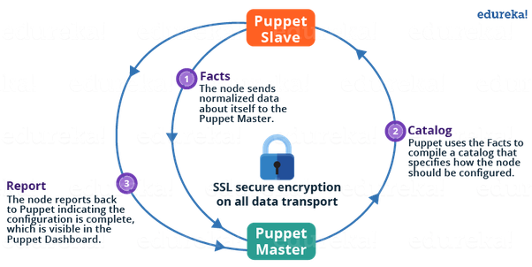
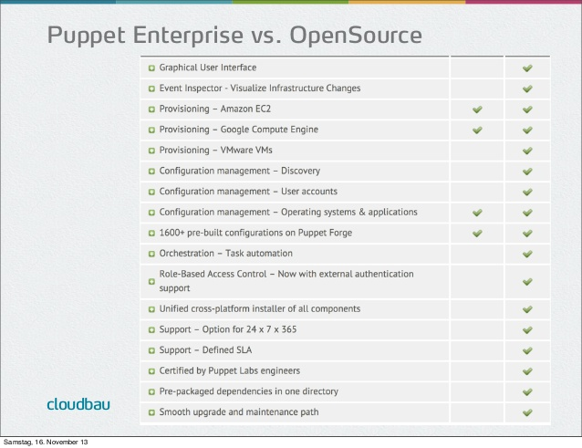

# Puppet Surveying

## Outline

1. Introduction and background to Cloud Automation
2. What is a configuration management tool (CMT) and what does it offer?
3. What is puppet?

    3.1)  How is Puppet organized
    
    3.2)  Puppet Architecture
    
    3.3)  Puppet open source vs Puppet Enterprise features
    
    3.4)  Popular Puppet ecosystem modules include: 
    
4. Conclusion

## 1.Introduction and background to Cloud Automation

 Today, every organization depends on software. Retail, logistics, government, scientific research, tech, education, financial services every sector needs some sort of software to meet customer and user needs. The expectations people have of software have changed dramatically over the last decade: They expect reliable and convenient services that are regularly improved. The complexity of our computing infrastructure increases continually, as does the pressure to deliver more software, more frequently, and at higher standards of quality.

  The normal way of delivering software in organizations has been incredibly dysfunctional, because incentives just haven’t been aligned. Too often, developers are incentivized solely to deliver new features; their responsibility ends as soon as the software is handed to the operations teams to deploy. Operations teams have been incentivized to keep infrastructure as stable as possible; their responsibility for software delivery starts only once they've been handed the software to deploy. (And of course, operations normally has plenty of responsibilities in addition to deploying software, including managing costs, user accounts and overall capacity, plus ensuring overall security.)

  Cloud automation follows the main principle of automating all routine tasks with configuration Management Tools. In this report, we take a closer look into Puppet Cloud Management.
  
**What is Puppet doing for us?**
To answer this question, it is helpful to understand the historical need for Cloud automation and what DevOps is all about.

#### Era 0:
  Depending on the need, different operating systems are installed. Just to imagine a big data center where a server administrator needs to go to every single server and install it by inserting an operating system CD and configure different settings to get the server into the network.
#### Era 1:
  This system administrator does not want to make the settings one by one for each new server again, so a “golden image” helps to have a pre configured operating system for a server.
#### Era 2:
  Computers or Servers don't stay the same. Software is added, removed, and updated. Configurations are changed. Think about the changes you've made to your computer since the first time you booted it up. Now imagine making those changes to 10, 100, or 1,000 more computers. Configuration management tools are what make implementing and enforcing these changes possible.

##  2. What is a configuration management tool (CMT) and what does it offer?

#### Enforcement
  Configuration enforcement may be the most important feature of a CMT. A regular run ensures the machine is configured to the desired state. That’s how CMT prevent configuration drift. A configuration shift can happen due to Package updates, live debugging, undiscussed changes etc. At any point after an enforcement it can be guarateed that the machine is configured in a specific way. This can reduce incident resolution time and reduce unwished events.

#### Enables cooperation

  CMT make it easier for team members to cooperate. One change can be updated across the entire infrastructure. Manual editing of configurations can lead to unexpected events, increase the failure probability and take a lot of time. By putting all of the configuration in one place, others can see the desired configuration state and no one interferes to someone else's requirements to a configuration.

#### Version control friendly VCS
  Like in github, the best way to enable cooperation is to have everything in a version control system.

#### Enables change control processes
  Because configuration management tools are textual and VCS-friendly, the infrastructure can treat infrastructure changes like code. Changes can be submitted as diffs or merge requests and be subject to code review before approval. Enumerated changes with timestamps can make reconstructing incidents much easier. Atomic changes, can be release at a desired rate and timing, instead of batching a bucket of changes at the infrastructure all at once.

### Abstraction
  Most infrastructures are not homogeneous environments. Many of the operating-system-specific implementations of a configuration are abstracted away of the hardware or software environment. The same configuration file can be used to manage, for example, the installation of Apache HTTPD on both Red Hat and Ubuntu systems
## 3. What is puppet?
  Puppet is a configuration automation and deployment orchestration solution for distributed apps and infrastructure. It was developed by Luke Kanies to automate tasks for sysadmins to improve configuring, provisioning, troubleshooting and maintaining server operations on the side of system administrators.

  Puppet is built with Ruby and offers custom Domain Specific Language and Embedded Ruby templates to create custom Puppet language files. Furthermore does it offer a declarative programming approach. Puppet uses an agent/master architecture. Agents manage nodes and request relevant info from masters that control configuration info. The agent polls status reports and queries regarding its associated server machine from the master Puppet server, which then communicates its response and required commands using the XML-RPC protocol over HTTPS. 

### 3.1 How is Puppet organized?

#### Manifests 
  Contain Puppet code (a Ruby DSL), describing the desired configuration, contents, or execution for files, services, scripts, and other pieces of infrastructure
#### Modules
  Group common manifests together to achieve some goal (e.g. an elasticsearch module could be used to install, configure, and start elasticsearch on a node)
#### Nodes
  Are the systems to be configured by one or more modules
#### Environments
  Are user-defined logical groupings, typically representing different versions of the total body of Puppet code. Typically aligned to software development life cycle states, like QA or Production

#### At runtime
  The Puppet executable runs the given modules for a particular matching node in the desired environment and prints its progress to stdout. 
  If all goes well the node should be configured as the described puppet code.

##### Extended run operations:
* Defining distinct configurations for each and every host, and continuously checking and confirming whether the required configuration is ensured and not altered. If altered, puppet will revert back to the required configuration on the host.
* Dynamic scaling-up and scaling-down of machines.
* Providing control over all your configured machines, so a centralized (master-server or repo-based) change gets propagated to all, automatically.

##  3.2 Puppet Architecture:
  In the following picture the master slave architecture is illustrated:
  
  

####  Following functions are performed:
1.  The Puppet Agent sends the “facts” to the puppet master. Facts are key/value data pair that represents some aspect of the client state -e.g IP address, up-time, operating system, mac address or whether it’s a virtual machine. 
  
2. Puppet Master uses the facts to compile a Catalog based on the manifests, that defines ho jinekologw the client should be configured. Catalog is a document that describes the desired state for each resource that Puppet Master manages on a client.

3. Puppet Clients (slaves) report back to Puppet Master that Configuration is complete, which is visible in the Puppet dashboard.

#### 3.3 Puppet open source vs Puppet Enterprise features

  There are always trade-offs when you choose to build versus buy. Many enterprises start with the open source version only to realize they don’t have the time or resources to maintain the deployment, or they need additional capabilities which they have to build and maintain themselves.  

  The following are some reasons large organizations choose Puppet Enterprise:
  
  

#### Packaging
  Puppet Enterprise includes over 40+ open source projects (MCollective, Facter, Hiera, etc.) in a straightforward installer. This saves teams precious time in packaging and managing dependencies for their Puppet deployments.
Out-of-the-box Scalability
  Puppet Enterprise is stable, tested and hardened and includes a multi-master installer for large deployments.

#### User Interface
  An intuitive, visual environment containing an extensive collection of highly useful features—dashboards for easy monitoring, advanced reporting capabilities, alerting capabilities, a unified installer, and the ability to deploy agents with just a few mouse clicks. And again, the GUI is a much more useful interface for both newbies wishing to learn Puppet and busy ops folks looking to avoid typing out repetitive commands.

### The standard puppet applications are?

#### 1.  Puppet Node Manager: 
  A rules-based node classifier that groups nodes based on key characteristics, such as operating system, graphic location and business unit.
  
#### 2.  Puppet Code Manager: 
  Leverages r10k technology to deploy infrastructure changes in a testable and programmatic way. Combined with Jenkins and Puppet Labs' Beaker for acceptance testing, you can apply continuous delivery practices to your infrastructure code.
  
#### 3.  Puppet Configuration Manager: 
  Gain insight into relationships of node configurations to ensure reliable deployments. You can visualize and easily map relationships across the resources on a node for troubleshooting purposes.

### Enterprise-only Capabilities

#### RBAC 
Important for large, distributed teams, RBAC allows you to safely delegate tasks to individuals and groups. Puppet Enterprise integrates directly with directory services such as Active Directory and Open LDAP.

#### Reporting:  
Puppet Server Reporting collects a wide variety of metrics about your Puppet Server health and performance including active requests, request duration, execution times and compilation load.

#### Event Inspection:  
Digests thousands upon thousands of piece of information generated by Puppet Enterprise and visualizes changes by nodes, classes and resources so you know exactly what changed, where and how.

#### Supported Modules:
Enterprise customers can call support when they need help with any one of the Puppet Supported modules. Supported modules include critical services such as Apache, MySQL, NTP, F5, Windows Registry, Docker, AWS, and more. Some modules, such as the SQL Server and VMware vSphere modules are available only for Puppet Enterprise.

#### Automated Provisioning: 
Support for automated provisioning of containers, cloud, VMs and bare metal.

#### Official Puppet Labs Support: 
Enterprises commonly shy away from open source offerings because of perceived lack of official corporate sponsorship and support. For mid-sized and large corporate clients with hundreds or thousands of nodes to manage, the peace of mind that comes with vendor-supported software is indispensable. Product upgrades, maintenance, and training come out-of-the-box with Puppet Enterprise, with support options available in both Standard (9am-5pm, 5 days a week) or Premium (24x7x365) formats.

#### Access to Professional Services: 
Professional Services can help you with deployment of Puppet Enterprise, upgrades, customization and education. Also, a Puppet Labs’ Professional Services consultant can evaluate your Open Source Puppet infrastructure and provide best practice recommendations to help migrate to Puppet Enterprise. 

Puppet Enterprise is tiered based on number of managed nodes and the support plan chosen. Pricing ranges from $112 per node/year with a standard support plan to $199 per node/year with the premium plan. For comparison, a standard subscription for 100 virtual nodes of Red Hat Enterprise Linux Server would be $39,950 per year. More details on pricing is available on Puppet Lab’s pricing page.

### 3.4 Popular Puppet ecosystem modules include: 

Like already mentioned, puppet offers many modules to improve the working environment. Listed below are the most famous modules and their description of it:

#### Puppet Forge
A repository that provides access to over 4,000 pre-built user contributed modules.

#### Beaker
A test harness focused on acceptance testing for interactions between multiple virtual machines (VMs).

#### Facter 
A tool for gathering basic facts about nodes, including hardware details, network settings, operating system (OS) type and version.

#### Hiera 
A key/value lookup tool for configuration data.

#### MCollective 
A framework for building server orchestration or parallel job execution systems.

#### PuppetDB 
A searchable database that stores information about every node. 

#### Razor 
A advanced provisioning application for discovering and deploying bare-metal VMs and virtual systems.

#### Trapperkeeper
A Clojure framework for hosting long-running applications

## 4. Conclusion 

We identified two main ideas about Puppet.
The first one is the principle of **consistency**. 

The second one is the **cloud automation**. 

The next step in the evolution of configuration management systems is what is called "installation management" tools. These provide more flexibility and basically allow the automation of a "normal" installation. Kickstart used by Puppet is a installation management tool. It allow machines to be installed with the desired configuration and software packages. Basic logic operators allow for some finer-grained control, and custom post-install scripts extend that further.

### 4.1 Who is using puppet?

* More than %66 of the Fortune 100 Companies are using Puppet.
* Amazon, Google, Intel , Twitter, RedHat, Spotify, GitHub and many more..
* The Enterprise Edition has many more built in functions for larger teams that saves a lot of time of deployment. But since Puppet is open source and modifiable, you can easily scale it up to your needs.

### 4.2 Pro and Contra
Pros:
* Strong compliance automation and reporting tools.
* Active community support around development tools and cookbooks.
* Intuitive web UI to take care of many tasks, including reporting and real-time node management.
* Robust, native capability to work with shell-level constructs.
* Initial setup is smooth and supports a variety of OSs.
* Particularly useful, stable and mature solution for large enterprises with adequate DevOps skill resources to manage a heterogeneous infrastructure.

Cons:
* Can be difficult for new users who must learn Puppet DSL or Ruby, as advanced tasks usually require input from CLI.
* Installation process lacks adequate error reporting capabilities.
* Not the best solution available to scale deployments. The DSL code can grow large and complicated at higher scale.
* Using multiple masters complicates the management process. Remote execution can become challenging.
* Support is more focused toward Puppet DSL over pure Ruby versions.
* Lacks push system, so no immediate action on changes. The pull process follows a specified schedule for tasks.

### 4.3 Which criteria to keep in mind by choosing the automation software?

#### Configuration Management vs Orchestration: 
Is the IAC tool designed to install and configure software on existing servers or to provision new servers?
#### Mutable Infrastructure vs Immutable Infrastructure:
Does the IAC tool update software by modifying it in-place or by deploying a new server with the updated software?
#### Procedural vs Declarative: 
Does the IAC tool use a procedural language where you write code that specifies, step-by-step, how to to achieve some desired end state or a declarative style where you write code that specifies your desired end state, and the IAC tool itself is responsible for figuring out how to achieve that state?

#### Client/Server Architecture vs Client-Only Architecture: 
Does the IAC tool require running a server and installing agent software, or is does it only require a client app?

### 4.3 Ressources for more information
https://puppet.com/products/why-puppet/puppet-enterprise-and-open-source-puppet - comparison open source and enterprise

https://opensource.com/business/16/9/what-are-configuration-management-tools - General explanation of configuration management tools

https://puppet.com/blog/what-is-devops - what is the devOps movement

https://www.youtube.com/watch?v=PL_J5Gj3GAQ Youtube video about puppet introduction

