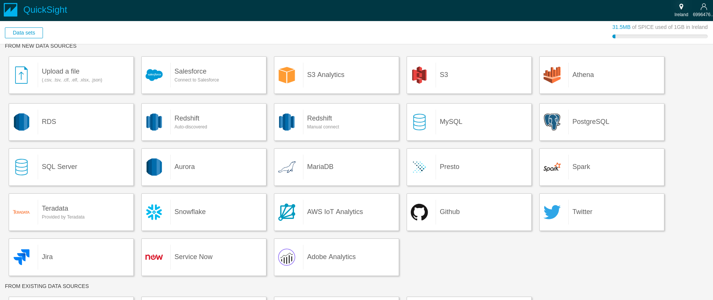

## Table of Contents
- [Introduction](#introduction)
- [Storage](#storage) 
    * [DynamoDB](#dynamodb)
    * [Simple Storage Service](#simple-storage-service)
    * [RedShift](#redshift)
    * [Elastic Map Reduce](#elastic-map-reduce)
- [Lambda](#lambda) 
- [Kinesis: stream and firehose](#kinesis-stream-and-firehose)
- [Machine Learning](#machine-learning)
- [QuickSight](#quicksight)
- [Use case: Social Media](#use-case-social-media)
- [Conclusion](#conclusion)
- [References](#references)  

# Introduction

Data science is an interdisciplinary field of scientific methods, processes, algorithms and systems to extract knowledge or insights from data in various forms, either structured or unstructured. In other words, is the unification of statistics and data analysis in order to understand and analyze actual phenomena, from which we have gathered some data. It has been a very hot topic in the last five years and a lot of companies are investing a lot of money in extracting knowledge from any kind of data. Some examples are the traditional movie recomendation system (e.g. [Netflix](https://www.netflix.com/es-en/)), image recognition in autonomous cars (e.g. [Waymo](https://waymo.com/)), speech recognition (e.g. Google Voice, Siri, Cortana etc.) and many others.  Furthermore, data is surrounding us and it's full of interesting information to discover that might lead us to exploit new applications. These are the reasons that motivated us to dig deeper into the field and learn how tools, provided by one of the biggest service provider, can be used to develop a machine learning application with a very small amount of money.

In the next section, we are going to talk about the storage services that are very convenient to save data for analyzing it later, then we will talk about the Lambda function as a service, real time data analysis with Kinesis, Machine Learning server with algorithm and we will present a typical Data Analysis use case using social media data. We are also going to give some insight about how might be the cost for the user to use the services presented in this document.

# Storage

In this section, we are going to give an overview of the most useful storage services for Data Scientists -what they are and why they are useful. With some of them, we will make some references to the cost it suppose to use a specific storage service. There is no better service over the others and that's why we are not giving any recommendation. The reason we believe in this is because every data analysis application has its specific funcionalities, make the user choose how to store the data according to them (e.g. medical data analysis needs a lot of storage capacity while real time needs very fast access).

## DynamoDB

Amazon DynamoDB is a fast NoSQL database service for all kind of applications that need consistency and low read/write latency. The NoSQL database model is non-relational, allowing both document and key-value data structures providing the flexibility to design the architecture that is optimal for a specific application. DynamoDB  service makes it very simple to store and retrieve any amount of data, as well as serve any level of request traffic. As other Amazon services, it has the Auto Scaling parameter that, if it's enabled, the database will scale automatically. Moreover, it has a trigger feature integrated with AWS Lambda to allow the developer code actions based on updates on items in the DynamoDB table, such as sending a notification. 

In the following Figure we can see an example of a DynamoDB where Tweets extracted from Twitter are saved by id.

DynamoDB has a fault tolerance system that automatically and synchronously replicas data across three data centers in a region. This is done to protect data against machine or facility failures. Furthermore, is highly scalable and elastic and without limit in the amount of data you can store in a DynamoDB.

#### Cost model

DynamoDB service differs from other Amazon service by allowing developers to purchase a service based on throughput, rather than storage. With 
DynamoDB, you pay only for what you use and there is no minimum fee. DynamoDB has three pricing components: provisioned throughput capacity (per hour), indexed data storage (per GB per month), data transfer in or out (per GB per month). New customers can start using DynamoDB for free as part of the [AWS Free Usage Tier.](https://aws.amazon.com/free/)

## Simple Storage Service

Simple Storage Service(S3) is an object storage service, similar to Dropbox, but more focused to be used to work with codes and applications. Each object is treated as a file, with its metadata included and having an ID number. A developer can access an objcet by using the ID number and via a rest API. Since S3 doesn't have a user friendly interface, as it's designed to work with online applications, some libraries or APIs makes it easier to work with. One of the most known libraries to work with S3 is Boto3, written in python and suitable to work with other AWS services as well. 

The amount of data you can store in S3 has no limit, the user just has to pay for the storage base on the demand needed every month. S3 is designed to deliver 99.999999999% of durability and it has two storage classes: S3 Standard and S3 Infrequent Access. S3 Standard is suitable for frequently accessed data offering high durability, availability, and performance object storage. Some use cases for this class are cloud applications, dynamic websites, content distribution, mobile and gaming, and Big Data analytics. The S3 Infrequent Access offers lower storage capacity used for backups and long-term data storage. 

Amazon S3 stores data as objects within resources called "buckets". The user can store in these buckets as many objects as he/she needs, up to 5 terabytes of data. The user can control the access to the bucket and objects, view access logs and choose the AWS Region where the bucket is stored, to optimize latency or minimize costs. Buckets are similar to the traditional folders and files system (e.g. if you store filename.txt on S3 with bucketname/textfiles/filename.txt as path, "bucketname" is the bucket used and textfiles/filename.txt is the key to the file). 

#### Cost model

The cost of this service is low, without a minimum fee. Prices are base on the location of the Amazon S3 buckets. There is an AWS Free Usage Tier where the user can have this service for free. New customers obtain a 5 GB of S3 storage with 20.000 Get Requests, 2.000 Put Requests and 15 GB of data transfer each month during one year. If the user is interested in having more storage capacity, the figure below indicate the price of diferent capacities within Europe region and for different storage classes.

## RedShift

RedShift is a data warehouse service that lets the user store big amounts of data. It's optimized for data sets ranging from a few gigabytes to petabytes. Data is distributed on different nodes (servers) connected to a cluster. When the user launches a query, they run in parallel on all the nodes and the results are being collected from each node. Furthermore, most of the common administrative tasks are automatized (such as provisioning, configuring, monitoring, etc.), facilitating the management and maintenance. Amazon Redshift is a good solution for online analytical processing using any of the existing business intelligence tools.

To obtain a high performance, Redshift uses a columnar storage, data compression and zone maps to reduce the amount of I/O needed to perform queries. Moreover, it has a massively parallel processing architecture to parallelize and distribute SQL operations to take advantage of all the resources available. If a node fails, is detected automatically and replaced. During this transition, the data from whe whole cluster is "read only" until a replacement node is provisioned and added to the DB. Depending on the user needs, he/she can change the number or type of nodes in the data wharehouse as the required performance or capacity changes. The user can start with a node of 160GB and scale up to a petabyte or more using many nodes.

#### Cost model

Redshift has two types of instances: Dense Compute and Dense Storage. The first one is optimized for fast querying and is cost effective for less than 500 GB of data(about $5,500/TB/Year for a three-year contract with partial upfront). Dense Storage is suitable for high amount of data size (about $1,000/TB/Year for a three-year contract with partial upfront) and is cost effective for every additional 500 GB. There is also an option with On-Demand pricing which allows you to pay for capacity by hour with no upfront costs - you simply pay an hourly rate based on the number of nodes in the cluster. In the following figure we can see the on-demand prices for both type of instances, Dense Compute and Dense Storage.

## Elastic Map Reduce

Elastic Map Reduce(EMR) is high distributed framework to process and store data in a cost effective manner. It uses Apache Hadoop to distribute the processing and the data across a cluster of [Amazon EC2](https://aws.amazon.com/ec2/) instances. EMR reduces large processing problems and data sets into smaller tasks that are distributed accross many computing nodes within a Hadoop cluster. The cluster can have three types of nodes: the master node who is responsible of managing the cluster and distribute the workloads to core and task nodes, the core nodes that processes the tasks and stores data and the task nodes that can only run tasks.

#### Cost model

Amazon EMR lets the user launch a cluster that stays up indefinitely or a temporary cluster that terminates after the analysis is completed. In both scenarios, the user only pays for the hours the cluster is up. As it's using EC2 instances, there are different price options. When launching an Amazon EMR, the user has to select the amount and which kind of EC2 instance to provision. Thus, the EMR price is added to the EC2 instance price. In the following image, we can see the prices for General Purpose instances with the price of the EC2 instance and the EMR added cost.

# Lambda

Using amazon lambda users are able to run code without the stress of managing a server,  the only thing that the user has to do is create the code, upload it to the platform and the service will take care of the rest  of the things like availability and scalability.

Lambda is really useful when we need execute an action as a response to a trigger.
For example: We can execute a lambda function if some data or some new file is loaded into the S3 service. Another possible case of use could be Extract, Transform and load (ETL) data from a repository to another.

Lambda supports different programming languages such as Java, Python, C#, etc.
 

#### Cost model

As a Cost Model, you only pay for what you are consuming, basically the cost will depend of the amount of requests that we throw and the amount of time of execution of the code. To have a baseline , 1 million of request will cost to us 0.20$.

# Kinesis stream and firehose

It is a tool that gives the possibility to users to capture streaming of data in real time. One case of use could be: monitor behavior of users in big architecture, this could be done reading all the logs of the application. Kinesis is capable of handle terabytes of data coming from thousands of sources.

One interesting point inside of the architecture of Kinesis is the option of change the size of the streaming of data,  uploading or downloading. All the data that is captured could be analyze using queries tools similar to sql or using other tools like QuickSight.

As a consequence of using a big amount of information, all the data captured will be deleted in 24 hours, there is   a parameter to set a bigger amount of time to retain the data, 7 days maximum for that reason Amazon Kinesis is used together other mechanism to store data like S3, Redshift or DynamoDB. There is an API that users can use for communicate with Amazon Kinetic, other options are: AWS software development kit or the Amazon Kinetic Agent.

# Machine Learning

Amazon machine learning is a server that provides to user with the tools to start using machine learning algorithms. In Amazon machine learning users can build models using the wizards and other visual tools.
The first step is to prepare the data, after that we can upload our data set to amazon s3, Amazon machine learning can select the type of model that better fit your data, if you are not happy with the prebuilt option then you  can select between a variety of models: Binary classification model, multiclass classification model, regression models, etc. 

After you have have uploaded the data and selected the target variable (the variable that you want to predict) you can run the model.  One interesting feature of this service is the fact that you can tune some metrics of your model (threshold).

Finally you can create predictions on running time, which means, you introduce the parameters manually and then using the model that we just created, we obtain a prediction, or you can upload a file with all the instances or observations that you want to create a prediction.
When use this service:
Forecast product demand: If you want to predict the consume of a product in the near future.
Enable applications to flag suspicious transactions: See if a transaction is legit or not, spam emails
Predict user activity: Can be apply to web pages.

Price: It is really cheap for basic models, Amazon ML charge you an hourly rate, that means, for the time that they spend building the model and for the number of predictions that you generate.

Pros:

* It is easy to create a project
* Cheaper for basic models
* Multiples options to upload input for testing (batch or manual entry)
* Users don’t have to worry about size of input data, (handle file of 100GB)
* It is easy to add a data source (just upload data to s3)

Cons:
* It is a black box, I never saw the option to select the type of model that I wanted to create. 

# QuickSight

It is a service cloud-powered for business analytic  that make it easy to build visualizations  as well as   create ad-hoc analysis in order to get some information from the data of your interest. This product has the capability to connect to  a considerable amount of possible source of information.

For visualization Amazon QuickSight offers the next set of graphs: Horizontal bar chart, Vertical Bar chart,
Stacked bar chart, Line chart, Area line chart, Pivot table, Tables, Scatter plot, Tree map, Pie chart, Heat map,
KPI (Key performance indicator), Clustered bar combo bar, points on map.

After the users have built their graphs, they have the option of create a dashboard , then users can  share with others the information or insight that have been found. The graphs can be visualized in mobiles.

# Use case social media

First at all we should figure out over which social media we would like to grab the data. After that, we could create an instance EC2 , in this instance we could build our app  that uses the API provided by the social media to download the data. After this we could take advantage of amazon Kinesis to handle all the data coming from our social media. If we would like to keep the data for more than 24 hours, we should create a destination of our raw data, in this case the destination is Amazon S3 . If the data stored in S3 is ready to be analyze we could start building the model in Amazon Machine Learning. If the data needs some kind of manipulations, we could apply a lambda function to transforms the raw data in some kind of table that will be consume for the Amazon ML. Once we have our output from Amazon Machine learning, we could use another lambda function to send the results to the final users, To do that , we could group our results and deliver them to the users via an email  from Amazon SNS.

# Conclusion

Currently the amount of data produced by all the users of internet is unaccountable. To handle such amount of terabytes or to collect a portion of this data we need services that are scalable and high performing. Another important factor is the period of time in which the data could be relevant to take decisions. For that reason, in our dynamic world we need tools were users should focus on understanding the results and not spending time building and managing the tools. As we have seen Amazon Web Services (AWS) is a suite that give the users the possibility of process and analyze big data to understand the business requirements.

In this document we have mentioned some pros and cons that we found along the research of the tools provided by AWS to data science. One interesting point to mention is the price model apply by AWS where users only pay for what they have consume. Even if you are running a small or a big company, AWS could be a good solution to build almost any kind of architecture for data analysis. Depending of the amount of data produced by the app, users can rent an initial number of gigabytes and escalate until have terabytes of data.

If users store all the data in AWS they will be able to take advantage of other services on AWS  that are orchestrated between them. For example, if there is a need to create a model to predict the value of a binomial variable the module Machine leaning could be useful, but if the data need some preprocessing, lambda function are there to help. Users don’t want spend time watching the monitor waiting for task's results, easily putting together lambda functions with Amazon SNS and an alert could be created to deliver the results, in this case an email, to inform users that the job was finished. As we have seen amazon provide several services to helps user to focus on solve problems and not in maintenance of those tools. 

# References

[Amazon firehose](https://www.youtube.com/watch?v=8L3lLSPPxpY&t=950s)

[Netflix using Kinesis](https://www.youtube.com/watch?v=8tsIqfvizpU&t=1128s)

[Lambda](https://www.youtube.com/watch?v=WbHw14hF7lU)

[Kinesis infographic](https://www.sumologic.com/aws/demystifying-kinesis-streams-firehose-infographic/)

[Amazon Machine learning](https://aws.amazon.com/machine-learning/)

[Amazon QuickSight](https://aws.amazon.com/quicksight/)

[Big Data Analytics options on AWS](https://d1.awsstatic.com/whitepapers/Big_Data_Analytics_Options_on_AWS.pdf)
    
