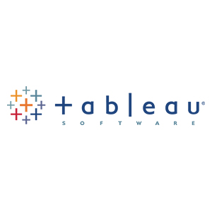
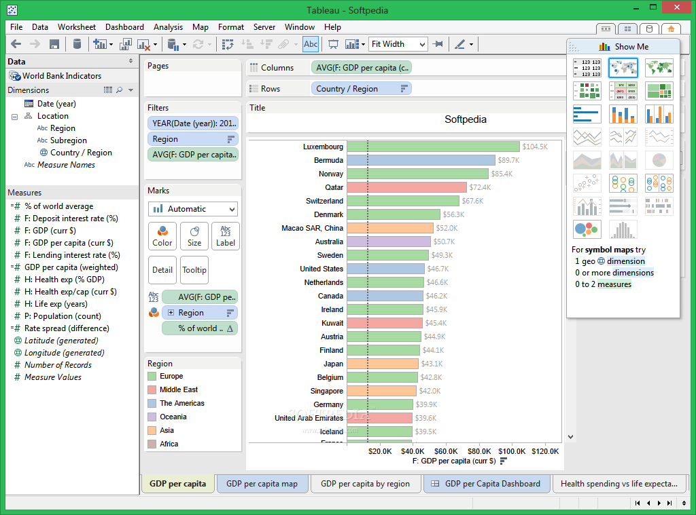
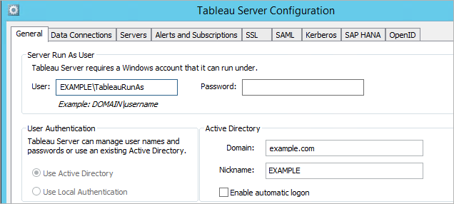
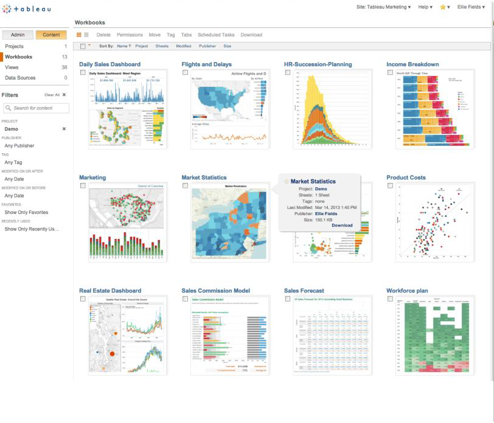
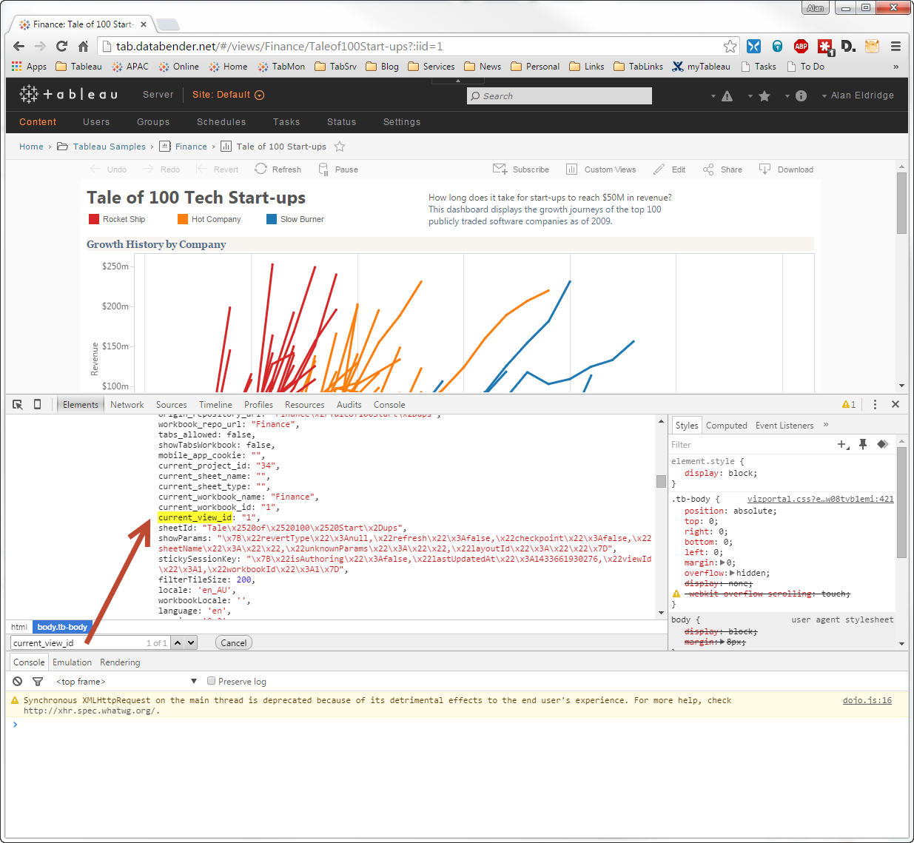
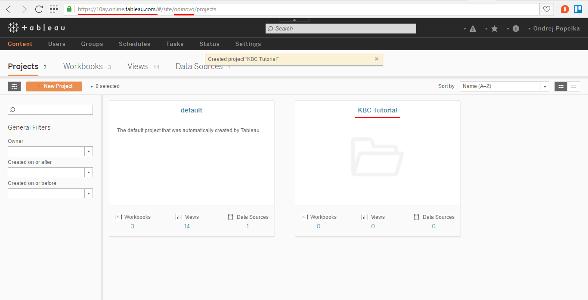
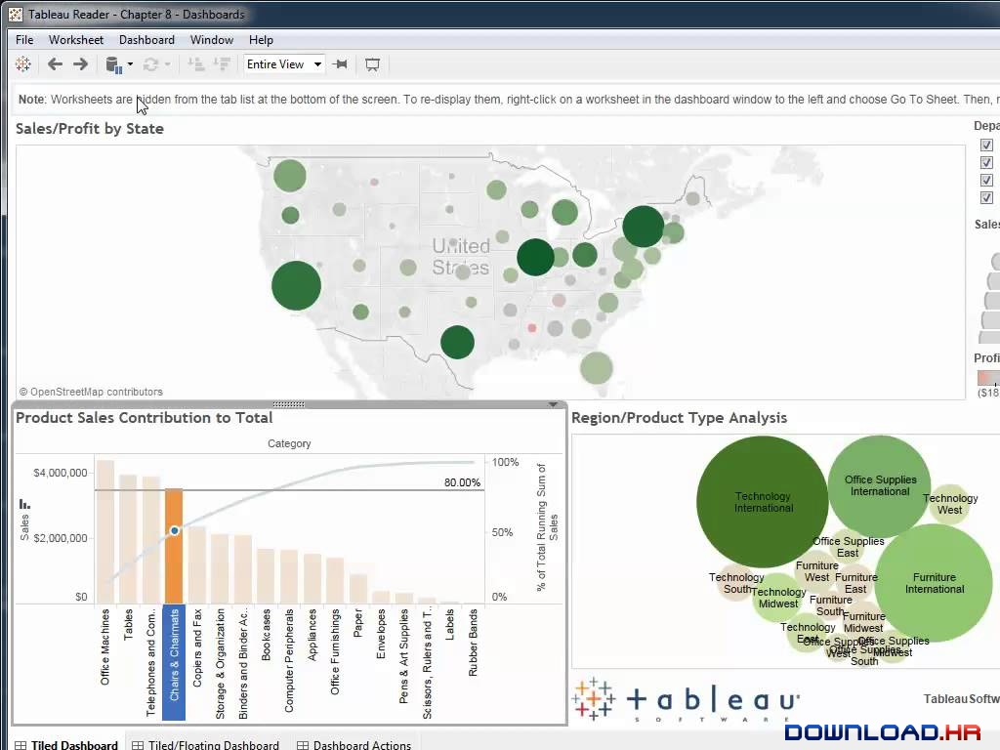

# CC-2018 - Data Visualization using Tableau - Research Project

* Segio J. Ruiz Sainz
* Dagoberto J. Herrera Murillo

_Cloud Computing and Big Data Analytics
Dr. Angel Toribio-González
May 8th, 2018_

  

`qdsddsdsdsdsffs`

## Index

1. [Introduction](#introduction)
2. [Company Profile and History](#company-profile-and-history)
3. [What is behind Tableau?](#what-is-behind-tableau)
4. [Products](#products)
5. [Comparison with PowerBi](#comparison-with-power-bi)
6. [Working with Tableau](#working-with-tableau)
7. [Conclusion](#conclusion)
8. [References](#references)

## Introduction

Global data is growing faster than ever before. More data has been created in the past two years than in the entire previous history of the humanity. And since this is not going to stop, by the year 2020 about 1.7MB of new information will be created every second for every human being on the planet [[1]](#references). This large amount of data represents a new era of unprecedented new opportunities for the human  advancement. The problem is that, while data grows at a gigantic pace, our ability to store, collect and calibrate these data increases at a much faster rate than the ability to analyze them.

In recent years, numerous automatic data processing techniques have been developed to assist people in the task of analyzing data. However, the complex nature of many real problems makes it essential to include human intelligence at the beginning of the chain of the data analysis process. This need to communicate the results has marked the emergence of Visual Analytics. Visual Analytics is the science of analytical reasoning, supported by interactive visual interfaces. Visual Analytics methods allow decision makers to combine their human flexibility, creativity and prior knowledge with the enormous storage and processing capabilities that today's computers and provide us to obtain new information and knowledge about complex problems. Using advanced visual interfaces, people can interact directly with the data analysis capabilities of current computers, allowing them to make well-informed decisions in complex and high-risk situations.[[2]](#references)

Data discovery based on Visual Analytics, in the context of modern business intelligence platforms (Business Intelligence), started around 2004. Modern BI and analytics platforms are characterized by user friendly tools that support a full range of analysis in addition to continuous workflow capabilities and do not require significant IT involvement to predefine data models in advance as a prerequisite for the analysis.

When analyzing the offer of current solutions in the analytics and business intelligence platform market, Tableau has been a clear within the tool offering in data visualization for a long time. Tableau offers an exploration experience based on images, being a highly interactive and intuitive tool for business users to easily access, prepare and analyze their data without the need to code. Tableau works through three main products: Tableau Desktop, Tableau Server and Tableau Online (the Tableau cloud offer). Since its inception, Tableau has focused on making the analytic workflow experience easier for its users, but at the same time, it gives analysts more power to explore and find information and knowledge in the data. Tableau achieved exponential growth and has disturbed the market by appealing to business buyers[[3]](#references).

### Company Profile and History

Tableau Software is a company from the United States, based in Seattle, Washington, that produces interactive data visualization products focused on business intelligence. In its beginnings, it began to commercialize investigations that had been carried out in the Department of Sciences of the Computation of the University of Stanford. The product consults relational databases, OLAP cubes, databases in the cloud and spreadsheets and then generates various types of graphics.[[4]](#references)

The company was founded in the Department of Computer Science at Stanford University between 1997 and 2002 by Professor Pat Hanrahan and the PhD. Student Chris Stolte, who specialized in visualization techniques to explore and analyze relational databases and data cubes, led the research in the use of table-based screens to explore multidimensional relational databases. Both experts combined a structured query language for databases with a descriptive language to render graphics and invented a database visualization language called VizQL (Visual Query Language). VizQL formed the core of the Polaris system, an interface to explore large multidimensional databases. In 2003, after Stolte recruited his former business partner and friend, Christian Chabot, to serve as CEO, Tableau separated from Stanford with a software application of the same name. The product consults relational databases, data cubes, databases in the cloud and spreadsheets and then generates various types of graphics that can be combined into panels and shared on a computer network or on the Internet.[[5]](#references)

### What is behind Tableau?

VizQL and Hyper are the two innovative technologies that support the success of Tableu's data visualization platforms. VizQL is a formal language to describe tables, charts, graphs, maps, time series and visualization tables. It combines queries, data analysis and visualizations in a single frame. These different types of visual representations are unified in the same environment, which facilitates the change from one visual representation to another (for example, from a list view to a table of cross references to a table). Unlike graphics packages of current tools and query languages, VizQL allows an unlimited number of image expressions. The visualizations can be easily customized and controlled. Both the current and traditional query languages, such as SQL and MDX, have very limited formatting and visualization capabilities. Therefore, although quite powerful queries can be composed, another layer of software is needed to inform or present the results in a useful and user friendly way to the analyst. VizQL is designed to fill that gap. VizQL allows a new generation of visual analysis tools that combine consultation, analysis and visualization [[6]](#references).

Hyper is a high performance memory data engine technology. With Hyper, transactions and analytic queries are processed in the same column store, without the need to reprocess again all the data once they have been obtained and imported. By doing this, the amount of useless data is reduced and dthe isconnection between specialized systems is minimized. Hyper's unique methodology supports the combination of intense write and read workloads in the same system. As a result, you can create extractions quickly and without sacrificing query performance[[7]](#references).

### Products 

__Tableau Desktop__: Tableau desktop offers all the full features of its software. One of its main functions, the workbooks, can be shared locally. This version also allows the connection to different types of files, create extracts from data sources and save Tableau workbooks locally and publicly[[8]](#references). It offers the following characteristics:

* Self-service business analytics and data visualization platform.
* Translates pictures of data into optimized database queries.
* Connect directly to data from your data warehouse for live up to date data analysis.
* Perform queries without writing a single line of code.
* Import data into Tableau’s data engine from multiple sources and integrate.
* Combine multiple views into interactive dashboards.
* Highlight and filter data to show relationships.
* Advances in database and computer graphics technology make even huge data sets possible to analyze.
* Optimized color schemes, automatic chart types and elegant design are built in, so insight is automatically communicated in the most effective way.
* Makes data easily understandable for everyone so decisions can be driven by data.
* There is a Mac version available.

  

__Tableau Server__: Tableau Server allows users to save workbooks securely throughout the organization using a secure server. This allows the user to not have to share the workbook publicly. However, this has an additional cost over the original price[[9]](#references). It offers us these characteristics:

* Publish dashboards with Tableau Desktop and share them throughout the organization with web-based Tableau Server.
* Users can interact with dashboards using browser or mobile-based devices.
* Leverages fast databases through live data connections, or can extract and refresh your data.
* Empower your business team to find answers in minutes, not months.

  

  

__Tableau Online__: This is a free version of the software that can allow anyone to connect to a spreadsheet or file and create interactive visualizations of data for the web[[10]](#references). It offers the following characteristics:

* Hosted version of Tableau Server makes business intelligence faster and easier.
* Publish dashboards with Tableau Desktop and share them with colleagues, partners or customers.

  

  

__Tableau Reader__: Tableau Reader allows you to read the Tableau file types. If you want to share your workbook by sending a file, the receiver will need a Tableau reader to open the document. Without the reader, you may need share it publicly or convert the workbook into a PDF format.[[11]](#references) It offers the following characteristics:

  

* Free desktop application that enables you to open and view visualizations built in Tableau Desktop
* You can filter, drill-down and view details of the data but you won’t be able to edit or perform any interactions if the author hasn’t built it[[12]](#references)
 

### Working with Tableau

Tableau uses a workbook and sheet file structure, much like Microsoft Excel. A workbook contains sheets. A sheet can be a worksheet, a dashboard, or a story[[13]](#references).

* A worksheet contains a single view along with shelves, cards, legends, and the Data and Analytics panes in its side bar. 
* A dashboard is a collection of several worksheets and supporting information shown in a single place so you can compare and monitor a variety of data simultaneously. For example, you may have a set of views that you review every day. Rather than flipping through each worksheet, you can create a dashboard that displays all the views at once.
* A story  is a sequence of visualizations that work together to convey information. You can create stories to tell a data narrative, provide context, demonstrate how decisions relate to outcomes, or to simply make a compelling case. A story is a sheet, so the methods you use to create, name, and manage worksheets and dashboards also apply to stories. At the same time, a story is also a collection of sheets, arranged in a sequence. Each individual sheet in a story is called a story point. When you share a story —for example, by publishing a workbook to Tableau Public, Tableau Server, or Tableau Online—users can interact with the story to reveal new findings or ask new questions of the data.

### Comparison with Power BI

  

So far we have talked about Tableau. But what about other similar tools in the market? The direct competition of Tableu would be Power BI. According to Gartner, Tableau and Microsoft Power BI are the two front-runners in the business intelligence (BI) and data visualization software industry. Tableau continues to be perceived as the modern BI market leader — still slightly ahead of Microsoft on overall execution. While growth continues for Tableau, it is at a much slower pace due to pricing and competitive pressure from Microsoft. We’ve compared Tableau and Power BI to highlight main differences and the factors to consider in a purchase decision.

__Pricing__: When it comes to cost, Power BI is generally a more affordable option. For users who prioritize free trial capabilities, Power BI offers a robust 60-day Pro trial, while Tableau’s free trial is 14 days. Additionally, Power BI starts at $9.99 per user per month, while Tableau starts at $35.

__Functionality__: The depth of data discovery is more sophisticated with Tableau than Power BI. Both Tableau and Power BI allow business managers to set up sophisticated visualizations that help spot patterns, reduce costs, speed up processes and generate consensus. However, Tableau allows users to leverage any number of datapoints for conducting analysis – something Power BI doesn’t offer. 
Both Tableau and Power BI offers support for hundreds of data connectors including online analytical processing (OLAP) and big data options (such as NoSQL, Hadoop) as well as cloud options. However, Tableau offers better support for connecting to a distinct data warehouse, whereas Power BI is heavily integrated with Microsoft’s portfolio, including its Azure cloud platform. 

__Product support and community__: While both platforms offer extensive digital resources for customers to self-serve, Tableau offers more comprehensive customer support options in terms of direct contact. Power BI users with a free account have limited support, while users with Pro and Premium accounts receive faster support. 
With Tableau users can access support resources tailored to their version of the software, including getting started, best practices and how to optimally use the platform’s top features. Users can also access the Tableau community forum and attend training and other events. In the case of Power BI, customer support functionality is limited for users with a free Power BI account. All users can submit a support ticket, however, users with a paid account receive faster support. Power BI also offers robust support resources and documentation, including guided learning, a user community forum and samples of how partners use the platform.

### Conclusion

Tableau is a tool of great potential because it is highly intuitive, it allows to visualize instantly any change that we are making and does not require great knowledge for the elaboration of reports of medium complexity. It is able to combine several analysis in a single report where different documents are inserted to facilitate the understanding of the data.

The connection with the data sources is direct, does not require programming and gives us the opportunity to generate personalized queries. We can generate queries in different programming languages ​​oriented to query data, such as Oracle or SQL Server among others. 

Starting to use Tableau is a decision that brings advantages for the entire company and also for the IT department. His absolute leadership in Gartner's Margic Cuadrant, where users rate him as the best BI solution for his user experience, his ability to implement himself on a tight budget to grow, and how easy it is to put IT, make implement Tableau is a very low risk decision.

## References:

[1] [Forbes, 2017, How To Stay Sane And Spur Sales In Data Wonderland](https://www.forbes.com/sites/falonfatemi/2017/06/27/how-to-stay-sane-and-spur-sales-in-data-wonderland/#2709d6d2f88f).

[2] Thomas, J., Cook, K.: Illuminating the Path: Research and Development Agenda for Visual Analytics. IEEE-Press (2005)

[3] [Magic Quadrant for Business Intelligence and Analytics Platforms](https://cdn2.hubspot.net/hubfs/2172371/Q1%202017%20Gartner.pdf?t=149626062)

[4] [Tableau Software Inc, 2017](http://www.annualreports.com/Company/tableau-software-inc)

[5] [Tableau, Our Story, 2017](https://careers.tableau.com/ourstory)

[6] [what-is-vizql, bibuddy](https://bibuddy.wordpress.com/2017/04/11/what-is-vizql/)

[7] [Tecnología de Tableau, Tableau, 2017](https://www.tableau.com/es-es/products/technology)

[8] [Tableau corporate, Chris Raby, 2017](https://www.slideshare.net/chrisraby/tableau-corporate-16363769)

[9] [Tableau corporate, Chris Raby, 2017](https://www.slideshare.net/chrisraby/tableau-corporate-16363769)

[10] [Tableau corporate, Chris Raby, 2017](https://www.slideshare.net/chrisraby/tableau-corporate-16363769)

[11] [Tableau corporate, Chris Raby, 2017](https://www.slideshare.net/chrisraby/tableau-corporate-16363769)

[12] [Power BI vs Tableau, 2017](https://www.encorebusiness.com/blog/power-bi-vs-tableau/)

[13] [Workbooks and Sheets, Tableau, 2017](https://onlinehelp.tableau.com/current/pro/desktop/en-us/environ_workbooksandsheets.html)

