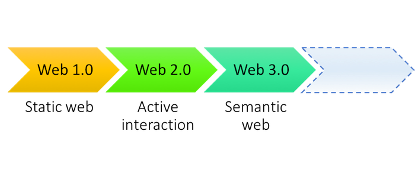
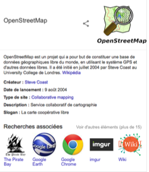
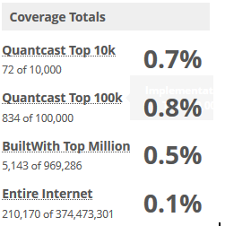
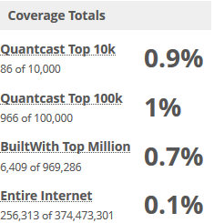
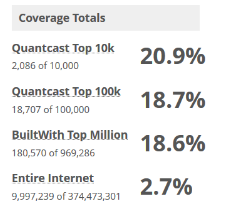
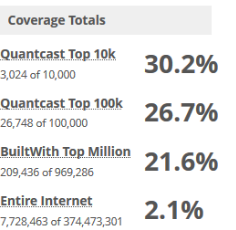
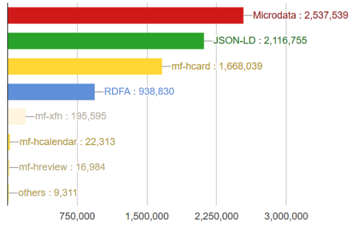
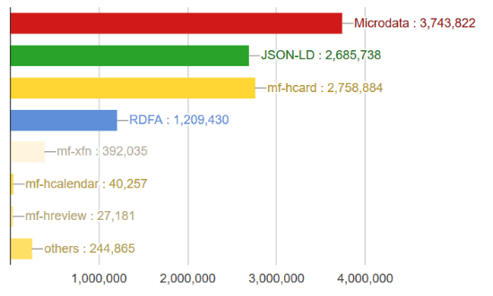
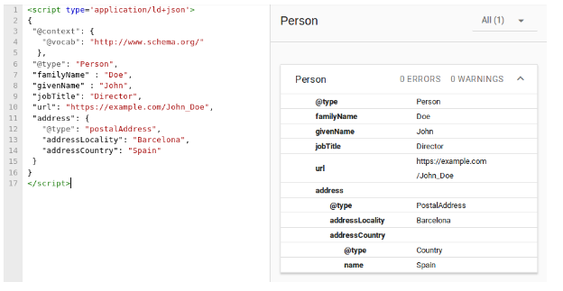
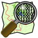

# Introduction
Nowadays, the volumes of stored data grow exponentially. Unfortunately, the vast majority of these colossal amounts of raw data are represented in different structure (hashtags in Twitter should have almost the same background as keywords of a scientific article) or not structured at all (e.g. documents, public messages, news, etc.). Necessity to process such information was a reason for development of the related technologies. As a result semantic data approach became the most popular idea to extend data by its cognitive information that impressively spreads data analysis opportunities. It was possible by using common ontologies (vocabularies). This vocabularies describe the concept independently of the certain language or information representation in unified format. Nowadays they are represented by RDF triples (sets of 3 elements: subject (noun) - predicate (verb) - object (noun). They are normally linked to the concepts from remote public vocabulary through URI. It is clear that the web was, is and will be the main generator of information.  
As a result, this technology was applied to this space and it successfully resolved data organization and integration problems. Furthermore, cloud technologies significantly extended its spread and created new areas of linked data principle application: cloud security, system topology, cloud portability, etc. The combination of these technologies provides impressive opportunities to end user which were not available before: flexible search engines, data aggregators, more interactive and responsible exchange of open data and knowledge.  
  
# Semantic Web conception
The web technologies are leading its history from 1990s’ when the term “web” appeared. It was dramatically developed during last years by introducing new visualization and back-end technologies. Furthermore, the approach “web 2.0” significantly increased social connections between users but information still left atomized. Further development of search engines, which became not only data retrievers but also problem solving tools, required more structured information because of the enormous volume of separate raw data sources. Furthermore, the same information can be represented in different languages that can be extremely complicated to save the information value when it’s translated.  
  
*Figure 1. Development of the Web*  
  
As a result, the idea of Semantic Web, which was presented in 2001 by web-technology leader Sir Tim Berners-Lee has development nowadays by both: academic researchers (fundamental researches) and corporations (commercial and internal projects and systems: search engines, information aggregators, etc.). [This technology](https://www.w3.org/standards/semanticweb/) extends the traditional approach “web of documents” by additional information about data semantics, which is based on support of “web of data”. According to the general principle of World Wide Web technology is that “anything can link to anything“, so the main aim of this new approach is delegating more data processing tasks (it is necessary to highlight that it only enables computer to comprehend documents and data which are machine-readable “a priory”) to machine. That can be made possible by significant improvement of data integration (when lots of data sources are used) and providing better reflection of virtual information to real objects (better knowledge organization). More details can be found in [this article](https://www-sop.inria.fr/acacia/cours/essi2006/Scientific%20American_%20Feature%20Article_%20The%20Semantic%20Web_%20May%202001.pdf).  
It is reachable by using main linked data [principles](https://www.w3.org/DesignIssues/LinkedData.html):  
1.	Use URIs as names for things;  
2.	Use HTTP URIs so that people can look up those names;  
3.	When someone looks up a URI, provide useful information, using the standards (RDF - Resource Description Framework, SPARQL - query language);  
4.	Include links to other URIs. so that they can discover more things.  
So, the general standard for knowledge description is RDF which is represented by triples of subject-predicate-object.  
  
  
*Figure 2. RDF triple structure*  
  
Subjects and objects (resources) should be related to some URI or literal value (that is not recommended). This idea of linked data is based on vocabularies which define concepts and relationships between them. It is important that sometimes vocabularies are messed up with ontologies which, in general, are referred to the same idea but there is a trend that “ontologies” are representing more complex collections of terms ([more details](https://www.w3.org/standards/semanticweb/)). It is recommended to use already existed vocabulary as much as possible instead of creating new ones because it creates significant threat for the idea of unified semantic web.  
Nowadays there are [hundreds](http://richard.cyganiak.de/blog/2011/02/top-100-most-popular-rdf-namespace-prefixes/) of ontologies from different areas: FOAF (Friend-Of-A-Friend – linking people), RDF (general RDF predicates and resources), OWL (general OWL predicates and resources), GEO (geospatial objects), DBO (DBpedia), etc. All of them are consisting the most general and useful items to describe the relationship. The general feature of websites that use this lanagues is just additional attributes inside of the pages’ source code. This attributes amke no sense for an end user but include lots of important machine-readable information about data (e.g. addresses, phone numbers, prices, etc.).  
Initially, the semantic knowledge were implemented by using already existed technology XML but nowadays, it can be represented dozens of different [formats](https://www.w3.org/2008/01/rdf-media-types): Microdata, JSON-LD (JSON-Linked Data), JSONTurtle (the most general), N3 (the most human readable), XML, N-Triple and other (which are not promoted by W3C).  
  
  
*Figure 3. Example of semantic information's usage by Google*  
  
The user’s benefit from this technology is more aggregated information in the search results. For example, Wikipedia, Ebay, My Space, IMDB and others: users can receive some additional information about the object already on the search webpage and perform some kind of related queries. Moreover, growth of the projects like DBpedia (ontologies of Wikipedia), Geonames (structured information about geographical names and its properties), Uniprot (protein database) and others showed success of the technology. However, at the same time it is known that [Amazon doesn’t use common vocabularies](https://www.quora.com/Why-do-big-websites-like-amazon-dont-use-schemas-from-schema-org-to-structure-offers) at all and its webpages are still well indexed by machines.  
  
>### "It's called linked data.  
>### I want you to make it.  
>### I want you to demand it.  
>### And I think it's an idea worth spreading.  
>#### Sir Tim Berners-Lee*  
**[TED materials https://www.youtube.com/watch?v=5MhNd5hTCx4](https://www.youtube.com/watch?v=5MhNd5hTCx4)*  
  
To sum up, the idea of semantic web exists more than 15 years and it has already proved itself in real life. Nowadays, it is an essential part of the modern web but it still has lots of potential benefits which are not yet opened. Unfortunately, even if the general idea of semantic web is open and free to use technology, the vast majority of produced knowledge graphs are internal projects of corporations (e.g. Yahoo, Google, Bing, Facebook) that makes end user depended on their policy.  
  
  
# Implementation  
For using the semantic web concepts in the real project, it is important to understand the [principles](https://developers.google.com/search/docs/guides/sd-policies) and possible advantages that this technology can bring. In this sections some advices and examples of implementation would be provided. 
## Vocabularies overview
First the vocabulary should be considered. The proper usage of the vocabulary can help the website to be ranked better for almost all kinds of content types. However, for achieving this in all the search engines the common standard should be implemented, otherwise the proper vocabulary can help the website to rank higher in the search results of one company engine but stay on the same place of the other. Internet companies such as Google, Yahoo, Microsoft and Yandex also had understood this and together launched the common vocabulary **Schema.org** in 2011.  Now for achieving the [better ranking](https://www.searchmetrics.com/news-and-events/schema-org-in-google-search-results/) webmasters can use the same vocabulary and can be sure that the technology will help them. Probably, the common format is one of the reasons why popularity of other vocabularies remains very low. For example, less than one percent of web-sites is using **FOAF**, the vocabulary the was extemely popular a couple of years ago.

  
*Figure 4. FOAF usage statistics according to BuiltWith Trends*  
   
## Schema.org implementation formats
At the next step the way of using a vocabulary should be considered. If a webmaster decides to use the **Schema.org** vocabulary as the most adopted, then 3 options should be considered: **RDFa**, **Microdata** and **JSON-LD**. To encourage others to use this technology, in this chapter some examples would be provided. We hope that this examples can facilitate the experiments and technology usage. All the implementation can be found at the project github **https://github.com/start-and-solve/semantic_formats_test**.


### RDFa
[**RDFa**](https://rdfa.info/) is an extension of HTML5 that helps to [markup](https://blog.kissmetrics.com/get-started-using-schema/) things like People, Places, Events, Recipes and Reviews. Search Engines and Web Services use this markup to generate better search listings. However the standard is extremely difficult and the specification was released very late. For that reason, the clear RDF format is not widely used by the community. 

  
*Figure 5. RDF usage statistics according to BuiltWith Trends*  
 

For showing the main ideas of **RDFa** (RDF attributes) the part of the standard, RDF-Lite, was used. RDF-Lite is a subset of **RDFa** that is completely compatible with the main **RDFa** itself. RDF-Lite attributes include the following: 
- vocab
- typeof
- property
- resource
- prefix

Typically when we talk about a thing, we use a particular vocabulary(key word **vocab**) to talk about it. So if some term would be mentioned , the vocabulary would specify terms like name and url(web-page) of this thing. Once the vocabulary is specified, the type of the thing(key word **typeof**) that is talked about should be specified. The next step includes marking the properties(key word **propery**) that the search engine should know about. The key word **resource** is used for distinguishing different objects on the same web-page. The last word, **prefix** is used when an instance from other vocabulary should be specified. Let’s look into the example below:

```
<p vocab="http://schema.org/" typeof="Thing" resource="#rdf">
  This is
  <span property="name">RDF</span>
  and you can read more about me at
  <a property="url" href="https://www.w3.org/TR/rdfa-lite/">my homepage</a>.
   I am a pioneer in <span property="foaf:Topic"> Semantic Web.</span>
</p>
```

In this example **Schema.org** vocabulary is used. It describes a Thing with the resource(identifier) rdf. The rdf has properties name, url and a topic that belongs to the different vocabulary.

### Microdata
The second way of utilizing **Schema.org** is using [**Microdata**](https://en.wikipedia.org/wiki/Microdata_(HTML)). It is an HTML specification used to nest metadata within existing content on web pages. Like **RDFa**, it uses HTML tag attributes to name the properties you want to expose as structured data. Search engines, web crawlers, and browsers can extract and process **Microdata** from a web page and use it to provide a richer browsing experience for users. The following advantages made a **Microdata** widely used by the community. At the same time, some companies, like Mozilla and Google argue that this format is [deprecated](https://www.fxsitecompat.com/en-CA/docs/2016/microdata-api-has-been-removed/) and suggest to use **JSON-LD** instead. Below you can see the Microdata usage statistics.

  
*Figure 6. Microdata usage statistics according to BuiltWith Trends*  
 

[**Microdata**](https://en.wikipedia.org/wiki/Microdata_(HTML)) usage in the real project reminds the main principles of **RDFa** such as vocabulary and properties usage. There are only few [attributes](https://developer.mozilla.org/en-US/docs/Web/HTML/Microdata) that can be used in HTML:  
- **Itemscope** attribute creates an item  
- **Itemid** is a unique global identifier of this item(the analog of resource in RDF)  
- **Itemprop** defines the properties of the item(the analog of property in RDF)  
- **Itemtype** defines a vocabulary identifier(analog of typeof in RDF)  
- **Itemref** specifies ids in the current document to which the current item is related  
  
Let's consider the following example.  
```
<dl itemscope
   itemtype="http://schema.org/Book"
   itemid="urn:isbn:0-330-34032-8">
<dt>Title
<dd itemprop="name">The Reality Dysfunction
<dt>Author
<dd itemprop="author">Peter F. Hamilton
<dt>Publication date
<dd><time itemprop="datePublished" datetime="1996-01-26">26 January 1996</time>
</dl>

<dl itemscope
   itemtype="http://schema.org/Book"
   itemid="urn:isbn:1-334-87043-9"
   itemref="urn:isbn:0-330-34032-8">
<dt>Title
<dd itemprop="name">The Reality Dysfunction
<dt>Author
<dd itemprop="author">Peter F. Hamilton
<dt>Publication date
<dd><time itemprop="datePublished" datetime="1998-04-19">19 April 1998</time>
</dl>
```


In this example, there are two editions of the same book. Each book has a unique **itemid** - isbn, also we specify a **itemtype** according to the **Schema.org** vocabulary and tag **itemscope** to limit the area of the item. For each of the editions, there are properties(that start with **itemprop**) that are also specified according to the **Schema.org** format: name, author and dataPublished. In the second edition of the book the reference(**itemref**) to the first edition is specified. These editions are related and there is a need to let the search engine know about it.
More Details about this topic can be found on [this webpage](https://www.w3.org/TR/microdata/).


### JSON-LD
[**JSON-LD**](https://moz.com/blog/json-ld-for-beginners) is a concrete RDF syntax. It is used not as an extension to HTML but as a separate script as a result it provides more opportunities than HTML by adding such advantages as serialization, Javascript data types and blockmarkup(write ones and reuse many times). **JSON-LD** was motivated by the desire for [better Web APIs](https://blog.codeship.com/json-ld-building-meaningful-data-apis/), not the Semantic Web. It starts at basics, assuming that the audience is a web developer with modest training and  strives to help developers. This format is recommended to use by Google and other companies and it is probably the main reason of the growing popularity of this syntax. As we see at the figure, this format is even more popular among the top websites than microdata. However, it has a very big disadvantage - data needs to be duplicated(once as HTML for users and as a script for engines).

  
*Figure 7. JSON-LD Statistics according to BuiltWith Trends*  
  
For determing the audience of the technology trends were analysed. Below there are tendencies provided by the [**WebDataCommons**](http://webdatacommons.org/) project of the University of Mannheim. From this chart we can see that in the entire Internet, all the technologies start to have more active domains that use them. This data provides an evidence that number of web-sites with semantic web technologies is growing. 

  
*Figure 8. Semantic Web instruments tendencies in 2016*  

  
*Figure 9. Semantic Web instruments tendencies in 2017*

There are [more properties](https://www.w3.org/2013/dwbp/wiki/RDF_AND_JSON-LD_UseCases) in **JSON-LD** comparing to **RDF** and **Microdata** so just some of them would be presented in this section.  
 
- **@context** is used to define the short-hand names for making identifiers smaller  
- **@type** deines a data type of a node or a value  
- **@vocab** upgrades the type by adding a specific vocabulary to which type is related  
- **@value** sets the data that is related to a specific property  
- **@container** names a type of the term(particular set of values)  

Additionally each **JSON-LD** script must be surrounded by the following key words otherwise it will not be parsed.  

```
<script type='application/ld+json'>
{
**Here the script goes**
}
</script>
```
So the final example will look as the following:  

```
<script type='application/ld+json'>
{
 "@context": {
   "@vocab": "http://www.schema.org/",
   "friends":{
       "@container": "@list"
   }
  },
 "@type": "Person",
 "familyName" : "Doe",
 "givenName" : "John",
 "jobTitle": "Director",
 "url": "https://example.com/John_Doe",
 "address": {
   "@type": "postalAddress",
   "addressLocality": "Barcelona",
   "addressCountry": "Spain"
 },
 "friends": ["Chuck Norris", "Bill Gates"]
}
</script>

<p>
   My name is John Doe. I am a director. I live in Barcelona, Spain. Please find addtional information about me at https://example.com/.
</p>
```

In this example we specify the context of the item by the vocabulary(**@vocab**) and the value type(**“@container”:@list**) of one of the terms. Additionally we specify the type of the person(**@type**) and specify number of properties such as familyName, givenName and etc. At the end we create a nested object(**@address**) and add values to the propertu "friends", type of which was specified before.  
 
As was mentioned above, one of the main advantages of **JSON-LD** is a possibility to reuse. For that reason, there are a number of [code generators](https://hallanalysis.com/json-ld-generator/) that can create many kinds of common templates.  
Additionally, we would like to specify that **JSON-LD** information is not showed on the page. It is created for providing information to scrappers and not to be displayed on the webpage. To check the code correctness the [following tool](https://search.google.com/structured-data/testing-tool/u/0/) from Google can be used. Here we can see that example above is successfully validated.

  
*Figure 10. Successfull validation example*

### Conclusion
At the previous section the most popular ways of vocabularies usage were considered. It included such option as RDFa, Microdata and JSON-LD. For each of this option a concrete example was provided. Additionally, so recommendation and useful links were mentioned as well. 

# Examples (Use cases)  
The idea of semantic web is extremely popular nowadays. There are lots of real examples where the technology was used in different sectors: news, maps, knowledge, social networks and others.  
  
## BBC  
*[Case Study: Use of Semantic Web Technologies on the BBC Web Sites https://www.w3.org/2001/sw/sweo/public/UseCases/BBC/](https://www.w3.org/2001/sw/sweo/public/UseCases/BBC/)*  
  
  
The British corporation BBC (one of the largest world broadcasting companies), which’s mission is to enrich people’s lives with programs that inform, educate and entertain. It owns more than 8 TV channels, more than 50 radio stations and really rich web project bbc.co.uk with lots of microsites which consist different kinds of information which were not linked together for years. Lack of data integration, separated information and poor cross linking were significant barrier for end users to use all the opportunities of the website.  
In 2007, the BBC Programmes was launched. Its goal was to provide human and machine understandable links for every BBC program and cross connections between them. The next step was integration of BBC Music with other BBC webpages and open source like Wikipedia. After the first success of data linking, all other projects also were modernized. Nowadays, the company reached integration of its search engine with DBpedia, Geonames, Musicbrainz and other open vocabularies. As a result, the developers’ teams received an opportunity to reuse the content of their colleagues. At the same time, users obtained significantly more attractive and useful website.  
  
## Facebook Open Graph  
  
  
Another example of semantic web is Facebook project [Open Graph](https://developers.facebook.com/docs/sharing/opengraph). It is clear that Facebook is one of the biggest storages of linked data. The launch of this technology was announced in April 2010. The general idea of this graph is based on the typical user’s actions: people are sharing their stories which are connected with some brands, pages, people, locations and other things. So, this information was successfully structured into a strong “social graph” (the Facebook’s term).  
The Open Graph includes 4 basic metadata elements:  
* Actor - The person who posts the story;  
* App - Every story includes attribution to the app that created it;  
* Action - Activity the actor performs;  
* Object - The thing the actor interacts with.  
  
The graph is based on RDFa format, so, it is necessary to add few `<meta>` tags to add the webpage to the graph. The main properties are:  
- og:title - title of the object as it should appear within the graph;  
- og:type - type of your object. Depending on the type, other properties are required. More details are [here](http://ogp.me);  
- og:image - image of the page for graph;  
- og:url - canonical URL of your object that will be used as its permanent ID in the graph.   
For example:  
```
<meta property="og:title" content="The Rock" />  
<meta property="og:type" content="video.movie" />  
<meta property="og:url" content="http://www.imdb.com/title/tt0117500/" />  
<meta property="og:image" content="http://ia.media-imdb.com/images/rock.jpg" />  
```  

As a result, this technology provides essential analysis opportunities for different kinds of users. For instance, the platform Audience Insights (*[https://www.facebook.com/business/news/audience-insights](https://www.facebook.com/business/news/audience-insights)*).   that provides information for businesses about its current and potential clients. Moreover, the Cambridge Analytica scandal proved its success (*[https://www.cnbc.com/2018/04/10/facebook-cambridge-analytica-a-timeline-of-the-data-hijacking-scandal.html](https://www.cnbc.com/2018/04/10/facebook-cambridge-analytica-a-timeline-of-the-data-hijacking-scandal.html)*).  
  
## OpenStreetMap  
  
  
  
The previous examples were about use the technology on internal closed data sets which belongs to certain company but the it has open data application as well. Moreover, the basic idea by Sir Tim Berners-Lee is just linking of users’ open content.  
The project [OpenStreetMap Semantic Network](https://wiki.openstreetmap.org/wiki/OSM_Semantic_Network) which is based on the geo information from different users (in 2018 it’s more than 450.000 contributors), started its Semantic Network project in 2018. It’s a semantic web resource which contains machine-readable representation of tags on the map. It is based on SKOS (Simple Knowledge Organization System – a W3C data model for sharing and linking knowledge via Semantic Web  (*[https://www.w3.org/TR/2008/WD-skos-reference-20080829/skos.html](https://www.w3.org/TR/2008/WD-skos-reference-20080829/skos.html)*)). The network was created by an open source Java/Groovy based OSM Wiki Crawler. Furthermore, all the tags are successfully mapped on the same items in vocabularies WordNet and LinkedGeoData.  
The resulting graph provides lots of [opportunities](https://www.researchgate.net/publication/255568270_Geographic_Knowledge_Extraction_and_Semantic_Similarity_in_OpenStreetMap) for future researches and applied projects in recommender systems which are based on OpenStreetMap data mining.  
  
So, the technology appears in different commercial and community projects. Somewhere it used mostly for the functionality improvement (BBC, Facebook, Google) or provides principally new opportunities for academic researchers and developers (it's better implemented in open projects like OSM, [DBpedia](http://wiki.dbpedia.org/) (linked Wikipedia) and others).  
# Conclusion

Finally, It is clear that the development of the web space has concrete steps (like Intel’s tic-tac principle): simple data in the WEB 1.0 were completed by social interaction in Web 2.0 that was extended by machine readable data and it experiences socialization again. Moreover, the main principles of unification, which was set by the technology developer – Sir Tim Berners-Lee, is respected by both: commercial and open projects (systems, knowledge bases, etc.).
The idea of semantic web, which was developed more than 15 years ago, has impressive popularity nowadays because of its main aim – data linkage. Common application in the web based on this technology, which had been generally in data integration for search machines, was successfully spread on the sphere of cloud computing where it can lots of various applications. It is clear that further development of related technologies can significantly and unpredictably change its applications. The prove is inside search engines that has changed dramatically to use JSON-LD, microdata and RDFa for supporting Schema.org onthology. 
The idea of semantic web already proved itself in real life but it is undoubtable that it is only the beginning of its history and the new world of linked data. 
