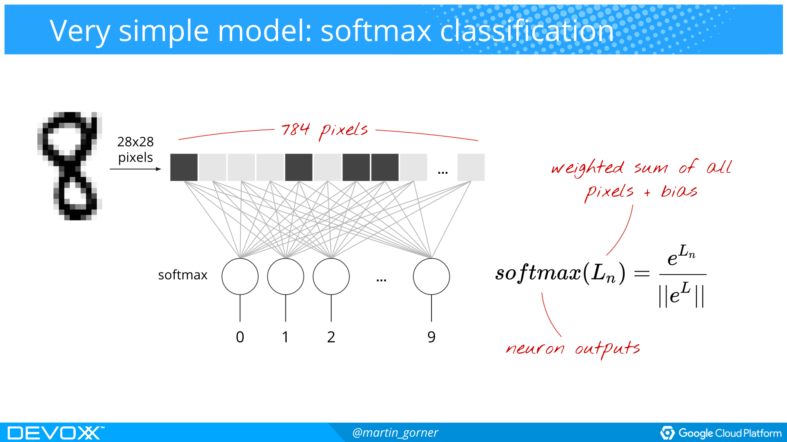

# GOOGLE CLOUD PLATFORM FOR DATA SCIENCE
*by Syeda Noor Zehra Naqvi - Sofia Yfantidou*

In the previous report we covered the first steps of the Big Data lifecycle. However, the ultimate goal is to gain actionable insights from the processed data with the help of data exploration, analysis and visualization. This report will cover the tools provided by Google Cloud Platform to support these operations.

## DATA EXPLORATION

Data exploration is a very important step in data analysis. It is an initial step where a large data set is explored in an unstructured way to discover initial patterns, characteristics and points of interest. In Google Cloud Platform, data exploration can be achieved using [**Google Big Query**](https://cloud.google.com/bigquery/), a highly scalable and cost effective data warehouse designed for analytics at any scale and [**Cloud Data Lab**](https://cloud.google.com/datalab/), an interactive tool for data exploration, visualization, analysis and machine learning.

###  <a name="bigquery"></a>Google BigQuery
BigQuery is Google's serverless data warehouse. As there is no infrastructure to manage, it allows developers to focus on analyzing data to find meaningful insights using familiar SQL without a need of a database administrator.

#### Getting Stated

To start working with BigQuey, it is required to enable BigQuery API. It is automatically enabled in the new projects but it is an important step for the pre-existing projects. The next step is to enable billing for the project on which the BigQuery will be used.

##### Adding Dataset in BigQuery

BigQuery accepts datasets in CSV, Parquet, Avro and JSON formats. BigQuery supports UTF-8 encoding for both nested or repeated and flat data and ISO-8859-1 encoding for flat data only for CSV files. Data can be loaded using simple BigQuery web UI by clicking on create dataset or by using gcloud cli by the following command:

```
bq --location=[LOCATION] load --source_format=[FORMAT] [DATASET].[TABLE] [PATH_TO_SOURCE] [SCHEMA]
```

##### Querying Dataset in BigQuery

BigQuery provides an SQL like syntax to query the datasets which makes it easier for the developer to query large datasets if they have knowledge of SQL. Following is a sample query which is querying a public database available in Google cloud platform.

```
#standardSQL
SELECT
 weight_pounds, state, year, gestation_weeks
FROM
 `bigquery-public-data.samples.natality`
ORDER BY weight_pounds DESC LIMIT 10;
```

#### How to access BigQuery

This section gives an insight on different ways to work with BigQuery

- **REST API:** Google BigQuery provides a [REST API](https://cloud.google.com/bigquery/docs/reference/rest/v2/) for easy programmatic access and application integration. To enable developers,  BigQuery offers client libraries in Java, Python, Node.js, C#, Go, Ruby, and PHP. Google AppScript can be used to access BigQuery from Google Sheets.
- **The bq command-line tool:** For those who prefer to work with the Unix command line, Google Cloud Platform's [bq command-line tool](https://cloud.google.com/bigquery/docs/bq-command-line-tool) can be used to add, update and query data with BigQuery.
- **Google Cloud Platform Console:** BigQuery Web UI provides as user friendly GUI to enable users to achieve all the functionalities by clicking a few buttons and writing queries.
- BigQuery can also be queried directly from Cloud Datalab and can be integrated with Cloud Data studio to directly plot graphs.

#### BigQuery Features

Google BigQuery has a lot to offer but this section will review some of the main features of BigQuery.

- **Serverless:** Serverless data warehousing provides resources when and where needed mitigating the problem of sizing and computing resources.
- **Petabyte Scale:** BiqQuery allows automatic scaling to store and analyse petabytes or more, with speed and ease without having to buy more capacity.
- **Real-time Analytics:** BigQuery high-speed streaming insertion API enables real time analytics.
- **Flexible Pricing Model:** BigQuery allows the selection of pricing model that suits the customer. The options include on-demand pricing (pay by usage) and flat-rate pricing (stable monthly cost).
- **Foundation for AI:** BigQuery’s ability to transform and analyze data helps get the data in shape for Machine Learning. Moreover, BigQuery provides integration with CloudML Engine and TensorFlow to train powerful models on structured data.
- **Automatic Backup and Easy Restore:** BigQuery automatically replicates the data and keep a 7 days history of all the changes. This allows easy restoration and data comparison of data from different times.
- In addition to these features BigQuery also provides flexible data ingestion, security and encryption, storage and compute separation, data governance, big data ecosystem integration, data locality, data transfer services, programmatic interaction, automated high availability, cost control and rich [logging](https://cloud.google.com/logging/) and [monitoring](https://cloud.google.com/monitoring/) with Stackdriver.

#### Google BigQuery Summary
BigQuery provides a standard SQL syntax to query big datasets after adding these datasets to BigQuery efficiently with an ability to auto-scale. This helps in data exploration to find unusual characteristics and patterns in data.

## DATA VISUALIZATION & COLLABORATION

Another important step in the lifecycle of Big Data is sharing, collaboration and visualization. [Google Datalab](https://cloud.google.com/datalab/) is a tool for exploration, visualization and collaboration of data which is built on top of [Jupyter Notebook](https://jupyter.readthedocs.io/en/latest/index.html) (a tool well-integrated with Google Cloud Platform to create and share documents that contain live code, equations, visualizations and narrative text) and [Google Data Studio](https://datastudio.google.com) is a tool for data visualization, sharing and collaboration.

###  Cloud Datalab

Cloud Datalab is a powerful and interactive notebook (based on Jupyter) for data exploration, analysis, transformation, visualization, collaboration to build machine learning models on Google Cloud Platform. It runs on [Google Compute Engine](https://cloud.google.com/datalab/) and connects to multiple cloud services easily so that the data analyst can focus on data science tasks.

#### Getting Started

First step to start working with Datalab is to enable Google Compute Engine and Cloud Source Repositories APIs on the project. [Google Cloud SDK](https://cloud.google.com/sdk/docs/?authuser=1) also needs to be installed. After installing the SDK, install the datalab component. Following is the gcloud cli command to install datalab:

```
gcloud components install datalab
```
To create a Cloud Datalab instance use this command:

```
datalab create datalab-instance-name
```
To use Datalab in team environment, each team member needs to have their own instance as Datalab instances are single-user environments. There are 2 ways to create instances for each team member. Either the project owner create instances for each team member, or each team member create the instance for themselves.

After the above steps, create notebooks and code in the preferred language to achieve what is required.

#### Cloud Datalab Services
This section describes how datalab is used to manage, visualize and process data.

##### Data Management and Visualization
Cloud Datalab uses BigQuery for data exploration (details in [BigQuery section](#bigquery)) and python for data visualization. It can also be integrated with Google Cloud Storage.

##### Machine Learning with Lifecycle Support
Cloud Datalab transforms data to deployed machine-learning (ML) models ready for prediction. It integrates with both TensorFlow (explained in [TensorFLow section](#tensorflow) and Cloud Machine Learning Engine (details in [Cloud ML Engine section](#cloudml) to build, evaluate and optimize machine learning models.

#### Cloud Datalab Features

This section highlights some of the most important features of Cloud Datalab.

- **Integrated and Open-source:** Cloud Datalab provides integration with Cloud BigQuery, Cloud Machine Learning Engine, Cloud Storage, and Stackdriver Monitoring. It is open-source and developers can submit pull requests on GitHub in order to extend its functionalities.
- **Machine Learning:** Datalab supports TensorFlow-based deep machine learning models in addition to scikit-learn. It also scales training and prediction via specialized libraries for Cloud Machine Learning Engine.
- **Multi-language Support:** Cloud Datalab provides support for Python, SQL, and JavaScript (for BigQuery user-defined functions).
- **IPython Support:** Datalab is based on Jupyter Notebook, so it is possible to use a large number of existing packages for statistics, machine learning etc.
- **Notebook Format:** Cloud Datalab combines code, documentation, results, and visualizations together in an intuitive notebook format.
- **Interactive Data Visualization:** Datalab provides the ability to use Google Charting or matplotlib for visualization of data.

#### Key concepts

- **Cloud Datalab and Notebooks:** Cloud Datalab uses notebooks instead of text files containing code. Notebooks bring together code, documentation written as markdown, and the results of code execution—whether as text, image or, HTML/JavaScript. Like a code editor or IDE, notebooks facilitate in writing code. Further, when a notebook is shared with team members, it includes code, markdown-formatted documentation, and results that include interactive charts, to provide them with context that goes beyond what Python or SQL code files alone can provide.

- **Compute Engine:** Data lab runs on Google Compute Engine, which delivers virtual machines running in Google's innovative data centres. Compute Engine's tooling and workflow support enable scaling from single instances to global, load-balanced cloud computing. The default machine type used is n1-standard-1. User can select a different machine type based on performance and cost characteristics to suit their data analysis needs.
- **Included Libraries:** Following is the list of already included libraries in Datalab notebooks, however additional libraries can be added using install commands.

```
argparse at version 1.2.1
bs4 at version 0.0.1
crcmod at version 1.7
future at version 0.15.2
futures at version 3.0.5
ggplot at version 0.6.8
google-api-python-client at version 1.5.1
google-cloud-dataflow at version 2.0.0
httplib2 at version 0.10.3
ipykernel at version 4.5.2
ipywidgets at version 6.0.0
jinja2 at version 2.8
jsonschema at version 2.5.1
lime at version 0.1.1.23
matplotlib at version 1.5.3
mock at version 2.0.0
nltk at version 3.2.1
numpy at version 1.11.2
oauth2client at version 2.2.0
pandas at version 0.19.1
pandocfilters at version 1.3.0
pillow at version 3.4.1
plotly at version 1.12.5
psutil at version 4.3.0
pygments at version 2.1.3
python-dateutil at version 2.5.0
python-snappy at version 0.5.1
pytz at version 2016.7
PyYAML at version 3.11
pyzmq at version 16.0.2
requests at version 2.9.1
scikit-image at version 0.13.0
scikit-learn at version 0.18.2
scipy at version 0.18.0
seaborn at version 0.7.0
six at version 1.10.0
statsmodels at version 0.6.1
sympy at version 0.7.6.1
tensorflow at version 1.5
tornado at version 4.4.2
```

#### Cloud Datalab Summary
Cloud Datalab integrates with BigQuery to explore data and transforms it into machine learning models using Cloud ML Engine or TensorFLow. It is developed over Jupyter Notebook, hence provides interactive notebooks to develop in python or any other supported language. Additional python libraries can easily be added using pip.

###  Google Data Studio
Google Data Studio is a tool to visualize the data sets and create extensive reports using tables, charts and maps etc. Google Data Studio has a simple drag and drop interface. Currently, Data Studio is a free beta product.

#### Connect to Data

Exporting data to Data Studio is as simple as clicking a button. Data Studio provides an extensive support to connect with a variety of datasets. Data Studio allows connection to 15 Google connecters and 74 partner connecters to connect to data sources including CSV file upload from computer, twitter connector, Stack Overflow questions, Youtube analytics, gitHub, BigQuery etc.


After connecting to a data source, it can be modified and fields can be removed or added before moving to report creating. Data Studio also provides a functionality to add metrics to the data such as count, percent etc.

#### Visualize Data

Data Studio turns data into dashboards. Once the data sources are added, the information can be plotted as graphs, charts, maps and tables. User can change/add filters, dimensions and metrics from the sidebar.


Following is a sample report created using Google Data Studio, which shows that using this tool the data can be visualized in a very detailed and expressive manner.


#### Share and Collaborate

Sharing and collaboration in Google Data Studio is similar to collaboration in Google Docs. Collaborators can be added by giving edit access while it is also possible to give view only access to other accounts. Both data sources and reports can be shared easily.


#### Google Data Studio Summary
Google Data Studio is an easy to use tool that provides the functionality to connect to datasets from different sources and visualize data by creating extensive reports according to user requirements. It also includes the functionality to collaborate and share the added data sets and reports.

## DATA ANALYSIS IN GOOGLE CLOUD PLATFORM

The final step in the Data Science lifecycle is the data analysis to gain actionable insights from data and make informed decisions. Google Cloud Platform offers various Machine Learning as a Service (MLaaS) solutions for developers with different levels of expertise. In the following sections we will explore Google’s most important MLaaS products, the [**Cloud Machine Learning Engine**](#cloudml), a service to build superior models and deploy them into production and [**TensorFlow**](#tensorflow), an open source machine learning framework. Google Cloud AutoML, a suite of Machine Learning products that enables developers with limited machine learning expertise to train high quality models, is a service recently released by Google, which is still in its Alpha release (as of May 2018), and thus will not be covered in this report.

###  Cloud Machine Learning Engine

Cloud ML Engine is part of [Google’s Cloud AI services]( https://cloud.google.com/products/machine-learning/). It is an [MLaaS]( https://analyticsindiamag.com/what-is-machine-learning-as-a-service-mlaas/) solution, which means that it is intended to mitigate infrastructural concerns, such as data pre-processing, model training, model evaluation, and ultimately, predictions, allowing developers to focus on models from training to deployment rather than operations.

#### <a name="cloudml"></a>Cloud ML Engine Services

This section describes Cloud ML Engine's training and prediction services, which can be used together or individually.

##### Training Services

Machine learning included training of a prediction model, in order to find common patterns in data that can be used to categorize further instances. Cloud ML Engine offers various training solutions for different expertise level. Firstly, it enables building state-of-the-art, highly customizable model architectures with the TensorFlow deep learning framework, which will be discussed in the following sections. Also, it allows easy and fast prototyping of deep learning by incorporating [Keras](https://keras.io/)' out-of-the-box solutions, to avoid the hassle of the deep learning curve of TensorFlow. Finally, it is compatible with [scikit-learn](http://scikit-learn.org/stable/) for classical machine learning in a pythonic way and [XGBoost](https://github.com/dmlc/xgboost) for gradient boosting. The [support for scikit-learn and XGBoost](https://cloud.google.com/ml-engine/docs/scikit/) is still on Beta release (as of May 2018) and its real-time usage for critical applications is not advisable.

##### <a name="prediction"></a>Prediction Services

Once the model is trained, it is capable of providing predictions on unclassified data. Cloud ML Engine provides two different types of predictions:

- **Online Predictions:** For applications that require real-time predictions with high availability, Google ML Engine provides a serveless, highly-scalable, fully managed hosting solution, which provides a web endpoint to integrate the trained model into any application.
- **Batch Predictions:** For applications that are asynchronous, or in other words do not require real-time predictions, Cloud ML Engine provides a more affordable solution for inferring predictions for large volumes of batch data.

#### How to access Cloud ML Engine

This section describes the pieces that make up Cloud ML Engine and gives an insight on how to access it.

- **REST API:** Cloud ML Engine's REST API is a set of services that manages jobs, models, and versions (terminology will be explained in the [TensorFlow section](#tensorflow)), and makes predictions on hosted models on Google Cloud Platform. The [JSON API](https://cloud.google.com/ml-engine/reference/rest/) can be accessed directly using GET and POST requests. However, the API can also be accessed through the [Google Client Libraries](https://cloud.google.com/apis/docs/cloud-client-libraries), which are available for various modern programming languages.
- **The gcloud command-line tool:** For those who prefer working from the Unix command line, Google Cloud Platform's [gcloud command-line tool](https://cloud.google.com/sdk/gcloud/reference/ml-engine/) can be used to accomplish most of Cloud ML Engine tasks. Note that this is the recommended way of interacting with the service whenever possible.
- **Google Cloud Platform Console:** For those who prefer the ease of a GUI and the functionalities of various tools, Google Cloud Platform Console can be utilized, which is connected with to useful tools, like [Stackdriver Logging](https://cloud.google.com/logging/) and [Stackdriver Monitoring](https://cloud.google.com/monitoring/).
- **Cloud Datalab:** The entire Cloud ML Engine functionality is integrated into Cloud Datalab, which was described in a previous section. While the biggest asset of Cloud Datalab is its interactive data visualization abilities, it can be possible to develop one's entire machine learning solution in a notebook environment.

#### Cloud ML Engine Features

Cloud ML Engine comes with a set of features that mitigate the effort needed to bring models from training to deployment.

- **Automatic Resource Provisioning and Scalability:** Given that Cloud ML Engine is a managed service (MLaaS), it manages and automates all resource provisioning and monitoring, which means that the infrastructure can scale automatically based on current needs.  Note that Google Cloud Platform is a pay-as-you-go service, which means that you also pay based only on your current needs. Moreover, it accelerates model development by enabling distributed training across different nodes, running different experiments in parallel, while it also supports computation on  CPU, [GPU](https://cloud.google.com/gpu/), and [TPU](https://cloud.google.com/tpu/) (Beta stage) units.
- **Automatic Hyper-tuning:** Machine Learning algorithms can have numerous free parameters that need to be fine-tuned. This can be a tedious and time-consuming task. However, correctly selecting these parameters can make a big difference in the quality of the results e.g. number of layers of neurons in a neural network. Google ML Engine incorporates HyperTune for automatically tuning deep learning hyperparameters. It carries out a search in hyperparameter space for the best set of parameters. The search itself is carried out by using an optimization technique that avoids laboriously trying out every possible set of parameters.
- **Model Portability:** Models trained using Cloud ML Engine can be exported for local execution or mobile integration. Also, models from any of the above-mentioned supported frameworks that have been trained outside Cloud ML Engine can be imported into the system without the need for a Docker container.
- **Integrated Services:** Cloud ML Engine is designed to work seamlessly with all Google Cloud Platform Services throughout the data lifecycle, from collection to analysis.
- **Rich Framework Support:** Cloud ML Engine's online prediction supports multiple frameworks to serve classification, regression, clustering, etc., as was mentioned in the [respective subsection](#prediction).

#### Cloud ML Engine Summary

To conclude, Cloud ML Engine mainly does two things; it enables scalable machine learning model training by utilizing various frameworks, with TensorFlow being its strong asset, and it hosts these models in the cloud in order to get predictions about new examples by utilizing them. While there are many MLaaS providers, the power of Cloud ML Engine, along with its wide accessibility and valuable features put it amongst the strongest competitors in the field of machine learning on the cloud.

###  <a name="tensorflow"></a>TensorFLow

TensorFlow is an open source software library for high performance numerical computation. Its flexible architecture allows easy deployment of computation across a variety of platforms (CPUs, GPUs, TPUs). It is widely used when it comes to extremely dense and highly correlated inputs, just as audio, images or video, where deep learning and neural networks are most effective.  

There is abundant material online about TensorFlow. However, Martin Görner gives an [excellent presentation of TensorFlow](https://www.youtube.com/watch?v=vq2nnJ4g6N0) in under three hours. The [code](https://github.com/martin-gorner/tensorflow-mnist-tutorial) presented in the video can also be found on GitHub. For a more detailed presentation of TensorFlow it is recommeded to read the book ["Data Science on Google Cloud Platform"](https://www.amazon.com/Data-Science-Google-Cloud-Platform/dp/1491974567) by O'Reilly Media. Moreover, if you want to experiment with it the easy way, there is a great [interactive visualization](http://playground.tensorflow.org/#activation=tanh&batchSize=10&dataset=circle&regDataset=reg-plane&learningRate=0.03&regularizationRate=0&noise=0&networkShape=4,2&seed=0.08457&showTestData=false&discretize=false&percTrainData=50&x=true&y=true&xTimesY=false&xSquared=false&ySquared=false&cosX=false&sinX=false&cosY=false&sinY=false&collectStats=false&problem=classification&initZero=false&hideText=false) available online.

#### TensorFlow Internals

TensorFlow uses a dataflow graph, a common programming model for parallel computing. In a dataflow graph, "the nodes represent mathematical operations e.g. logistic regression's sigmoid function, and the edges represent the data consumed or produced by a computation, or in other words the multidimensional data arrays (tensors) communicated between these nodes". An example can be seen in the following figure. This definition will become clearer later by means of an example.


*An example of Dataflow Graph.*

The Dataflow paradigm entails, but is not limited to, the following advantages; parallelism, distributed execution, fast compilation and portability. TensorFlow leverages all these features to achieve maximal performance.

#### TensorFlow Features

This section gives an overview of TensorFlow's most important features.

- **Power:** TensorFlow is powerful enough to carry out distributed training on a cluster of machines, in order to deal with huge volumes of data.
- **Portability:** TensorFlow is portable enough to support a wide range of hardware, from massively parallel prediction on custom application-specific integrated circuits (ASICs) to prediction carried out on handheld devices.
- **Flexibility:** TensorFlow is flexible enough to support the latest machine learning research such as wide-and-deep networks.
- **Adaptability:** TensorFlow is adaptable enough to accommodate any level of expertise through its [high-level (out-of-the-box solutions) and low-level (highly customizable) APIs](https://www.tensorflow.org/programmers_guide/).

#### Simplified TensorFlow Example

The following example is taken partly from [Martin Görner GitHub page](https://github.com/martin-gorner/tensorflow-mnist-tutorial/blob/master/mnist_1.0_softmax.py) and will be used to explain basic concepts of deep learning (the most important application of TensorFlow) and thus give a better understanding of how TensorFlow works.

The example presents a simplified image classifier, which identifies which digit (0-9) is depicted in an 28x28 pixel black-and-white image. Normally, this code should be nested in a training loop. Note that this example is quite minimalistic, presenting a neural network with just a single layer of neurons. In reality multiple layers are used as can be seen in the following figure.


*A neural network with multiple layers of neurons.*

For the single-layer example, each of the 10 neurons (1 for each digit) does the exact same thing; it takes as input a 28x28 digit image, it computes the weighted sum of all the pixels, adds a constant (bias) to it and then feeds it to the activation function e.g.softmax classification. Then it produces the result, meaning in this case the probability [0-1] that the picture depicts the digit the neuron represents (through normalization). The final goal here is that if the weights and biases are adapted correctly during training iterations, then the when inserting an image of 8, the eighth neuron will "light up", recognizing the digit. A visualization of this description can be seen in the following figure.  


*Visualization of the single-layer example.*

```python
# input X: 28x28 grayscale images, the first dimension (None) will index the images in the mini-batch
X = tf.placeholder(tf.float32, [None, 28, 28, 1])
# correct answers will go here
Y_ = tf.placeholder(tf.float32, [None, 10])
# weights W[784, 10]   784=28*28
W = tf.Variable(tf.zeros([784, 10]))
# biases b[10]
b = tf.Variable(tf.zeros([10]))

# flatten the images into a single line of pixels
# -1 in the shape definition means "the only possible dimension that will preserve the number of elements"
XX = tf.reshape(X, [-1, 784])

# The model
Y = tf.nn.softmax(tf.matmul(XX, W) + b)

# loss function: cross-entropy = - sum( Y_i * log(Yi) )
#                           Y: the computed output vector
#                           Y_: the desired output vector

# cross-entropy
# log takes the log of each element, * multiplies the tensors element by element
# reduce_mean will add all the components in the tensor
# so here we end up with the total cross-entropy for all images in the batch
cross_entropy = -tf.reduce_mean(Y_ * tf.log(Y)) * 1000.0  # normalized for batches of 100 images,
                                                          # *10 because  "mean" included an unwanted division by 10

# training, learning rate = 0.005
train_step = tf.train.GradientDescentOptimizer(0.005).minimize(cross_entropy)
```

##### Important Concepts

In this section we will explain the important concepts of Neural Networks and thus TensorFlow by explaining our example almost line by line.

- **Weights:** (`W = tf.Variable(tf.zeros([784, 10]))`) When it comes to a single-layer network, one can think of the the set of incoming weights to a neuron as measuring what that neuron "cares about". Because the activation function is monotonic, a given neuron's activation will be higher when the input pixels are similar to the incoming weights of that neuron. In our case, the weights of a neuron must reward images with input pixels that represent the same number as the neuron.
- **Biases:** (`b = tf.Variable(tf.zeros([10]))`) In simple words, it is that output of the neural net when it has absolutely zero input. It is a constant that gives an extra degree of freedom to each neuron. It enables moving the training curve so that it fits the prediction with the data better.


*Visualization of the weights' matrix and how it is being applied to each image (matrix multiplication). Note that the biases added per neuron are constant for every image.*

- **Activation Function:** (`Y = tf.nn.softmax(tf.matmul(XX, W) + b)`) The activation function is responsible for deciding whether a neuron will be "fired" or not given a certain input (e.g. weighted sum of all pixels). There are various activation functions for different purposes. The **step function**, which is being activated when the input exceeds some threshold, the **linear function**, where the activation is proportional to the input, the **sigmoid non-linear function**, where small changes in the values of input in its steep region will cause output values to change significantly, the **ReLu non-linear function**, where the activation is proportional to the input only in the positive axis, etc. The sigmoid, ReLu and softmax are amongst the most used activation functions. More information can be found [here](https://medium.com/the-theory-of-everything/understanding-activation-functions-in-neural-networks-9491262884e0).


*A neural network's activation function.*

- **Loss Function:** (`cross-entropy = - sum( Y_i * log(Yi) )`) The loss function is responsible for calculating the error rate of the trained model in each iteration. It is a measure of you successful our model is at each iteration and the choice of loss function depends also on the choice of activation function. For instance cross entropy is suggested for softmax activation.


- **Optimizer:** (`train_step = tf.train.GradientDescentOptimizer(0.005).minimize(cross_entropy)`) The goal of the optimizer is to minimize the loss function at each iteration by adjusting the weights and biases for each neuron. There is a wide range of optimizers available in TensorFlow.

#### TensorFlow Summary

To conclude, TensorFlow is ideal to conduct distributed training, while its design allows a developer to go as low-level as required, based on currents needs and expertise. Also, many ML innovations are integrated into TensorFlow, therefore, using TensorFlow allows data scientists to use innovative ML research soon after it is published rather than wait for a reimplementation in some other framework. Finally, using TensorFlow enables easy model deployment into data pipelines regardless of where they are running, because it is portable across a wide range of hardware platforms.

## Conclusion

To sum up, in the course of two reports, we have covered the Data Science tools provided by Google Cloud Platform for data collection, data extraction and transformation, data cleaning and preprocessing, data exploration, as well as collaboration, visualization and analysis. We have also discussed the assets and shortcomings of Google Cloud Platform in a Data Science context to provide the reader with an in-depth but quick overview of the provided services.
