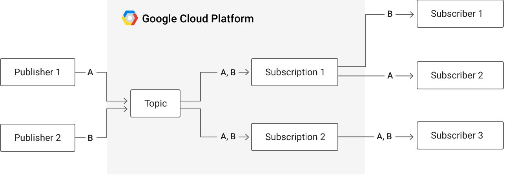
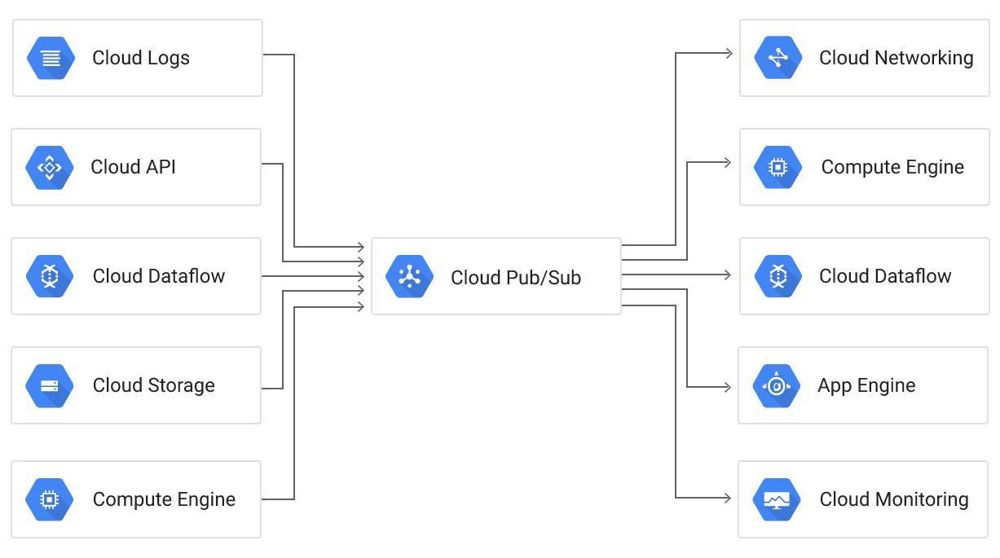
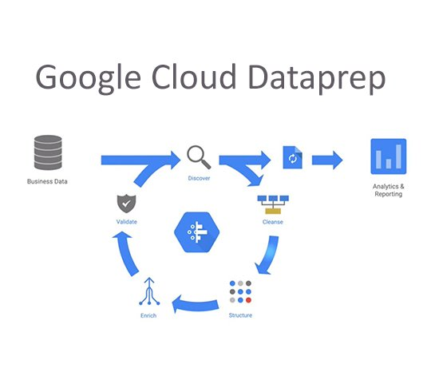
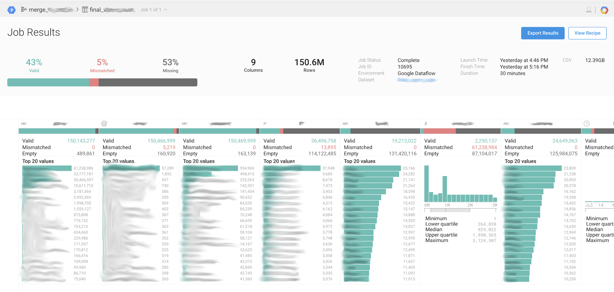
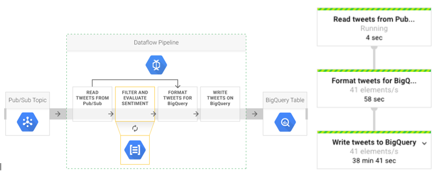
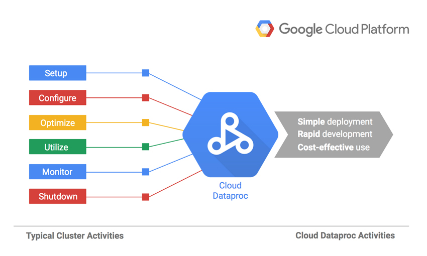
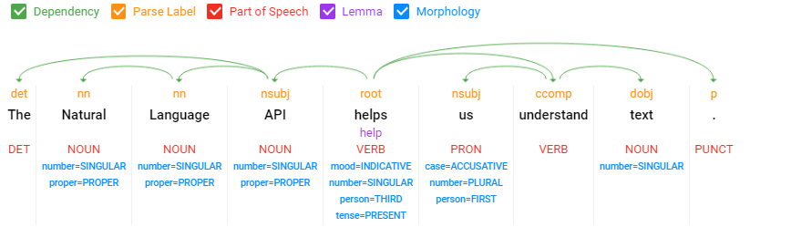

# Google cloud platform for Data Science - Data collection

### Google Cloud Storage
Google Cloud Storage is a service within the Google Cloud Platform. It provides unified object storage for live or archived data. Objects stored in Google Cloud Storage are grouped into buckets. Buckets are containers within the cloud that can be individually assigned to storage classes.

Google Cloud Storage customers can access their data through a web browser or command-line interface. Customers can also choose the geographical location in which their data lives. The data can be accessed by a single API which offers Open Authorization (OAuth) with granular access controls. The service is offered in pay-per-use model.

Finally, Google Cloud Storage offers four storage classes: Multi-Regional, Regional, Nearline and Coldline. Below we provide an explanation for better understand which of the classes should be chosen for which purposes.

#### Google Cloud Storage Multi-Regional
Google Cloud Storage Multi-Regional stores data in data centers across the globe and has 99.95% availability. It is suitable for companies that need to access data frequently. Multi-Regional class data is stored in at least two separate locations, which improves availability. 

#### Google Cloud Storage Regional
Google Cloud Storage Regional stores data in one geographic location, rather than spreading it out. It offers 99.9% availability and is best for computation, analytics and machine learning workloads. When storage and computational resources are in the same region, Google Cloud Storage Regional provides high performance and availability. The practice of storing data regionally can reduce network charges. 

#### Google Cloud Storage Nearline
Google Cloud Storage Nearline is for customers who need long-term storage for data that users access less than once a month. It is best used for archiving data, as well as backup and disaster recovery (DR), and it integrates with third-party backup products from vendors, such as Unitrends and Symantec. Google Cloud Storage Nearline offers 99% availability and has a minimum storage period of 30 days. 

#### Google Cloud Storage Coldline
Google Cloud Storage Coldline is for customers who need to store data they access less than once a year. It is mainly for archiving and DR. It requires a 90-day minimum storage duration and it is the least expensive of the three storage tiers. Customers can integrate Coldline with third-party backup and storage products, such as those from Veritas, Egnyte and NetApp. Companies can store Nearline and Coldline class data into buckets created in regional and multiregional locations.


### BigQuery

BigQuery is Google's serverless, highly scalable, low cost enterprise data warehouse. It enables the user to collect different data sources by creating a logical data warehouse over columnar storage as well as data from object storage, and spreadsheets. Furthermore, in the cases of data scientist teams, BigQuery makes it easy to securely share insights within the team and beyond, such as datasets, queries, spreadsheets and reports. 

There is no set up costs to build such data warehouse and it can be ready in seconds. Google BigQuery is tested to store gigabytes to petabytes of data and makes it easy to join public or commercial datasets with your data. There is also the possibility to integrate it with existing ETL tools like Informatica and Talend to enrich the data you already use. Also, it supports automatic ingestion of Google Ads. It uses familiar ANSI-compliant SQL and provides ODBC and JDBC drivers to make your data integration faster and easier. By being a cloud product, there is no need to worry about the data warehouse capacity, as there is no limit on the scaling capacity. 

In addition, while doing streaming data ingestion, the scientist can benefit from the automatic scaling of this serverless infrastructure. The tool allows capturing data in real-time using its powerful streaming ingestion capability so that your insights are always current. BigQuery is free for up to 1TB of data analyzed each month and 10GB of data stored. Users can eliminate the time-consuming work of provisioning infrastructure and reduce their downtime with a serverless infrastructure that handles all ongoing maintenance, including patches and upgrades. Google BigQuery eliminates the data operations burden by providing automatic data replication for disaster recovery and high-availability of processing for no additional charge. BigQuery makes it easy to maintain strong security with fine-grained identity and access management control. Last but not least, BigQuery data is always encrypted, at rest and in transit.


### Cloud Pub/Sub
Pub/Sub is a shorthand from publish and subscribe. According to Chockler (2007) it is a paradigm for supporting many to many communication in a distributed system. In such a system messages are sent in the abstract channels that are called topics. The users get only the needed information from the topics where they have subscribed to. The system guarantees that all users that are subscribed on a certain topic will receive all new messages. Pub/Sub is used in different types of applications because of its reliability and simplicity, especially in enterprise applications. 

Google has implemented this pattern as Cloud Pub/Sub on its platform. Pub/Sub model is shown in the figure below. 



With Cloud Pub/Sub it is possible to send and receive messages from any component hosted on the Internet with a guaranteed delivery. It can send up to 100 million messages per second. The system scales horizontally. This means that when the number of topics, subscriptions or messages increases, Google Cloud Platform creates new instances. Cloud Pub/Sub consists of a control plane and a data plane. The data plane transfers messages between publishers and subscribers. The control plane assigns publishers and subscribers to physical machines. The integration of Cloud Pub/Sub with the other products on Google Cloud Platform is shown in figure below.



#### AWS Kinesis vs. GCP Pub/Sub
The features of Kinesis and Pub/Sub are very similar.  They are essentially distributed queues with at-least-once delivery semantics supporting multiple publishers and multiple subscribers.  They both have a number of integrations with other services, such as allowing a serverless function to be a subscriber and to act on messages being published to the queue.  There are at least two significant ways in which these services differ, however:

1.	Kinesis allows new subscribers to start reading messages in the past. Pub/Sub only allows a new subscription to start reading messages that were created after the subscription was created.
2.	Pub/Sub has a vastly superior scalability and cost model. 

The pricing and scaling model for GCP’s Pub/Sub is simply pay-by-volume. That’s it. You don’t need to estimate your request rate or monitor usage and scale the service.  You don’t need to pay for capacity you are not using.  In Kinesis, you need to provide much more capacity than you need most of the time, but that requires paying for capacity you are not using.

Scaling at Kinesis means manually splitting or merging shards. Of course there are buffer strategies that can mitigate these types of issues, but that’s not a feature the Kinesis client libraries provide out of the box, so you’re going to have to build that capability yourself. 
With GCP Pub/Sub you don’t have to worry about how the service scales or whether you’re leaving money on the table due to over-provisioned capacity. The user can focus on product features instead of operational issues.

### App Engine
Google App Engine is a web framework and cloud computing platform for developing and hosting web applications. App Engine processes each request in a separate “sandbox”, which means that two requests from the same computer can be directed and handled on different servers. This way of execution reduces time and resources spent on a single request, plus different applications can run on the same server without performance penalties. 

App Engine offers two environments: flexible and standard. They provide infrastructure to deploy, serve and scale, but the difference is in how they run, scale and access external services. In the standard environment the application tends to be stateless. This gives performance benefits but introduces some limitations of the sandbox, such as restriction to use libraries that are not in the white list or disability to write to disk. Also, memory and Central Processing Unit (CPU) usage for one instance is limited in the standard one, but can be configured in the flexible environment. Moreover, it is possible to write to the disk and use any libraries or programming languages without limitations, because the application runs in a Docker container. One more difference is in accessing external services: the standard environment uses the built-in API, while the flexible uses external. Also scaling is different: standard scales much faster and has no limitation of the minimum running instances. 

On the top level the application consists of the services. Services are components of the application and help to split it into logical parts that can share App Engine features. It is done like in the microservice architecture. Each service can be configured differently, has its own runtime and consists of the configuration file and the source code itself. 

One of the most important things in the configuration is the version of the service, because it is possible to deploy different versions of the same service. It helps to switch back to old versions in case of critical errors, redirect traffic from one version to another one without uptime or even to increase traffic step by step to a new version and see how it works with higher load. One of the advantages of App Engine is that the application scales when there is a greater demand for it. It means that more computation power, network traffic, etc. is allocated for this app, while the app itself knows nothing about it. App Engine creates a new instance of the required version when more resources are needed and destroys extra instances after a traffic peak to reduce costs. 

Scaling can be configured and there are three types of it. Every instance will be crated depending on the scaling type. App Engine offers three types of scaling: automatic, manual and basic. When developers use manual scaling the service will run continuously. This type makes it possible to do complex initialization. The basic one creates the instance of the service upon user request and turns it down it when it is idle. Automatic scaling creates and destroys instances depending on the number of requests, size of queues and other data.


### Stackdriver Logging
Stackdriver logging is helping Google cloud users to collect and monitor logs that are generated by different products of the platform. It allows users to store, search, analyze, monitor, and alert on log data and events. Stackdriver is designed as a hybrid solution that can be useful when running applications in a multi-cloud environment or migrating from one to the other. It lets you manage and analyze log data in one place. By default, both Google Cloud and Amazon Web Services are supported. 

Stackdriver Logging is based on Fluentd and to be able to collect the logs it relies on the google-fluentd logging agent installed in each VM. When cloud platforms are used, this product offers its own API which allows ingestion of any custom log data from any source. For easy integration, Google ships SDKs for multiple languages including Go, Java, JavaScript, .NET, PHP, Python, and others. It is a fully managed service that performs at scale and can ingest application and system log data from thousands of VMs. The tool provides the capability to analyze all that log data in real time.

Stackdriver Logging is an integrated solution that works seamlessly with Stackdriver Monitoring, Trace, Error Reporting, and Debugger. This integration makes it possible to navigate between incidents, charts, traces, errors, and logs on the same place which helps a lot to quickly find the root cause of issues in the systems, applications or other tools that are used.

Stackdriver Logging is scalable and works well at high ingestion with low latency at terabytes per second. Stackdriver Logging is a fully managed solution that takes away overhead of deploying or managing a cluster.

 It is possible to combine the power of the Google Stackdriver suite with Cloud Platform’s data and analytics products for advanced log analysis. One of the powerful features of Stackdriver Logging is exporting the logs to external services such as Google Cloud Storage bucket, a Google BigQuery dataset, a Google Cloud Pub/Sub topic, or any combination of these three services. This enables long-term retention of logs by moving to an inexpensive Google Cloud Storage bucket. Logs exported to BigQuery can be searched and analyzed. Finally, Cloud Pub/Sub can be used to export Logs to third-party services or a REST endpoint. 


# Data Cleaning

 Analysts and data scientists are often deal with complex data and the data usually cannot be analyzed immediately. Almost 80% of time in data science is spent on cleaning and preparing the data therefore fastening this process reduces time to insight and data driven decisions can be more responsive.

### Cloud Dataprep
 Google Cloud Dataprep is an intelligent data service for visually exploring, cleaning and preparing data for analysis. It is serverless and works at any scale without infrastructure to deploy or manage. It requires no configuration or management. It support for BigQuery and cloud storage as well as uploading local files. Common file types like CSV, Excel and JSON can be imported and Dataprep automatically detects schema, type and mismatched or missing data. Distributions are visualized instantly. Also joining datasets is easy and visual because common keys are automatically detected and visual preview of join is generated. With the addition of Machine learning, it can also suggest different ways of cleaning the data, which make data preparation faster and less prone to error.

With Cloud Dataprep, preparing big data for training machine learning models, visual analytics or powerful interactive queries is done very easily

Missing parts:
* In beta version, jobs cannot be shared between different users
* Data cannot be stored in another data store for the rest of the data pipeline.
* Uploading very large files from local is not possible. Data first needs to be uploaded to Cloud Storage.





# Data Processing
In this stage, the data is transformed from raw form into actionable information


### Cloud Dataflow: 
Cloud dataflow executes data processing pipelines. A pipeline is sequence of steps that reads the data, transforms it and writes it out. Dataflow is designed to process very large datasets. It distributes these processing task into different virtual machines in the cluster so that they can process different chunks of the data in parallel. Cloud dataflow has very important part in processing big data in the sense of many of its features. First; it is serverless so this means there is no need to manage computation of results. Performance, scaling, availability, security and compliance tasks handled automatically in Dataflow. Users only focus on writing the code instead of building clusters. Secondly; processing code is separated from the execution environment. Pipelines are developed using the open source Apache Beam API/programming model. Third and the most important feature of Dataflow is; It is designed to process both batch and streaming data with the same model. This feature is perfect for cleaning data or scoring models on streaming data. It is  also very important because other softwares that commonly used in data science tasks like Spark requires to separate these processes.  
 
Cloud Dataflow is very useful tool for data science because data science implementations like predictive analytics, fraud detection, real-time personalization and similar use cases can be added as data processing pipelines and every task inside them is executed automatically. For example streaming tweets into Google cloud’s warehouse -BigQuery- can be pipelined like this;





In its own website, there is a clear walkthrough;
 https://cloud.google.com/dataprep/docs/quickstarts/quickstart-dataprep

### Cloud Dataproc
Cloud Dataproc is managed service for running Apache Hadoop and Spark jobs. In many companies and areas Hadoop plays an important role. Cloud Dataproc includes core Apache Hadoop (MapReduce, HDFS, and YARN), Spark, Hive, Pig, and also has connection to other GCP services like Cloud Storage, BigQuery and BigTable all deployed on Debian. This result in stateless Hadoop and Spark clusters meaning fully functioning clusters can be started in just seconds. Also can be managed easily, and money is saved by turning clusters off when they are not needed. In Dataproc, clusters are deleted after process is finished. The reasons are; first, it typically takes less than two minutes to start a cluster. Because cluster creation is fast and can be automated, it is wasteful to keep unused clusters around. Second, on-premises Hadoop clusters are kept always on is because the data is stored on HDFS. Instead, it is better to keep the data on Google Cloud Storage and directly read from Cloud Storage through MapReduce jobs. Google data centers has high network speed therefore reading large files from Cloud Storage is better than HDFS. Even in small files can be justified in cloud storage because since storage and compute is separate in google cloud more compute nodes can be created and the process would be much faster than HDFS.

Dataproc is mostly used for big data processing and machine learning. 



##### Quick Start Using Python

1. Set the environment variable GOOGLE_APPLICATION_CREDENTIALS to the file path of the JSON file that contains service account key.
```sh 
export GOOGLE_APPLICATION_CREDENTIALS="/home/user/Downloads/service-account-file.json"
```
2. Create a Cloud Storage bucket:

3. Google Dataflow library can be added to virtual machine with this install command;
```sh 
pip install google-cloud-dataflow
```
Set the PROJECT environment variable to GCP project ID. Set the BUCKET environment variable to the bucket 
```sh 
BUCKET=gs://<bucket name>
```

4. Run the python project remotely

```sh
   python -m name_of_python_project \
  --project $PROJECT \
  --runner DataflowRunner \
  --staging_location $BUCKET/staging \
  --temp_location $BUCKET/temp \
  --output $BUCKET/results/output
```


## Data Extraction and Translation

### Google Cloud Vision API

Google Cloud Vision API is part of the AI tools offered by Google in his cloud platform and can be used by data scientist to extract information and understand the content of images from different data sources. This can be done in an easy way by calling REST API that take benefit of Google’s powerful machine learning models to evaluate the image content. 
Vision API analysis the image and provides information in different aspects like it classifies images into different categories (e.g., “Bird”, “fauna”, “animal”), detects individual objects within the image, faces within images, and can extract text from images. You can use the API by both sending the image throw the request or by integrating it with the cloud storage of Google if you already are already their client.

The usage of Vision API enables the build of metadata on your image catalog because it gives different labels for the image, web search information about that image, safe search information about it and property analysis of the image itself. 
The importance of this API in the prospective of a data scientist it stand on the fact that the extracted information can be useful to analyze the data in order to do some sentiment analysis by getting insights from the images, detect unappropriated content, find similarities of images in other websites etc. 

It is to be mentioned that this is a new product and still is not very robust. There have been done researches in the beginning of 2017 that evaluate the robustness of Google Cloud vision API to input perturbation. It is noticed that pictures with noise may lead to wrong outputs from API. In particular, when it is added sufficient noise to the image, the API generates completely different outputs for the noisy image, while a human observer would perceive its original content. Anyway, this can’t be considered a big issue because if some noise filters are applied than the result of the API is the same. Based on our experiments, the noise is not a problem anymore because the API is giving the same results on both noisy and clear images. This confirms the fact that the product is being enhanced by Google to overpass these known issues. Also, Vision API improves over time as new concepts are introduced and accuracy is improved because it is an AI tool.

### Google Cloud Speech-to-Text

Google Cloud Speech-to-Text is another tool of AI offered by Google Cloud in the package of data science. It enables users to convert audio to text by applying powerful neural network models in an easy to use API. Based on Google documentation they apply advanced deep learning neural networks algorithms to audio for speech recognition which has a high accuracy. The accuracy of this tool is being improved continuously by Google due to the technological investments that they do in the speech recognition field.

Being a data scientist, this tool can be very useful in the data collection phase because it can help to transform audio and video sources into text by giving so the possibility to make further analysis on that information.
The Speech-to-Text API of Google can recognize 120 languages and variants. You can enable voice command-and-control, transcribe audio from call centers, and more. It can process real-time streaming or pre-recorded audio.

Cloud Speech-to-Text can stream text results, immediately returning text as it’s recognized from streaming audio or as the user is speaking. Alternatively, stored audio files can be used to convert it into text. There is an added value while dealing with audios of real-life speech because the tool can accurately transcribe proper nouns and appropriately format language (e.g., dates, phones numbers). It supports more than 10x proper nouns compared to the number of words in the entire Oxford English Dictionary.  Speech-to-Text can analyze short and long-form audio.


### Cloud Translation API
The Google Cloud Translation API provides a simple programmatic interface for translating a string into any supported language. This service can be invoked using REST  API calls from various programming languages. API can be invoked with given text to detect source language and translation to target language can be done. Like any other GCP service, this API is highly scalable and comes with a simple pricing model. Translation API is useful if a company has users all around the world with the help of this API content can be translated into their host language. Airbnb uses translation API in translating the reviews

 This is the python code that calls Cloud Translation API.
 
```python
# Imports the Google Cloud client library
from google.cloud import translate

# Instantiates a client
translate_client = translate.Client()

# The text to translate
text = u'Hello, world!'
# The target language
target = 'ru'

# Translates some text into Russian
translation = translate_client.translate(
    text,
    target_language=target)

print(u'Text: {}'.format(text))
print(u'Translation: {}'.format(translation['translatedText']))
```


### Cloud Natural Language API

Cloud Natural Language API is used for extracting entities, sentiment and syntax from text. Being able to extract insights on product reviews or from customer conversations in email, chat or social media by using entity detection and sentiment analysis is very important for businesses.

These are the methods that can be used in Cloud Natural Language API:

##### Extract Entities: 
API looks the given text for known entities (proper nouns such as public figures, landmarks), and returns a JSON file containing information about those entities.
```json
  "entities": [
    {
      "name": "Obama",
      "type": "PERSON",
      "metadata": {
        "mid": "/m/02mjmr",  
"wikipedia_url": "http://en.wikipedia.org/wiki/Barack_Obama"
}
```

##### Sentiment Analysis
API looks the given text and detects emotion within the text, especially determines  attitude as positive, negative, or neutral. It returns the JSON file containing score and magnitude value for emotion. Score ranges from negative 1 to 1. Magnitude tells how strong the sentiment regardless of being positive or negative. Magnitude can range from zero to infinity and it is based on the length of the text.
```json
{
  "documentSentiment": {
    "magnitude": 0.8,
    "score": 0.8
  },
  "language": "en",
  "sentences": [
    {
      "text": {
        "content": "Enjoy your vacation!",
        "beginOffset": 0
      },
      "sentiment": {
        "magnitude": 0.8,
        "score": 0.8
      }
    }
  ]
}
```

##### Analyzing Syntax:  
Syntactic Analysis breaks up the given text into a series of sentences and tokens and provides linguistic information about those tokens. It returns a JSON file involving the information of how each of the words in the sentence relate to each other, which words they depend on and role of the each word in the sentence




PS: Cloud Natural Language API supports English, Spanish, Japanese, Chinese (Simplified and Traditional), French, German, Italian, Korean and Portuguese..


How to call Cloud Natural Language API using Python;
1. Install the library;
  ```sh
 pip install --upgrade google-cloud-language
 ```

2. Set up the authentication on Google Cloud

3. Use the client library;

```python
# Imports the Google Cloud client library
from google.cloud import language
from google.cloud.language import enums
from google.cloud.language import types

# Instantiates a client
client = language.LanguageServiceClient()

# The text to analyze
text = u'Hello, world!'
document = types.Document(
    content=text,
    type=enums.Document.Type.PLAIN_TEXT)

# Detects the sentiment of the text
sentiment = client.analyze_sentiment(document=document).document_sentiment

print('Text: {}'.format(text))
print('Sentiment: {}, {}'.format(sentiment.score, sentiment.magnitude))
```

