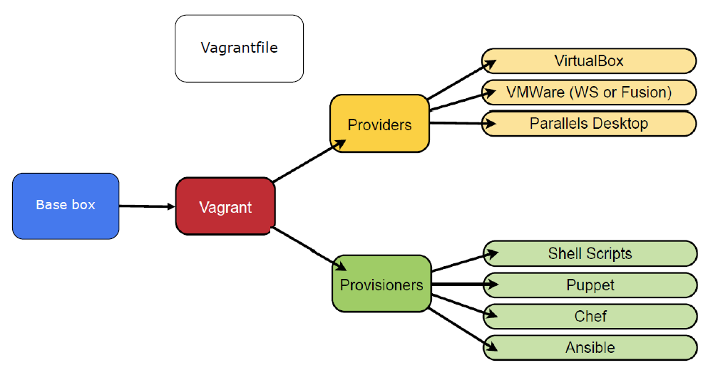
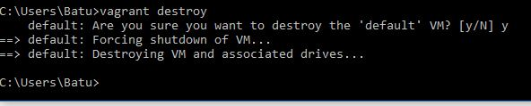

# Homework Research Project - Vagrant

Group 1210

TUTER, Batuhan

WANG, Yue

# 1 Introduction to Vagrant

## 1.1 What is Vagrant (“But it works on my machine!”)
[Vagrant](https://www.vagrantup.com/) is a powerful tool for building and managing virtual machine environments in a single workflow, written in Ruby and it’s first release was in 2010, developed in [HashiCorp](https://www.hashicorp.com/). It is developed as an open-source project and it is also available in GitHub. [Source](https://github.com/hashicorp/vagrant)

When developers are working on a software project, most of the times, they prefer working in their own development environment but as a result, they need to set up, install all the required dependency softwares and configure multiple services on their own laptops or workstations. Modern web applications has a lot of parts to such as; web servers, application servers, backend API services etc. Installing all of these services and configuring them manually is a tedious task for a developer. The development work carried out by developers can be on Mac, Windows or Unix and commonly the applications developed will be running on Linux servers in production. This leads to a huge disparity between environments used by different developers and the actual production environment. Thus; it’s not the installation of application components that’s difficult, it's the configuration part that creates the trouble, as it should resemble the production environment. Furthermore, developers might be working in multiple projects, which means that their local environment needs to be configured with different configurations, applicable to those different projects and this can make things much more messier. This kind of changes in configuration can lead to problems where things are working perfect in development environment, but not in production. This situation is commonly known as “But it works on my machine” problem. [Source](https://www.slashroot.in/what-vagrant-and-how-does-it-work)

Vagrant is trying to solve these problems by allowing developers work on the same exact mirror configuration, that is running in production environment, no matter what operating system developer is using in development environment. It is yet another Virtualization mechanism that puts your development environment into a virtual machine and makes it easier to work in collaboration by sharing the virtual machine image with any team member. Developers can do anything inside their Vagrant image without changing anything in their development environment. Mitchell Hashimoto, crater of the Vagrant, described it in his book as; “Vagrant is a tool for building complete development environments, sandboxed in a virtual machine. Vagrant lowers development environment setup time, increases development/production parity, and brings the idea of disposable compute resources down to the desktop.“ [Book](https://books.google.es/books?id=9c0hT2EOxLQC&dq=Vagrant:+Up+and+Running:+Create+and+Manage+Virtualized+Development+Environments+1st+Edition&hl=tr&lr=) 

## 1.2 Vagrant Context 

### 1.2.1 Vagrantfile 
Vagrant is configured per project, where each project has its own isolated work environment. These environments need to be configured in a file named “Vagrantfile” and each project has a single Vagrantfile. In this file, the developer specifies how the environment should be set up, configured, which software should be installed, physical properties of the environment you need (e.g., RAM) and which operating system should be used. Vagrant will then follow every step as defined in the provided Vagrantfile and initialise the machine. The Vagrantfile is meant to be distributed among other developers in order to set up the same development environment automatically and easily on their own machine, without having to configure anything.

### 1.2.2 Box

Vagrant uses a base image and clones it to rapidly create a usable machine and this base image is called a “Box” and it is distributed in the form of box files. Boxes contain already-installed operating systems and they can easily be shared among developers to get identical working environments.  The box that is required for an environment is specified on a per-project basis Vagrantfile. HashiCorp develops the proprietary [Atlas](https://app.terraform.io/session), which features cloud-based sharing and storage possibilities for custom boxes. This enables users of Vagrant to share and download boxes with other users from the Command-Line. Once a box is downloaded, it can be used by multiple projects because Vagrant only uses the boxes as a base image to clone from, there is never any risk of conflicting changes and file modifications in one Vagrant environment never affect another.

To Mention:
Since Vagrant makes use of external virtual machines, it is highly dependent on VM providers like [VMware](https://www.vmware.com/), [Docker](https://www.docker.com/) or Oracle’s [VirtualBox](https://www.virtualbox.org/).  

## 1.3 Features of Vagrant

### 1.3.1 Provisioning
The problem of installing software on a booted system is known as provisioning and
is often the job of shell scripts, configuration management systems, or manual command-line entry. Vagrant supports automated provisioning so that the necessary software and configurations needed to run the project being developed in the Vagrant environment are all properly prepared. Automated provisioning offers three main benefits: ease of use, repeatability, and improving parity between development and production. Today, many developers manually set up servers, copying and pasting configuration from guides online or giant README files with various platform-specific steps to set up the machine for development into the terminal prompt of their newly created server. Problem arises when a new server needs to be set up where the same guides need to be followed to create another identical server but in practice, they end up being different and these differences can cause problems in production. With automating provisioning, identically configured and installed software is guaranteed, regardless of the development environment.  Vagrant also supports provisioning with shell scripts, Chef or Puppet and additional provisioners can be added via plug-ins if needed.

### 1.3.2 Networking
Networking is a feature of vagrant to allow users to use the browser and development tools on the local machine as well. One way to do so is using shared folders which users could sync files to the virtual machine. Vagrant has provided a set of tools for the networking of the virtual box. For example, port forwarding can be used in vagrant to forward the host port towards the guest port to enable the access of the guest machine without using IP. It is easy to set up the networking in this way, however, Vagrant can’t forward to ports less than 1024 on the host system (so using forwarded port for SSL is not a good idea as it is supposed to be on port 443). 
Users can also create private network for communication between host machine and guest machine and this network is not accessible for global network. Multiple machines within same private network can also communicate to each other. On the other hand, users can choose public network as well. The difference is just the general public can access to the network as well. Anyway this way is still ambiguous because of the variety of different providers. IP can be assigned via DHCP, which is the easiest way, or you can assign a static IP. You need to be cautious not to collide with other machines in the same network.  

### 1.3.3 Multimachine Clusters
Multi machines are usually needed in the development, for example the web and the database server. The more complex the website is, the more components are involved. Vagrant is supposed to provide the environment when Vagrant up is running. To satisfy the whole development requirement, multi machines are required or preferred instead of a single machine. Instead of putting all the required services onto one machine, Vagrant lets you accurately model these scenarios using a feature called multimachine environments, which builds multiple virtual machines based on one Vagrantfile. It is better because otherwise it has a higher possibility to fail working or if it fails it is going to be hard to tell which part is wrong. In the way vagrant helps, services are separated as they are in production. However, in the real cases, running multi virtual machines is rather expensive. It is necessary to decide which parts should be combined and which should be separated on how many virtual machines.

We are going to show a hands-on case in the second chapter of the report to better interpret this feature.

### 1.3.4 Boxes
Vagrant environments are built upon base images ‘Box’. Users can create boxes and boxes can have any operating systems installed. Inside the Box, there are Package manager; SSH; SSH user so Vagrant can connect, perhaps Chef, Puppet, etc. but not strictly required. Boxes can be used to help you to match the same environment as run in production. Also it may take hours to pre install some dependencies or softwares. This can be improved by using Box. Instead of installing Java on every vagrant up, you could install it on the base image to save time. Box can do such optimization because vagrant uses snapshotted base images which don’t change often to build pre-created base on top of it. Thus, the process of Vagrant destroy-up cycle can only take up several minutes. Box is also portable to work on various operating systems which means one packaged on Windows should work properly on Mac OS and Linux as well. The format of box is a tar file. The manage of vagrant is global: any changes of the box may affect all environments as box is global per user instead of project. Box also supports versioning so that members could update the box accordingly, which makes it fit better for a group workflow.  

### 1.3.5 Extending with Plugins
Although vagrant has provided a set of strong features to try to cover most scenarios users may come into, in the real world there still are more specific user cases. In order to cover all, vagrant provides a powerful interface to add third party plugin to enhance the vagrant features. For example, [Vagrant Berkshelf](https://github.com/berkshelf/vagrant-berkshelf) is a Vagrant plugin that adds Berkshelf integration to the Chef provisioners; [agrant-omnibus](https://github.com/chef/vagrant-omnibus) is a Vagrant plugin that ensures the desired version of Chef is installed via the platform-specific Omnibus packages. To install a new plugin, you can simply use command line vagrant plugin install followed by the plugin name. Vagrant takes care of the dependencies and versions. 

## 1.4 Alternatives of Vagrant

### 1.4.1 Desktop Virtualization

A natural solution to use the virtual environment is to use desktop virtualization which means to install the operating system and development environment to the virtual machine on virtualbox or vmware to set the required environment. Virtualbox will be very much another physical machine. It is more of a virtualized machine sharing hardware with host machine. The advantage of this method is that it can also provide a virtual environment that is isolated to the host machine and you could also deploy the whole settings and share with other users. However, unlike vagrant, if you want to change the environment on all machines, you have to do it one by one instead of just changing the vagrant file.

### 1.4.2 Containers(Docker)
Container is another virtualization technology. A container image is a lightweight, stand-alone, executable package of a piece of software that includes everything needed to run it: code, runtime, system tools, system libraries, settings. Available for both Linux and Windows based apps, containerized software will always run the same, regardless of the environment. Containers isolate software from its surroundings, for example differences between development and staging environments and help reduce conflicts between teams running different software on the same infrastructure. [Docker](https://www.docker.com/what-container)

Docker is an example which uses containization to create virtual environment for the development. Basically it implements similar functions as vagrant. But vagrant is more faced to development while docker is more about the runtime environment. So vagrant is a multi platform virtual environment construction tool using vagrantfile to describe virtual machine and deploy it to hypervisor, while docker is a construction tool of linux container on linux using DOckerfile to define a container and deploy on the host machine. 

 

Here is a list about the differences between docker and vagrant:

### 1.4.3 Cloud
There are more option like using cloud service to obtain a virtual environment. For example, users can define a virtual machine of any operating system on AWS or Azure in minutes. These virtual machines run on the cloud servers instead of local host machine. The advantages are that it does not occupy local computing resource to process but the resource from the cloud service provider and it can be accessed anywhere connected to internet. 

# 2 Hands-on Example

This example is created by following [Vagrant Book](https://books.google.es/books?id=9c0hT2EOxLQC&dq=Vagrant:+Up+and+Running:+Create+and+Manage+Virtualized+Development+Environments+1st+Edition&hl=tr&lr=) but most of the configurations are depreciated in this source thus; we used [Vagrant Docs](https://www.vagrantup.com/docs/) to make configuration changes when necessary. We used Windows OS in the host machine. If your host machine is running Dual-Boot with Windows & Linux and if you decide to use Vagrant in Linux, you need to close UEFI Secure Boot to install VirtualBox, which disables the dual-booting with Windows. Network configurations might change depending on the Host OS.

## 2.1 Up And Running

We are going to create our first Vagrant Virtual Machine and see how vagrant uses Networking, Shared Folders and Provisioning.

### 2.1.1 Baby Steps

Download and install the proper Vagrant for your OS from the [link](https://www.vagrantup.com/downloads.html
):

You can type `$ vagrant --version` to verify your installation in the shell of your OS.

We chose to install VirtualBox as a provider for Vagrant, but other options are also available, e.g. VMware, EC2 etc.

Next, go to [Virtual Box](https://www.virtualbox.org/) to download and install the software, that is for your OS.

Run the following command to have a fully running virtual machine in Virtual Box running a Ubuntu 12.04 LTS 64-bit box.

`$ vagrant init hashicorp/precise64`

You can also choose another vagrant box to run from [Vagrant Cloud](https://app.vagrantup.com/boxes/search)

Now you can run `$ vagrant up`.
You need to wait for Vagrant to download the box you initialized and to be booted in you VirtualBox. The console output should look like the following:

~~~~
$ vagrant up
Bringing machine 'default' up with 'virtualbox' provider...
[default] Box 'precise64' was not found. Fetching box from specified URL for
the provider 'virtualbox'. Note that if the URL does not have
a box for this provider, you should interrupt Vagrant now and add
the box yourself. Otherwise Vagrant will attempt to download the
full box prior to discovering this error.
Downloading with Vagrant::Downloaders::HTTP...
Downloading box: http://files.vagrantup.com/precise64.box
Extracting box...
Cleaning up downloaded box...
Successfully added box 'precise64' with provider 'virtualbox'!
[default] Importing base box 'precise64'...
[default] Matching MAC address for NAT networking...
[default] Setting the name of the VM...
[default] Clearing any previously set forwarded ports...
[default] Fixed port collision for 22 => 2222. Now on port 2200.
[default] Creating shared folders metadata...
[default] Clearing any previously set network interfaces...
[default] Preparing network interfaces based on configuration...
[default] Forwarding ports...
[default] -- 22 => 2200 (adapter 1)
[default] Booting VM...
[default] Waiting for VM to boot. This can take a few minutes.
[default] VM booted and ready for use!
[default] Configuring and enabling network interfaces...
[default] Mounting shared folders...
[default] -- /vagrant
~~~~

Since Vagrant runs the virtual machines without a graphical user interface by default, you won't see anything visual. To verify if you Successfully deployed your Vagrant Machine, you can check your Virtual Box to see if the new image is present

Now run `$ vagrant ssh` to get into a full-fledged SSH console within the virtual Machine.

Inside this vagrant machine, you can do anything you want, such as installing software, modifying files, or even removing the entire file system. You can log out by typing `vagrant@precise64:~$ exit`, this will put you back into your terminal on the host machine.

Since Vagrant runs the virtual machines without a user interface, you can type `$ vagrant status` to see current machine states.

Inside the project directory, in which you run `$ vagrant init` command, Vagrant creates the Vagrantfile that has the configuration for the image. The parameters given to the vagrant init command configure the “box” and “box_url” parameters within the Vagrantfile, which are defining the box that will be used in the virtual machine. Vagrantfile is written in Ruby programming language but no Ruby-specific knowledge is necessary, since the Vagrantfile is composed only of variable assignment, function calls, and configuration blocks. You can define amount of memory that is allocated for the image and other configurations here.

### 2.1.2 Networking

We’ll manually set up Apache by installing and configuring it over SSH. This is usually the first step involved before setting up any automation.

Uncomment the line that creates a forwarded port mapping in your previously created Vagrantfile.

Now run `$ vagrant reload` to apply new configurations in Vagrantfile. You should see the following output in your shell.

Run `$ vagrant ssh` to enter an SSH prompt. Then run `vagrant@precise64:~$ sudo apt-get update` to download the latest index of available packages for Ubuntu.

After the update, run
`vagrant@precise64:~$ sudo apt-get install apache2`
to install Apache server to the machine.

After the installation, If you browse “localhost:8080” in your host machine, you will see that we are forwarding the Apache Server, that is running inside the Virtual Machine, to our Host Machine from port 8080.

### 2.1.3 Shared folders

If you run `vagrant@precise64:~$ ls /vagrant/` inside the vagrant machine, you can see that “/vagrant” folder is the shared folder with the host machine. By default, Vagrant shares the project directory with the "/vagrant" directory inside the virtual machine.

The Vagrantfile in this directory is actually the Vagrantfile from the project directory. If a file is created on the host machine or within the Vagrant machine, the changes will
be mirrored from host to guest or vice versa.

Apache installation creates a path for the files to be served in "/var/www/". We are going to change "/var/www" to be a symbolic link to the default shared folder directory "/vagrant". This way, any files we put into the shared folder will be served from Apache by default, and we don’t have to actually modify any Apache configuration files. Run following commands to apply this.

~~~~
vagrant@precise64:~$ sudo rm -rf /var/www
vagrant@precise64:~$ sudo ln -fs /vagrant /var/www
~~~~

Now logout from the vagrant machine and create an index.html file in the host machine folder where VagrantFile is present:

~~~~
vagrant@precise64:~$ logout
$ echo "<strong>Hello!</strong>" > index.html  
~~~~

Open your browser in the host machine and direct to "localhost:8080". You will see that our Apache server in Vagrant machine can successfully serve our "index.html" that is created by the Host machine inside the shared folder

### 2.1.4 Provisioning

Until now, we followed steps to create a Server in our guest machine by hand and as you can imagine, it could be a very dirty to follow the same steps every time a new environment is being setup. Now we are going to use provisioning, so that we can install software on the guest machine automatically when the Vagrant environment is created.

We chose to use shell scripts for provisioning instead of configuration management tools like Chef or Puppet, since they more complex to use. But these tools should be considered for bigger projects for maintaining.

Create the following "provision.sh" script file in your project directory

~~~~
#!/usr/bin/env bash
echo "Installing Apache and setting it up..."
apt-get update >/dev/null 2>&1
apt-get install -y apache2 >/dev/null 2>&1
rm -rf /var/www
ln -fs /vagrant /var/www
~~~~

Scripts tells Vagrant to install Apache server and creates the link between shared folder and the Apache server folder.

To configure Vagrant to use this scripts, add the following line somewhere in the Vagrantfile.

`config.vm.provision "shell", path: "provision.sh"`

Now, run `$ vagrant destroy`to destroy the current guest machine and start from a clean state to show that provisioning works. Machine will be deleted and any resources it consumed such as RAM or disk space will be reclaimed.

Now run `$ vagrant up` and enjoy fully automated provisioning.

If you direct to "localhost:8080", you will see that server works same as before.

With this first part of the Hands-on example, we showed How Vagrant works, how Networking happens in Vagrant Virtual Machines, how Shared Folders are used in Vagrant and we created a small Apache Web Service by using the Shared Folders to show the interaction between Host and Guest Machines.

## 2.2 Multimachine Environment

Sometimes modern web applications are created using multiple services such as one web and
database server. Complex websites are often created with many services and in some cases these services required to be run in different machines in production. Vagrant has a feature called “Multimachine Environments”, which builds multiple virtual machines based on one Vagrantfile and this is useful for properly isolating separate services as they are in production. In this part, we are going to create to deploy web server and database server in two separate virtual machines to simulate a Multimachine Environment.

### 2.1.1 initialization

First run `$ vagrant destroy` to destroy any pre-existing virtual machines so start from a clean state and then edit your Vagrantfile accordingly:

~~~~
Vagrant.configure("2") do |config|
  config.vm.box = "hashicorp/precise64"

  config.vm.define "web" do |web|
    web.vm.network "forwarded_port", guest: 80, host: 8080, auto_correct: true
    web.vm.provision "shell", path: "provision.sh"
    web.vm.network "private_network", ip: "192.168.50.4"
  end

  config.vm.define "db" do |db|
    db.vm.network "private_network", ip: "192.168.50.5"
  end
end
~~~~

Here each "config.vm.define" line creates two “web” and “db” virtual machines that are completely independent from each other, since their code scopes are different.

For “web” machine we still use the “provision.sh” that is previously created and we forward the web app to localhost:8080 as before.

Private Network allows two machines to communicate with each other from the given IP address. It’s important to know that these IP addresses are not used already in the same network. We avoid giving Dynamic IP addresses for the simplicity but it could be done by simply deleting the given “ip: x.x.x.x” and the machines will be assigned to a free IP address by the vagrant.

Run `$ vagrant up` and login to web machine with `$ vagrant ssh web`.

Run `vagrant@precise64:~$ ifconfig` to verify given IP address.

Now logout from "web" and login to "db" with `$ vagrant ssh db` and run `vagrant@precise64:~$ ifconfig` to verify given IP address.

As you can see, we properly configured the IP addresses. Now to verify that two machines can communicate with each other ping “web” machine from “db”.

We managed to reach “web” from “db”. You can also try to ping “db” from “web” to verify.

### 2.2.2 MySQL Server

Until now we configured two machines that can communicate with each other properly. Now we are going to install MySQL server to “db” machine and we are going to talk with this client from “web” machine.

First create another provision script “db_provision.sh” for the “db” machine in the project root folder. This will tell “db” machine to install MySQL server and configure MySQL to allow remote connections.

~~~~
export DEBIAN_FRONTEND=noninteractive
apt-get update
apt-get install -y mysql-server
sed -i -e 's/127.0.0.1/0.0.0.0/' /etc/mysql/my.cnf
restart mysql
mysql -uroot mysql <<< "GRANT ALL ON *.* TO 'root'@'%'; FLUSH PRIVILEGES;"
~~~~

Update Vagrantfile to apply new provisioning to “db” machine and install mysql client to “web” machine.

~~~~
Vagrant.configure("2") do |config|
  config.vm.box = "hashicorp/precise64"

  config.vm.define "web" do |web|
    web.vm.network "forwarded_port", guest: 80, host: 8080, auto_correct: true
    web.vm.provision "shell", path: "provision.sh"
	web.vm.provision "shell", inline: "apt-get install -y mysql-client"
    web.vm.network "private_network", ip: "192.168.50.4"
  end

  config.vm.define "db" do |db|
    db.vm.provision "shell", path: "db.provision.sh"
	db.vm.network "private_network", ip: "192.168.50.5"
  end
end
~~~~

Now run `$ vagrant destroy` to start from a clean state then run “vagrant up” and wait for machines to be fully provisioned.

Now run `$ vagrant ssh web` to login web machine and run `vagrant@precise64:~$ mysql -uroot -h192.168.50.5` to connect MySQL client in “db” machine.

You should see the following output if everything went right.

With this example we showed that “web” machine can connect to a remote MySQL server where the remote server is another vagrant virtual machine This concepts can be applied to larger and more complex architectures.
